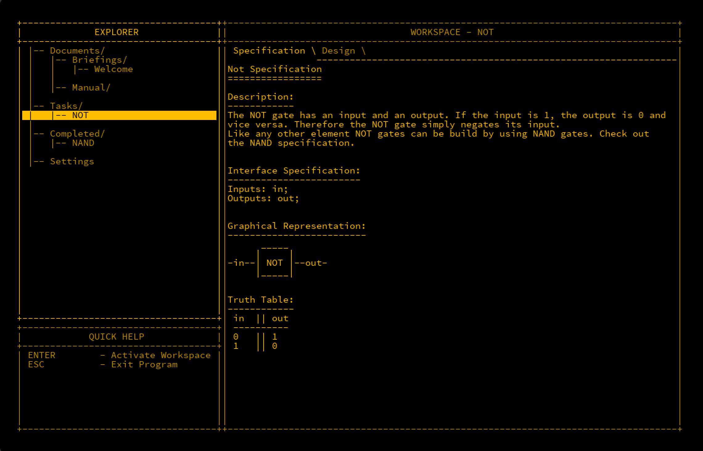
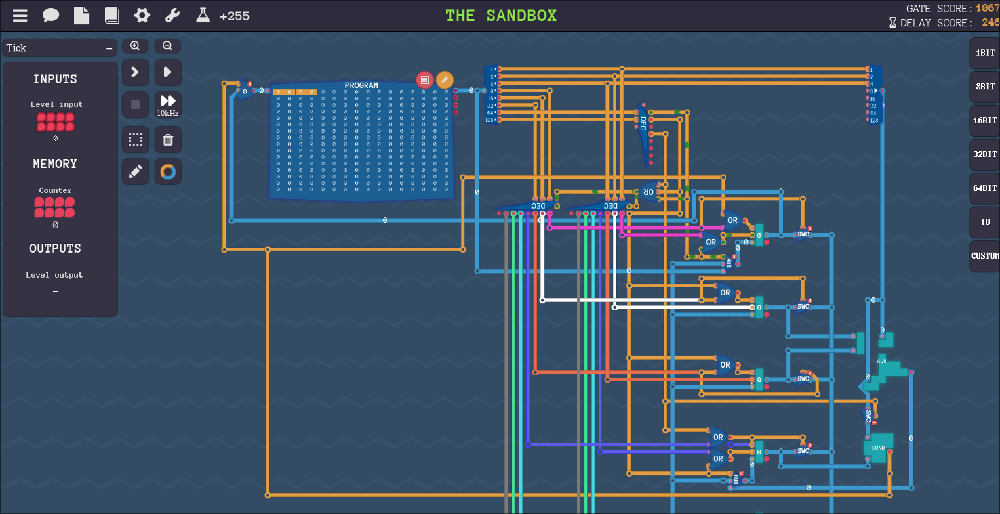
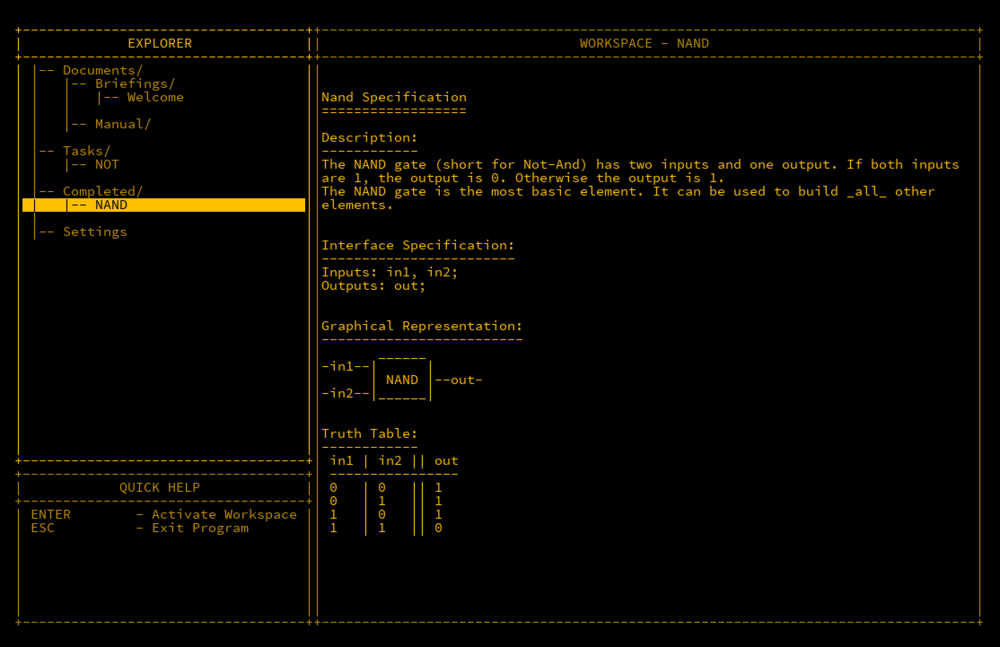

## Initial
The topic of Digital Electronics was always fascinating to me.  When I was a young boy in the 80's, games on the Commodore 64 weren't enough in the simple joy of playing them, I HAD to learn how they were made.  I remember pouring through code printed in magazines written in BASIC and painstakingly typing them out (often wrongly) to get them to run. Once they were finally correct and ran, they were very slow and clunky and it was later that I learned that the code I had typed was running on a slow language. The real developers for the C64 were using Assembly language to make their games.  This language is very primitive but complex, and my preteen self simply couldn't understand it.  Years later when I started to passively study malware and perform cursory reverse engineering, I once again encountered Assembly (ASM) and I wanted to research it again, albeit not for C64 games but to understand how the hell it works.

### ASM - What is the secret of your power?
I'll briefly discuss ASM here without deviating too much from my original topic. ASM is a low level language that computer CPUs can understand.  Well, almost true. CPUs can understand *bytecode* which is a series of instructions the CPU can directly interpret. The issue here is that this is very difficult for humans to understand.  ASM can be seen as a more human friendly version of this. Two main advantages of coding in ASM are the fact it's compact, where a few instructions could only be a few bytes long, and it's also very fast to run.  Because it's close to what the CPU understands, it's called a *low-level* language.  Other languages like C++ are *high-level* languages because they are easier to understand by a human, but may end up being larger and in theory slower than bytecode.

This is just breezing over the concept to understand ASM and we will certainly return to it. Going back to my curiosities which got me here, I wanted to know *how* CPUs worked at a fundamental level.  After much research, I'd like to share this with you in the hopes there are similar people like me that want to know how a computer works from the ground up.

## Learning Through Gaming
There's somewhat an irony that it was learning to code a game that got me here, but there are games available that can teach you to code the very fundamentals.  For this I will heavily reference two which are MHRD and Turing Complete.

### MHRD
[Steam Link](https://store.steampowered.com/app/576030/MHRD/)

MHRD is a hardware design game that enables you to build the very fundamentals through to a fully blown basic CPU. It's also fun to play as it's in a retro style terminal window. It starts small building out primitive logic circuits, building up to more complex pieces until there is enough to build out a CPU. Circuits are built using a text based syntax. 

### Turing Complete
[Steam Link](https://store.steampowered.com/app/1444480/Turing_Complete/)

Turing Complete is a more advanced approach to MHRD. The initial concepts are the same however the primary differences are that it is GUI based, in that you design your circuitry with the mouse as opposed to typing out the connections.  You also have the ability to create a CPU of your design and corresponding language to program it with, unleashing almost unlimited potential. 

For the first part of this, I'll focus on MHRD however we will plug our learned knowledge from there into Turing Complete also.
### Further Reading
Two references that I also found extremely useful were the [NAND2Tetris](https://www.nand2tetris.org/) project that provides a very similar approach to MHRD, in fact I would wager that MHRD is based off of this project anf if you complete MHRD, then you have most of this course already completed.  Second is a book called [Digital Computer Electronics](https://archive.org/details/367026792DigitalComputerElectronicsAlbertPaulMalvinoAndJeraldABrownPdf1) which takes a much deeper approach to the above, but also discussed building the SAP-1 (Simple As Possible) computer which is a very basic computer that can perform basic instructions and run small bytes of code.  This is quite heavy to absorb however if you aren't accustomed to the fundamentals.

## The NAND Gate
In the above games, the most basic logic is called the NAND gate.  It's a tiny piece of hardware that can receive two binary inputs and has one output.  Binary inputs can only have two states: `TRUE` or `FALSE` (`1` or `0`).  It's called a gate as like one, it can only be open or closed and NAND is an abbreviation of "NOT AND" which will be explained below.  What makes the NAND gate so interesting is that in theory all other gates and computer elements that we will make can be made just by using NAND gates, or gates built using other gates created this way.  The basic theory of a NAND gate is that it will output true as long as both inputs are NOT true, i.e. if input A AND input B are 1, then it outputs 0, otherwise 1. 

### Boolean Logic
Logic gates are core to understanding how digital electronics work. To make the understanding of this a little easier, Boolean Logic is applied. Basically it's a representation of what the output will be depending on the inputs provided.  As there are two inputs in a NAND gate with two possible options, there's a total possibility of four input combinations.  This can be represented in what's called a truth table like so:

**NAND Gate Truth Table**

| Input A | Input B | Out |
| ------- | ------- | --- |
| 0       | 0       | 1   |
| 0       | 1       | 1   |
| 1       | 0       | 1   |
| 1       | 1       | 0   |

A graphical representation of a NAND gate is as follows.  The `D` shape indicates an AND gate, and the little circle called a bubble is representative of a negator, i.e. it will invert whatever is behind it. Removing this bubble would give you an AND gate.

As discussed, a NAND gate will always output a 1 signal unless both inputs are 1.  In MHRD, there's a very similar write up on it...

## Conclusion

Now that we have the first building block in our hands, we will start to build more useful circuits which will make even more useful circuits.