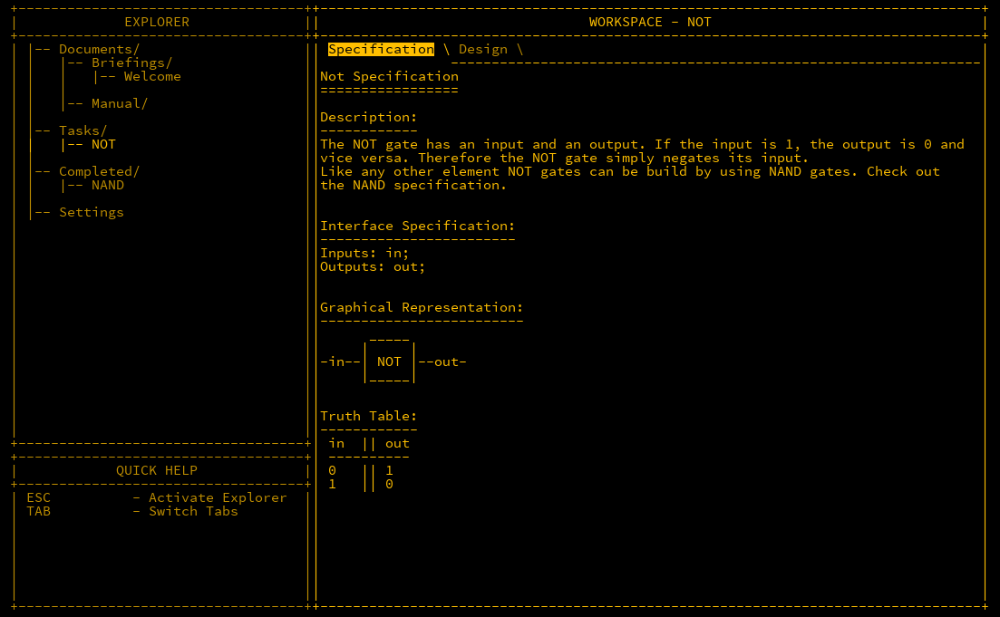
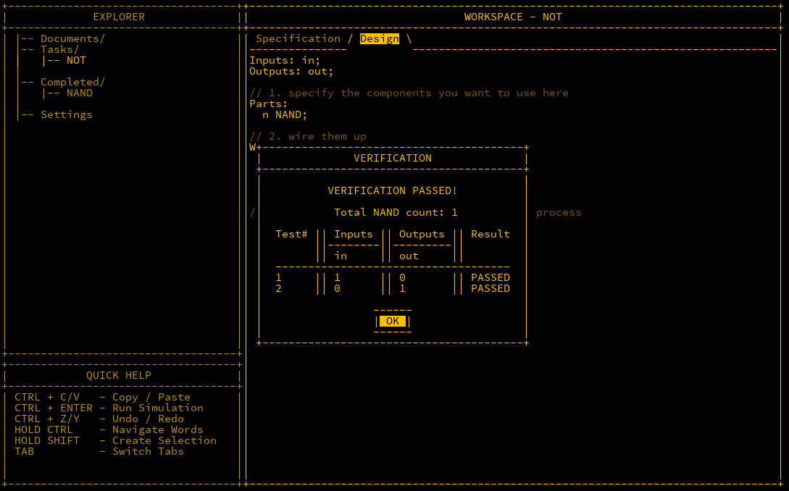
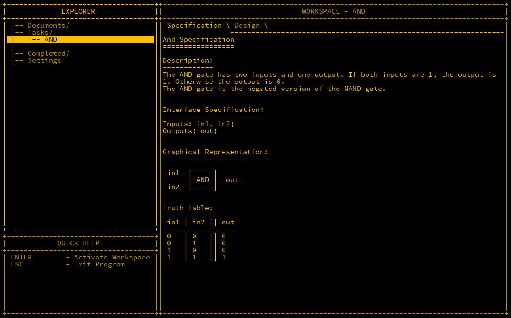
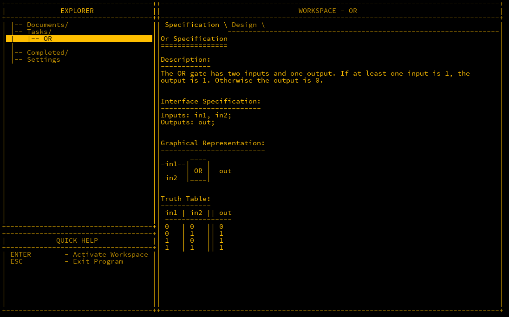
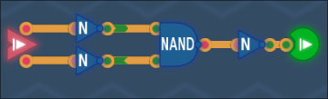
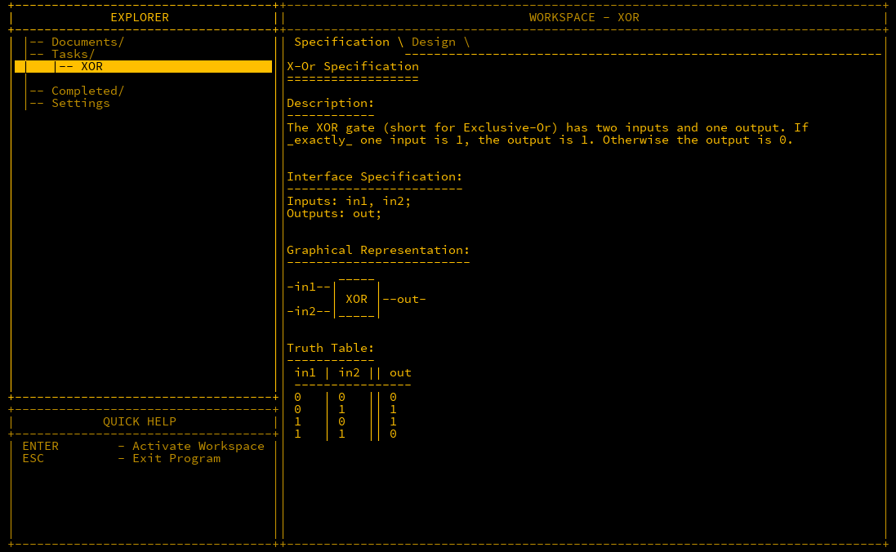
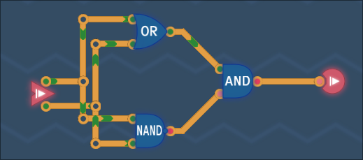
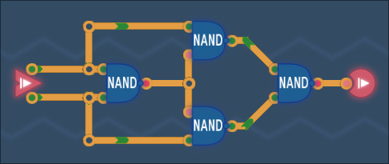
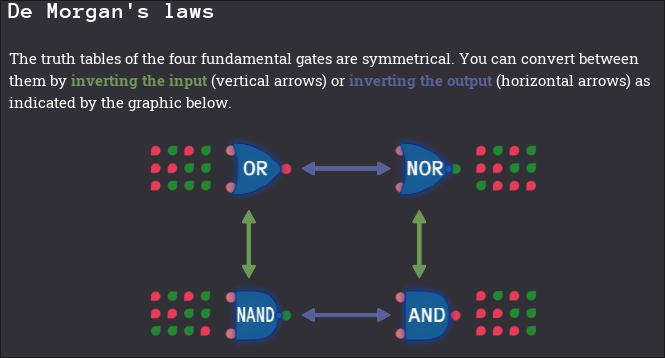

## Initial

Now that we have the initial building block of a NAND gate under our belt, the next step is to start building new gates from it.  We will work on NOT, AND, OR, NOR and XOR gates next.  

## NOT Gate

The NOT gate takes one input only and negates it, i.e. turn `1` into `0` and vice versa. This is useful for flipping a bit for example.


*NOT gate symbol*

Below is the MHRD documentation.



We can replicate the truth table using just a NAND gate but inputting the single NOT input into both NAND inputs. If `in1` and `in2` are both `0` then the output is `1` and vice-versa.  It looks like this in Turing Complete:


Designing this in MHRD can be done in the 'Design' tab of the component.  It explains the inputs and outputs given, and you have to declare what parts you intend to use and how they are connected. The design for this part is as follows:

```matlab
Inputs: in;
Outputs: out;

Parts:
  n NAND;

Wires:
  in -> n.in1,
  in -> n.in2,
  n.out -> out;
```

Once this is wired up, run the simulation to check it is correct (CTRL + ENTER).



Once a test has completed, other new components for designing appear. Next is the AND gate.

## AND Gate

As the name implies, the AND gate only outputs `1` if both inputs are also `1`, otherwise `0`. AND gates are useful when you want to check if two or more inputs are true.


*AND gate Symbol*



As we have a NAND and a NOT gate, we can invert the output of the NAND using the NOT to get the same results. Double NOTs cancel each other out so a NOT NAND is an AND.


Wiring this up looks like this:

```matlab
Inputs: in1, in2;
Outputs: out;

Parts:
  nand NAND,
  not NOT;

Wires:
  in1 -> nand.in1,
  in2 -> nand.in2,
  nand.out -> not.in,
  not.out -> out;
```

## OR Gate

Similar to the above, the name gives it away, if any of the inputs is `1` then the output is `1` else `0`. This is useful for checking if any input is true.


*OR gate symbol*



Taking a look at the output, all outputs are true except when the inputs are all `0` which is the same as a NAND gate except the conditions there are when all inputs are `1`.  This suggests that we need to flip each of the input values with a NOT before feeding into a NAND like so:


```matlab
Inputs: in1, in2;
Outputs: out;

Parts:
  n1 NOT,
  n2 NOT,
  nand NAND;

Wires:
  in1 -> n1.in,
  in2 -> n2.in,
  n1.out -> nand.in1,
  n2.out -> nand.in2,
  nand.out -> out;

```

## NOR Gate


Although not covered in MHRD, Turing Complete also talks about a NOR gate, which implies that it's a NOT-OR gate.

As it's a negation of the output of an OR gate, all that's needed is to add a NOT after the output of the last gate above.



## XOR Gate

The previous gates were fairly intuitive, in that you could figure out the actions of it by the name. This next gate differs from that which is the XOR (Exclusive OR) gate.  XOR gates output `1` if only one input is `1` else `0`.  Their usages are quite varied but for now, just think of it as a difference checker.


*XOR gate symbol*



There's a simple solution to this but also a more complex one with less parts.  One thing you'll notice is that each solution has a NAND count, the lesser the better as parts with a higher NAND count are slower.  Let's go over the two solutions.

### Solution 1

The truth table is identical to an OR table except for one condition and the same as a NAND gate. We can use the outputs of both and AND them like so:

| OR out | NAND out | OUT |
| ------ | -------- | --- |
| 0      | 1        | 0   |
| 1      | 1        | 1   |
| 1      | 1        | 1   |
| 1      | 0        | 0   |

The diagram is a representation of the above


The wiring of this is:

```matlab
Inputs: in1, in2;
Outputs: out;

Parts:
 a AND,
 n NAND,
 o OR;

Wires:
 in1 -> o.in1,
 in2 -> o.in2,
 in1 -> n.in1,
 in2 -> n.in2,
 o.out -> a.in1,
 n.out -> a.in2,
 a.out -> out;
```

This diagram has a NAND count of 6, but it can be reduced.

### Solution 2

This is more complicated to understand but bear with me.   First gate takes both inputs, so it will only output `0` when both are true. Next two gates which are identical except checking on different inputs will output `1` except when its corresponding input is `1` and the other is `0`. Final NAND combines the outputs of both.  It's hard to understand but this is a well regarded diagram, so we will use this instead.



```matlab
Inputs: in1, in2;
Outputs: out;

Parts:
 n1 NAND,
 n2 NAND,
 n3 NAND,
 n4 NAND; 


Wires:
 in1 -> n1.in1,
 in1 -> n2.in1,
 in2 -> n1.in2,
 in2 -> n3.in2,
 n1.out -> n2.in2,
 n1.out -> n3.in1,
 n2.out -> n4.in1,
 n3.out -> n4.in2,
 n4.out -> out;
```

## XNOR Gate


In Turing Complete, an XNOR gate is also created, which is just the negated output of an XOR gate:


## De Morgan's Laws

An interesting observation of OR/NOR/AND/NAND is their relationship to one another.  Obviously to convert an OR to a NOR, or an AND to a NAND, all that's needed to do is invert the output.  What's also interesting is that an OR can be converted to a NAND, and a NOR to an AND but inverting the inputs also.  This screenshot from Turing Complete represents this nicely.



## Conclusion

We've expanded out the NAND gate to build out four new but very powerful gates.  Next we will introduce the topic of using *buses* to compute larger bits of data.
