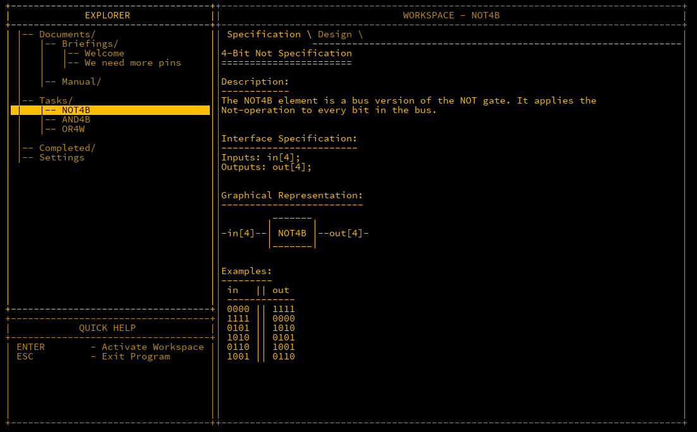
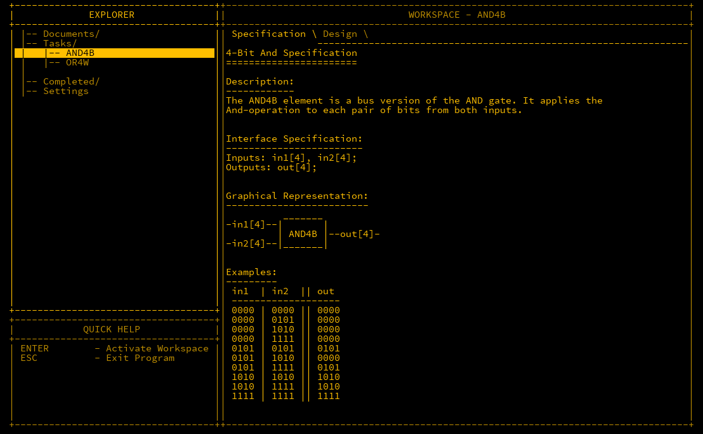
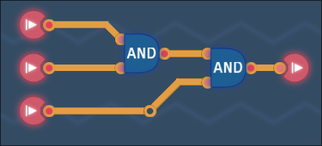
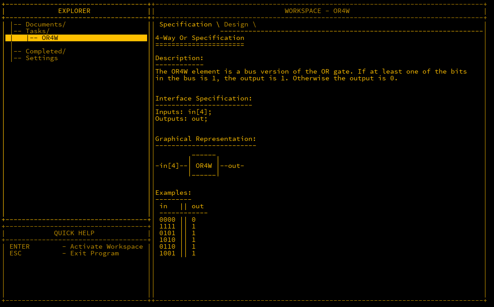
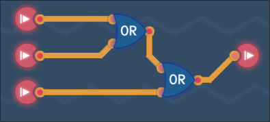
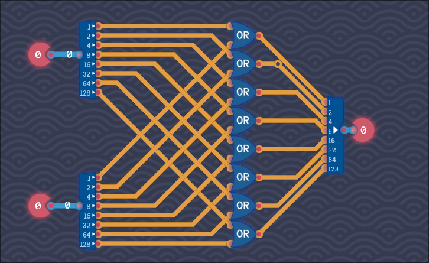
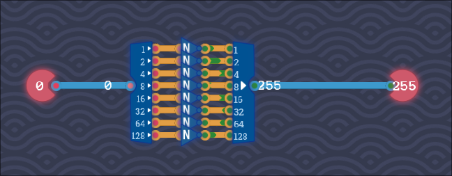

## Initial

We have a good collection of logic gates available to us, but there's still not a whole lot that we can do with them, as they only take in singular bits of information.  With a single binary input, we can only represent the numbers `1` and `0`.  If we want to start using numbers higher than this, more inputs in parallel must be used. Using 4 inputs, we can represent the numbers 0 to 15. 
### Understanding multiple bits
The first input would be the standard `1` or `0` mapping, but if we want to show the number `2`, an extra input must be used. When that is positive, it means that the value represented contains a 2. Further bits added can represent further values in multiples of 2, for example a third represents `4` and a fourth stands for `8`. A partial list of numbers would look like this: 

```
0 - 0000
1 - 0001
2 - 0010
3 - 0011
4 - 0100
5 - 0101
6 - 0110
7 - 0111
...
```


The concept of joining together multiple binary inputs is called a *bus* which is what will be explored in this post. Two main uses of buses are like above, representing larger values, and also performing logic calculations from more than two inputs. 

MHRD has presented us with three new challenges. Let's explore them to see the potential of each

## NOT4B

NOT4B stand for NOT 4-Bit, in that a NOT instruction is taken on 4 inputs. Pretty simple. MHRD documentation follows:



This takes 4 bytes as input, and they are flipped using 4 NOT gates.  There's a new terminology where multiple similar inputs are represented with brackets (`[]`). 
The wiring is:

```
Inputs in[4];
Outputs out[4];

Parts:
	n1 NOT,
	n2 NOT,
	n3 NOT,
	n4 NOT;

Wires:
	in[1] -> n1.in,
	in[2] -> n2.in,
	in[3] -> n3.in,
	in[4] -> n4.in,
	n1.out -> out[1],
	n2.out -> out[2],
	n3.out -> out[3],
	n4.out -> out[4];
```

This just takes each input, and inputs each into a NOT gate, and outputs it accordingly. 

## AND4B

Similar to the above, AND4B stands for a 4-bit AND gate. As there's two inputs in each AND gate, there will be a total of 8 inputs, in1[4] and in2[4].



Wiring up is the same as the not4b, just taking into consideration the two inputs instead of one.

```
Inputs: in1[4], in2[4];
Outputs: out[4];

Parts:
	a1 AND,
	a2 AND,
	a3 AND,
	a4 AND;

Wires:
	in1[1] -> a1.in1,
	in2[1] -> a2.in1,
	in3[1] -> a3.in1,
	in4[1] -> a4.in1,
	in1[2] -> a1.in2,
	in2[2] -> a2.in2,
	in3[2] -> a3.in2,
	in4[2] -> a4.in2,
	a1.out -> out[1],
	a2.out -> out[2],
	a3.out -> out[3],
	a4.out -> out[4];
```

When this is completed, you are informed that your partner in the game has created a few designs for you, an XOR4B and OR4B.

### TC - Bigger And Gate
A similar challenge is presented in Turing Complete, however just three inputs are used.  


## OR4W
This design is different than a 4B design as it takes 4 inputs (4-way) but only one output.  A OR4W design is useful for checking if any of the 4 inputs is true.



This can be achieved by using three OR gates. Gate 1 will take the first two inputs, gate 2 the next two, and gate three will take the inputs from the first two gates.  

```
Inputs: in[4];
Outputs: out;

Parts:
	o1 OR,
	o2 OR,
	o3 OR;

Wires:
	in[1] -> o1.in1,
	in[2] -> o1.in2,
	in[3] -> o2.in1,
	in[4] -> o2.in2,
	o1.out -> o3.in1,
	o2.out -> o3.in2,
	o3.out -> out;
```

Completing this design will also unlock the following gates: XOR16B, OR16W OR16B AND16B NOT16B NAND16B NAND4B.  It should be fairly obvious what is performed by each judging by the name alone.

### TC - Bigger OR Gate
A similar challenge is presented in Turing Complete, however just three inputs are used.  


## TC - OR8B
Turing Complete also has an 8-bit OR component. There's a new component called a splitter and its inverse called a maker in this also.  You may know by now that 8 bits put together is called a byte. A byte can be a value from 0 to 255.  The splitter breaks down a byte into each of its component bits, and the maker does the opposite.  The below diagram just ORs each respective bit and joins them back together.




## TC - NOT8B
Using the splitters and makers, an 8-bit NOT


## Conclusion
The basic gates are now completed.  We now move to building out the next layer of more complex components.   