## Initial

The time has come to start building out the next layer of components.  These are slightly more advanced and complex but shouldn't be too difficult to figure out.  

## MUX

A Multiplexer (MUX) component is a very useful piece of technology in that it takes two normal inputs, and depending on the value set on the third input called `sel`, will output the value of the corresponding input. If `sel` is set to `0`, then the value of `in1` is outputted, otherwise the value of `in2` is outputted.

It looks like this:

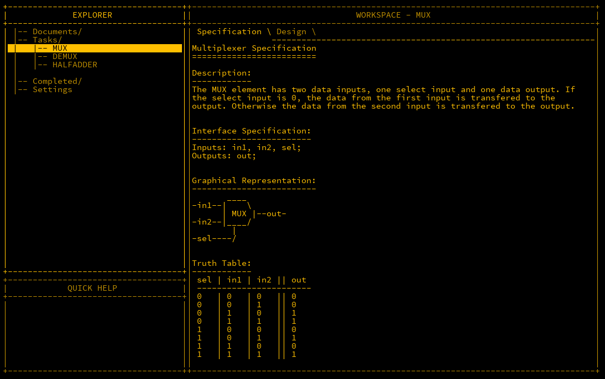

### Solution 1

To understand how we can build this, let's look at the behaviour if `sel` is set to `1`.  The output is only true if both `sel` and `in2` are true.  This can be calculated via an AND gate:

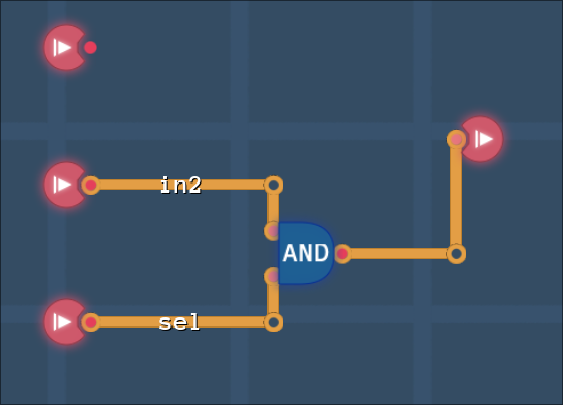

The same can also be done for `in1` however as `sel` is false, it has to be inverted via a NOT gate.  The outputs of both ANDs are then fed into an OR gate.

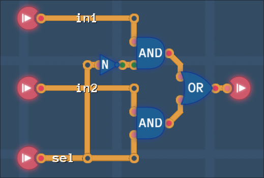

The code for this is:

```matlab
Inputs: in1, in2, sel;
Outputs: out;

Parts:
 n NOT,
 a1 AND,
 a2 AND,
 o OR;

Wires:
 in1 -> a1.in1,
 in2 -> a2.in1,
 sel -> n.in,
 sel -> a2.in2,
 n.out -> a1.in2,
 a1.out -> o.in1,
 a2.out -> o.in2,
 o.out -> out;
```

### Solution 2

There is a much more efficient solution however using just 4 NAND gates.  I personally prefer the first solution but if you want to be efficient, this can be used.

```matlab
Inputs: in1, in2, sel;
Outputs: out;

Parts:
  n1 NAND,
  n2 NAND,
  n3 NAND,
  n4 NAND;

Wires:
  in1 -> n1.in1,
  in2 -> n2.in2,
  sel -> n2.in1,
  sel -> n3.in1,
  sel -> n3.in2,
  n3.out -> n1.in2,
  n1.out -> n1.in1,
  n2.out -> n4.in1,
  n4.out -> out;

```

## DEMUX

Demutiplexers (DEMUX) are used to perform the opposite of a MUX, in that there is one input and two outputs, and a selector to choose which output to use.  This is similar to construct albeit a little simpler.


Looking at the truth table, we can see that positive outputs occur once for each output so two AND gates are to be used, as well as a NOT to flip the selector. This is actually very similar to the last component removing the OR gate.  Wiring is as follows:

```matlab
Inputs: in, sel;
Outputs: out1, out2;

Parts:
 n NOT,
 a1 AND,
 a2 AND;

Wires:
 in -> a1.in1,
 in -> a2.in1,
 sel -> n.in,
 n.out -> a1.in2,
 sel -> a2.in2,
 a1.out -> out1,
 a2.out -> out2;
 
```

## MUX4B

Like before, a MUX can be extended for a bus. Same concept except a 4bit bus as input 1 and 2, and one selector.

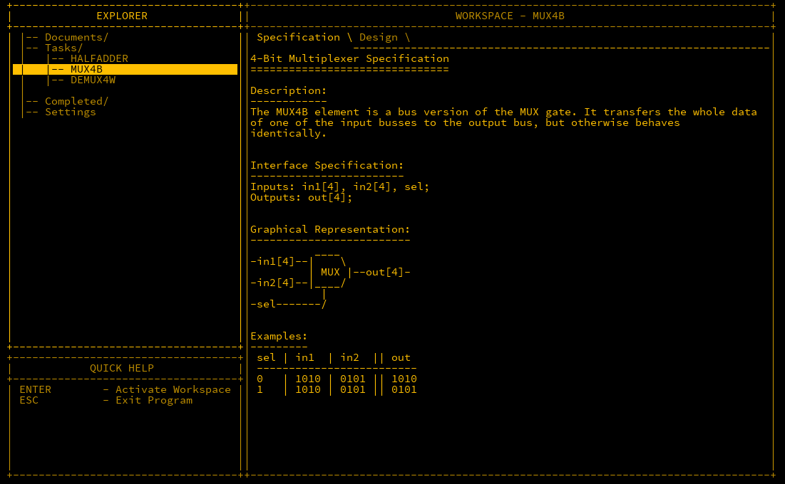

As we already have the MUX component built, we just extend from that.

```matlab
Inputs: in1[4], in2[4], sel;
Outputs: out[4];

Parts:
 m1 MUX,
 m2 MUX,
 m3 MUX,
 m4 MUX;

Wires:
 in1[1] -> m1.in1,
 in1[2] -> m2.in1,
 in1[3] -> m3.in1,
 in1[4] -> m4.in1,
 in2[1] -> m1.in2,
 in2[2] -> m2.in2,
 in2[3] -> m3.in2,
 in2[4] -> m4.in2,
 sel -> m1.sel,
 sel -> m2.sel,
 sel -> m3.sel,
 sel -> m4.sel,
 m1.out -> out[1],
 m2.out -> out[2],
 m3.out -> out[3],
 m4.out -> out[4];
```

## DEMUX4W

As the name implies, this is a Demultiplexer with 4 outputs.  What's new is that the selector has to be 2 bits in size as 4 outputs cannot be chosen with one only.

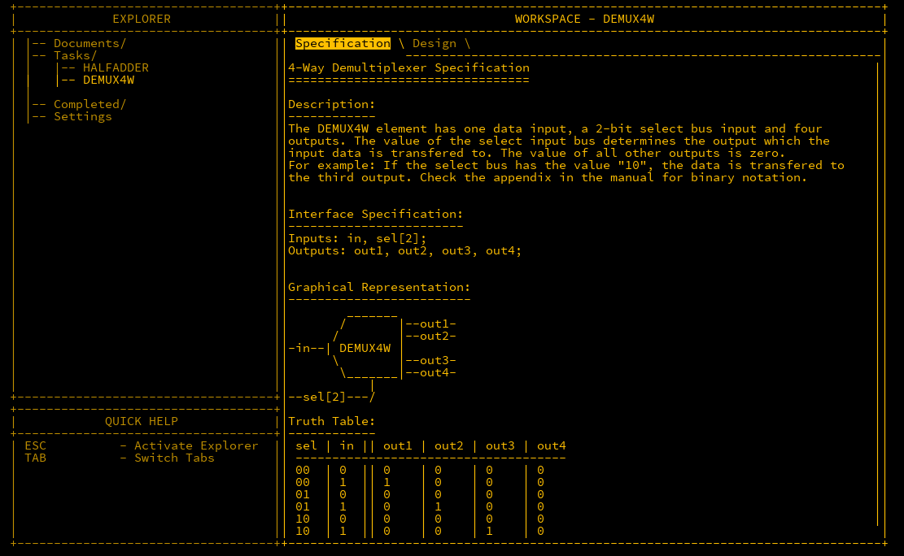

The first bit in the selector decides if it goes to out1/3 or out2/4.   The next is a further reduction to see if it goes to out1/2 or out3/4.  We just need 3 DEMUX components for this.

```matlab
Inputs: in, sel[2];
Outputs out1, out2, out3, out4;

Parts:
 d1 DEMUX,
 d2 DEMUX,
 d3 DEMUX;

Wires:
 in -> d1.in,
 sel[2] -> d1.sel,
 d1.out1 -> d2.in,
 d1.out2 -> d3.in,
 d2.out1 -> out1,
 d2.out2 -> out2,
 d3.out1 -> out3,
 d3.out2 -> out4,
 sel[1] -> d2.sel,
 sel[1] -> d3.sel;
```

Completing this unlocks MUX4W16B, MUX16B and DFF components.  The DFF will be discussed in the future.

## HALF ADDER

A core action of a CPU is the ability to add numbers together.  This component is the beginning of getting there.  A half adder takes two inputs and adds them together.  If both are `0`, then so is the output.  If one input is true then so is the output. If both are positive however, then a second output called `carry` is true.

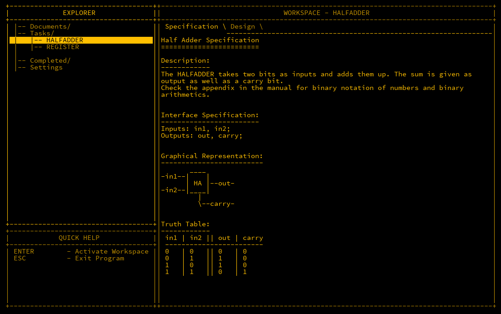

Adders can be joined together to add larger numbers together. The `carry` flag means something along the lines of "I can't represent this value, so I'm handing it off to something else".

Looking at the two outputs of this, the mappings should be familiar. The `out` is an XOR and the `carry` is an AND.  Let's just use those as our components.

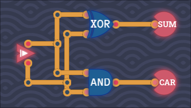

```matlab
Inputs: in1, in2;
Outputs: out, carry;

Parts:
 x XOR,
 a AND;

Wires:
 in1 -> x.in1,
 in2 -> x.in2,
 in1 -> a.in1,
 in2 -> a.in2,
 x.out -> out,
 a.out -> carry;
```

This is called a half adder as it can only calculate two inputs, and cannot input a carry from another adder. The next piece will also include a carry input.

## FULLADDER

A full adder is similar to the half adder as mentioned however it will also include a new input `carryIn`. As the name implies, this takes in a third input of a carry from another adder.  This will be used to add values of larger bits together.

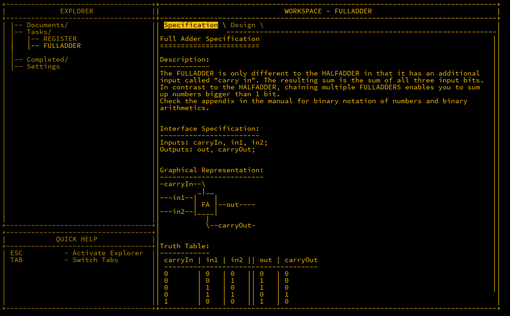

The trust table for this is:

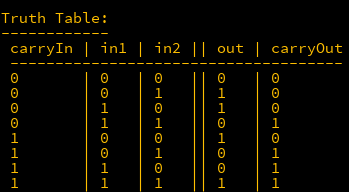

### Solution 1

Looking at the `out` map, the first half is an XOR like before, however the second half is an inverted XOR, the `carryOut` is also an AND for the first half but the second half looks like an OR gate.  There is temptation to rebuild a new design from scratch, but since we have built out half adders and DEMUX components, let's attempt to exclusively use those first.

First, use a half adder for when the `carryIn` is `0`. Take both outputs and place into MUX gates so the other half can be wired in later. Wire the `carryIn` into both MUX gates as the selector. When `carryIn` is `0`, it will work perfectly.  

```matlab
Inputs: carryIn, in1, in2;
Outputs: out, carryOut;

Parts:
 h1 HALFADDER,
 m1 MUX,
 m2 MUX;

Wires:
 in1 -> h1.in1,
 in2 -> h1.in2,
 h1.out -> m1.in1,
 h1carry -> m2.in1,
 carryIn -> m1.sel,
 carryIn -> m2.sel,
 m1.out -> out,
 m2.out -> carryOut;
```

Adding a HALFADDER in the same manner will not work. If we take a look at the outputs for when `carryIn` is `1`, the output can only be achieved by negating both the inputs and the outputs. It's a little clumsy but it works.

```matlab
Inputs: carryIn, in1, in2;
Outputs: out, carryOut;

Parts:
 h1 HALFADDER,
 h2 HALFADDER,
 m1 MUX,
 m2 MUX,
 n1 NOT,
 n2 NOT,
 n3 NOT,
 n4 NOT;

Wires:
 in1 -> h1.in1,
 in2 -> h1.in2,
 h1.out -> m1.in1,
 h1.carry -> m2.in1,

 in1 -> n1.in,
 in2 -> n2.in,
 n1.out -> h2.in1,
 n2.out -> h2.in2,
 h2.out -> n3.in,
 h2.carry -> n4.in,  
 n3.out -> m1.in2,
 n4.out -> m2.in2,
 carryIn -> m1.sel,
 carryIn -> m2.sel,
 m1.out -> out,
 m2.out -> carryOut;
```

While this works, it feels a little clumsy.  Let's try a simpler approach.

### Solution 2

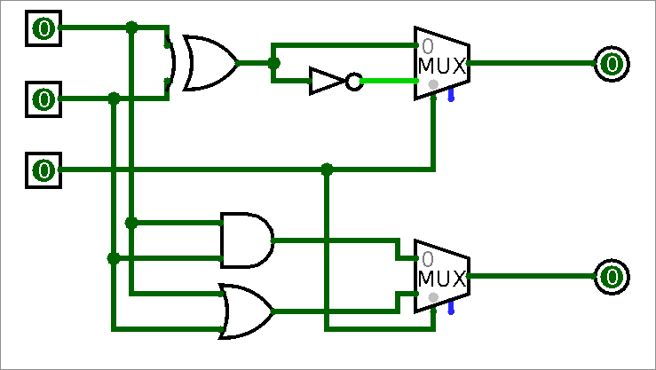

Looking back at the truth table, the `out` is an XOR, then an inverted XOR, so XOR the inputs, and the output and its negative are inputted into a MUX which is controlled by the `carryIn` bit.  

The `carryOut` value is an AND gate when `carryIn` is `0` and an OR gate when it is `1`. Using another MUX, this is easy to create.

Wiring this up:

```matlab
Inputs: carryIn, in1, in2;
Outputs: out, carryOut;

Parts:
 x XOR,
 a AND,
 o OR,
 n NOT,
 m1 MUX,
 m2 MUX;

Wires:
 in1 -> x.in1,
 in1 -> o.in1,
 in1 -> a.in1,
 in2 -> x.in2,
 in2 -> o.in2,
 in2 -> a.in2,
 x.out -> n.in,
 x.out -> m1.in1,
 n.out -> m1.in2,
 carryIn -> m1.sel,
 m1.out -> out,
 a.out -> m2.in1,
 o.out -> m2.in2,
 carryIn -> m2.sel,
 m2.out -> carryOut;
```

Not only was this easier to understand than the first solution, but the NAND count is smaller, going from 32 down to 26.

### Solution 3 - TC's Version

Turing Complete has a different approach, as the MUX components are not available yet.  The three inputs are fed into two XOR gates. This will check to see if the inputs are odd (even numbers will have `0` out.), Next, three AND comparisons against all three inputs are made, and if any are true, then the `carryOut` is true.

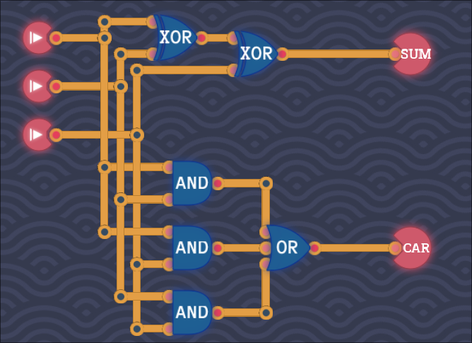

Overall, I like solution 2 best, but solution 3 is also quite elegant.

## ADDER4B

Our last component is joining multiple adders together to add 2 4-bit values together.

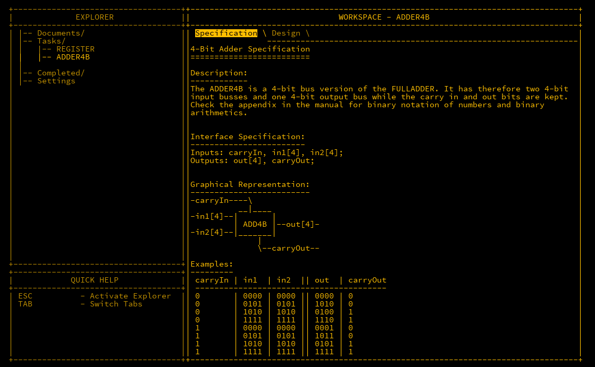

If you understand the role of the carry bit, then this should be trivial to create. All we need are 4 FULLADDERs chained up correctly.  Note that some adders use a HALFADDER for the least significant bit (LSB) however as there is a `carryIn` input, we cannot do that.

Wiring is:

```matlab
Inputs: in1[4], in2[4], carryIn;
Outputs: out[4], carryOut;

Parts:
 f1 FULLADDER,
 f2 FULLADDER,
 f3 FULLADDER,
 f4 FULLADDER;

Wires:
 in1[1] -> f1.in1,
 in2[1] -> f1.in2,
 in1[2] -> f2.in1,
 in2[2] -> f2.in2,
 in1[3] -> f3.in1,
 in2[3] -> f3.in2,
 in1[4] -> f4.in1,
 in2[4] -> f4.in2,

 f1.out -> out[1],
 f2.out -> out[2],
 f3.out -> out[3],
 f4.out -> out[4],

 carryIn -> f1.carryIn,
 f1.carryOut -> f2.carryIn,
 f2.carryOut -> f3.carryIn,
 f3.carryOut -> f4.carryIn,
 f4.carryOut -> carryOut;
```

New design unlocked: ADDER16B

## TC - Byte Adder

In Turing Complete, we can extend the above to 8 bits where the same can be performed with a carry input and output.

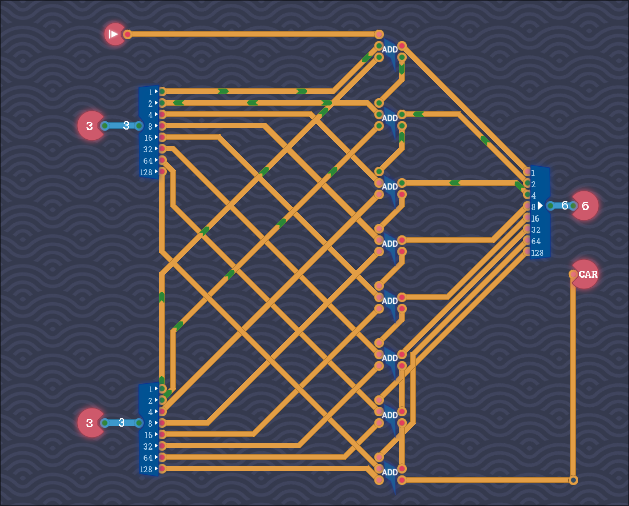

## Conclusion

We can now add two 4-bit values together, even 2 16-bit values which is the first component used in the *Arithmetic Logic Unit* (ALU).
