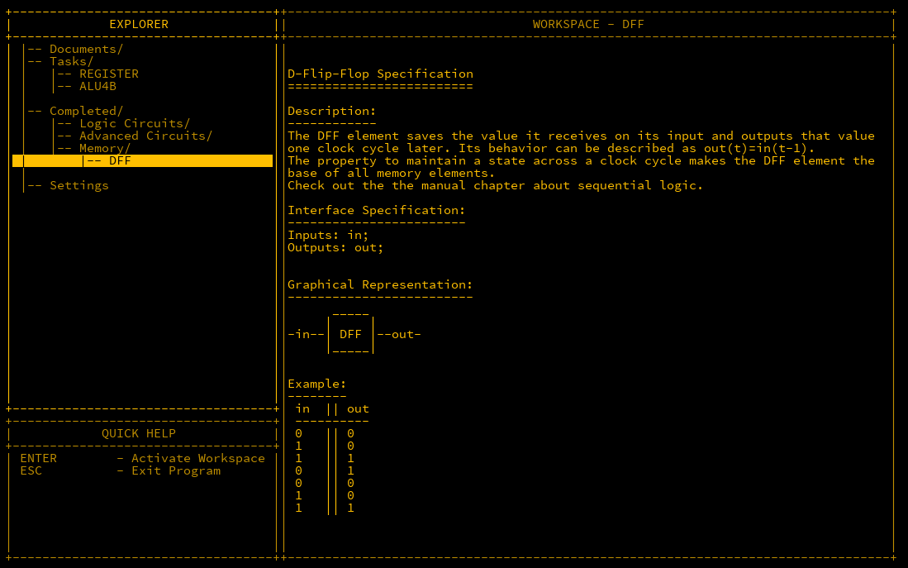
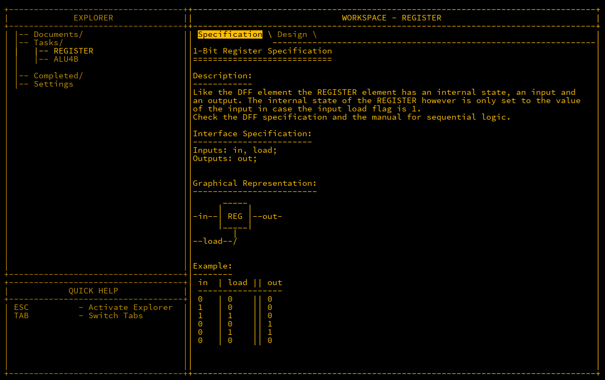
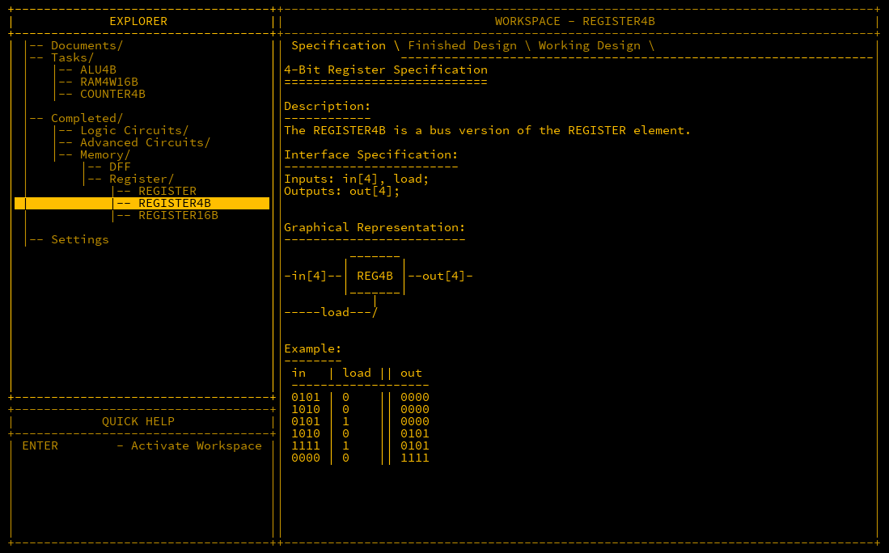
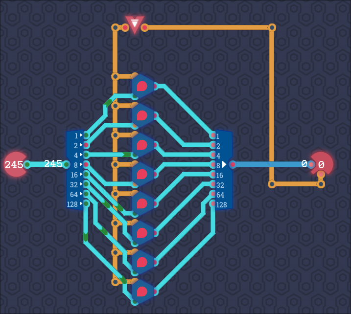
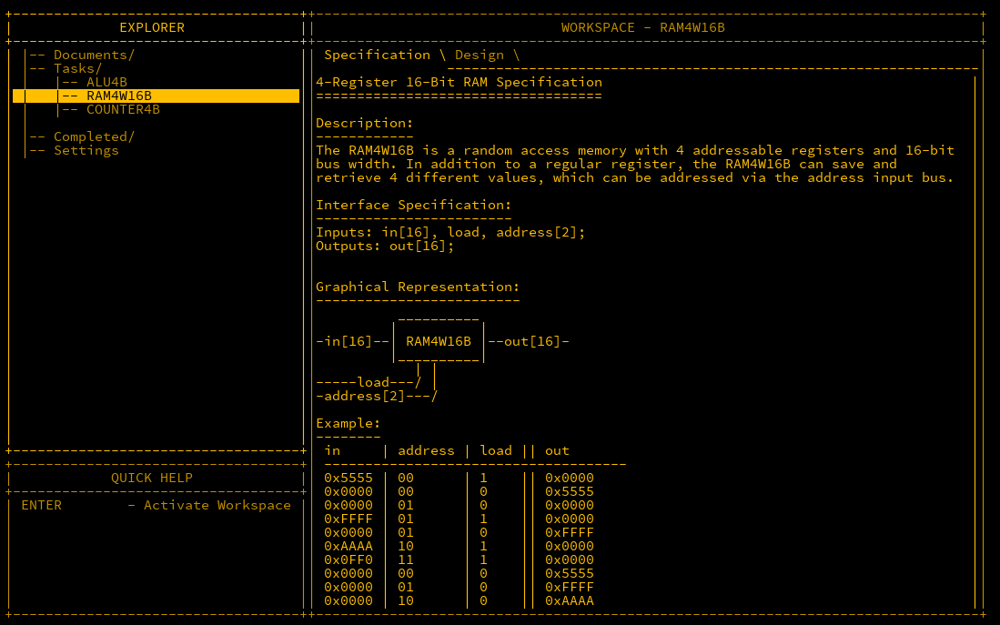
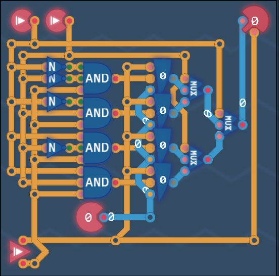

We turn our attention now to using storage of data. Data storage is crucial for performing calculations for example where the input values to be calculated are stored before calculation as well as the output afterwards.  In cases like this, a *register* is the most common component used.

## Registers

Registers are at the very core of a CPU.  A register is a component that can store and hold a value that can be called back later. In programming terms it is similar to a variable.  For a register to work, it must have an input of the value to be stored, and a `load` input that tells the register to read the input and store it.

In MHRD, the *DFF* (D-Flip-Flop) component should be unlocked by now, which is a device that takes an input and outputs the value of the input one clock cycle later.  Clock cycles determine how fast a CPU can run and is set by a *clock* component which will be discussed later.  As you can see below, the out value is determined by the value of the input of the previous cycle.



As mentioned in the documentation for the register component, there is similar behaviour with it, so a clue is given that we need to use a DFF for building out the register.



The trick to this is repeatedly taking the output of the register and feeding it back to the register input *except* when the `load` is set true, where it would take the input of the `in` value instead.  This can be done using a MUX.  Wiring is as follows;

```matlab
Inputs: in, load;
Outputs: out;

Parts:
 d DFF,
 m MUX;

Wires:
 in -> m.in2,
 load -> m.sel,
 m.out -> d.in,
 d.out -> out,
 d.out -> m.in1;
```

This component can now accept a bit when desired, and repeatedly output it.

As there's no 1-bit MUX in Turing Complete, switches are used instead.


## Register4B

Storing just 1-bit is not very useful. In order to store larger values, more bit 1-bit registers are needed. A 4-bit register can hold a value from 0 to 15.  As we have already build out a 1-bit register, we just need to expand that out 4 times.



```matlab
Inputs: in[4], load;
Outputs: out[4];

Parts:
 r1 REGISTER,
 r2 REGISTER,
 r3 REGISTER,
 r4 REGISTER;

Wires:
 in[1] -> r1.in,
 in[2] -> r2.in,
 in[3] -> r3.in,
 in[4] -> r4.in,
 load -> r1.load,
 load -> r2.load,
 load -> r3.load,
 load -> r4.load,
 r1.out -> out[1],
 r2.out -> out[2],
 r3.out -> out[3],
 r4.out -> out[4];
```

This design also unlocks the REGISTER16B design which again is a further extension of the same concept.

Turing Complete has a similar challenge. Note that this is for 1-byte (8-bits) and there's also the ability to toggle the output via a an input in the output component.


## RAM4W16B

As mentioned, registers are really useful in a CPU for calculations, but what it you wanted to store a bunch of data? The answer is *Random Access Memory* or *RAM* which is vital for most computers to function.  RAM can be written to and recalled at a later stage just like a register, in fact RAM is in essence a bunch of registers tied together.  To in order to access a register to read/write, an *address* is assigned to each.  This component only has 4 registers so it's quite small but a good place to start.



### What the 0xFF?

If you're confused by all the `F` values in the example above, it's a good time to talk about hexadecimal notation.  Humans count to 10 as (most of us) have 10 fingers.  As far as I know, computers have zero fingers so are not hindered by this primitive limitation.  Using 1-bit, a computer can only count to 1, using 4-bits however they can count up to 15 (starting from 0).  Numbers from 0-9 are great as they only take up one character of information, however base-10 numbers are called so as there's only 10 of them and when you add 1 to 9, you can no longer use one character.  As computers love using numbers from 0-15 and multiples of such, hexadecimal notation is preferred. In hex, the decimal number 10 is represented as `A`, 11 as `B` up to 15 which is `F`. Hex numbers are prepended with `0x` to differentiate between decimal and hex.

You may recall that a *byte* is the standard unit for data which comprises of 8 bits.  As hex only represents 4 bits, another character is added to represent the other 4 bits. The highest value a byte can hold is 255 which in hex is `0xFF`. The inputs above are 2 bytes (or 16 bits) in size, and the value of the 4th input is `0xFFFF` which is 255 x 255 (65535). It's a little tough at first to think in hex over decimal however you will quickly adapt.

### Wiring

As there are 16 bits as input, you're probably thinking that the wiring of this will be a nightmare which it would be if there wasn't a handy shortcut we can use. In MHRD, if an input has the same byte size as a component input, there is no need to wire them individually by bit but as the full name instead.

The first components to line up are 4 register16Bs which will store the values. Next is to wire up the `in` to all registers which is harmless as the value will not be stored unless the `load` value is active.  Next item is tackling the address which easily handled by an unlocked piece DEMUX4W. The DEMUX4W has 1 input for the `load` value, a 2 bit `sel` which can take the address, and 4 outputs that can be wired up to the `load` of each register.  The output is similarly handled, firstly the output of the selected address can be handled using another unlocked piece, the MUX4W16B which takes 4 16-bit inputs, a two bit `sel` which is again for the address, and one output which is piped to the `out` output.

Wiring is as follows:

```matlab
Inputs: in[16], load, address[2];
OutputsL out[16];

Parts:
 r1 REGISTER16B,
 r2 REGISTER16B,
 r3 REGISTER16B,
 r4 REGISTER16B,
 loader DEMUX4W,
 regout MUX4W16B,

Wires:
 in -> r1.in,
 in -> r2.in,
 in -> r3.in,
 in -> r4.in,
 load -> loader.in,
 address -> loader.sel,
 loader.out1 -> r1.load,
 loader.out2 -> r2.load,
 loader.out3 -> r3.load,
 loader.out4 -> r4.load,
 r1.out -> regout.in1,
 r2.out -> regout.in2,
 r3.out -> regout.in3,
 r4.out -> regout.in4,
 address -> regout.sel,
 regout.out -> out;
```

Designed unlocked: RAM64K16B

### TC Version

Turing Complete has a nice challenge to make the same circuit but with two differences. We don't have DEMUX switches to enable easy selection of registers, and there's a physical constraint to making it work to make it more challenging.  



## Conclusion

Having the registers and RAM components unlocked is a big step towards our goal of building a simple computer. The component last unlocked gives 64k (65535) bytes of memory to play with which when you're programming at such a low level can be massive.  Registers also also a vital component of a CPU.
