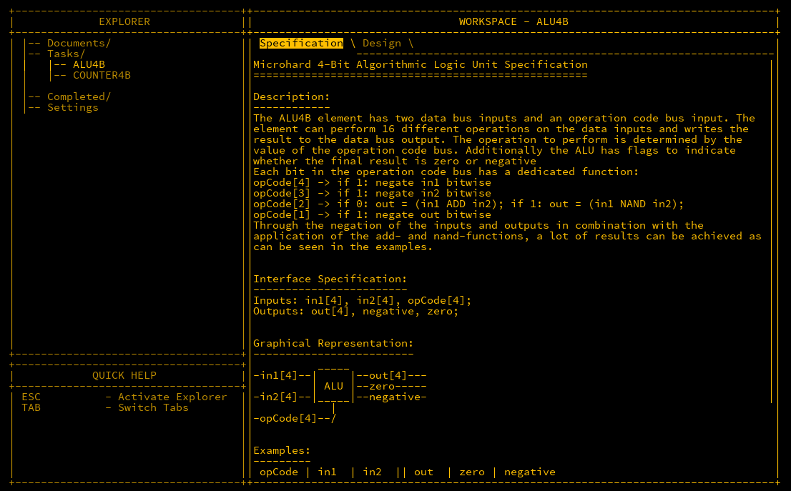

## Initial

The *Algorithmic Logic Unit* (ALU) is the core component to perform calculations within a CPU.  It normally takes two inputs and has one output. In addition to this, there is an operation code (opcode) input which will decide what to do with the two inputs. For example, if you wanted to ADD the two inputs together, the opcode would be one value, and maybe you wanted to subtract one from the other, that would be another value.   ALU designs of what the perform and what opcodes do what are are entirely up to the designer, however as we are attempting to build out MHRD's tasks, let's start there.

## ALU4B
The ALU below take 2 4-bit inputs as well as a 4-bit `opCode` value which gives a possible 16 different opcodes to chose from. There are also two 1-bit outputs called `negative` and `zero` to represent when an output is one of these.



The example table below represents what the opcodes intend to perform:

| opCode | in1 | in2 | out | zero | negative | action |
| ---- | ---- | ---- | ---- | ---- | ---- | ---- |
| 0000 | 0011 | 0101 | 1000 | 0 | 1 | in1 + in2 |
| 0000 | 0001 | 1111 | 0000 | 1 | 0 | overflow |
| 0101 | 0011 | 0101 | 0010 | 0 | 0 | in2 - in1 |
| 1001 | 0011 | 0101 | 1110 | 0 | 1 | in1 - in2 |
| 0010 | 0011 | 0101 | 1110 | 0 | 1 | in1 nand in2 |
| 0011 | 0011 | 0101 | 0001 | 0 | 0 | in1 and in2 |
| 1110 | 0011 | 0101 | 0111 | 0 | 0 | in1 or in2 |
| 0101 | 0011 | 0000 | 1101 | 0 | 1 | -in1 |
| 0001 | 1100 | 0000 | 0011 | 0 | 0 | not in1 |

### Negative Numbers
Now is a good time to talk about how negative numbers are represented in binary. As it is impossible to just add a `-` symbol in binary, a little trick is instead used to show that a number is a negative by using the *most significant bit* (MSB). If the MSB is set to `1`, then it means that the value it is representing is negative.  Easy right? Well not quite. There is a nuance which is required to be understood first.

### Signed vs Unsigned
Up until now, it was only known that a 4-bit value could any number between `0-15` as it has $2^4$ (16) possible permutations.  This is known as an *unsigned integer* as is only can be positive. In this ALU, the idea of using negative numbers is enforced, so if we are to use the MSB as a negative sign, then we can only represent $2^3$ (8) different values, with the indicator of positive or negative being used as the 4th bit.

For positive values, the first 8 possibilities in the range are identical to an unsigned integer i.e. `0000 = 0` and `0111 = 7`.  The other 8 are different however.  Suppose for a moment that we have a secret 5th bit in a binary value like so: `10000`. If it is subtracted by 1, then the value would be `01111`.  Removing the bit again shows how the behaviour works.  `0 - 1 = -1` in decimal would be `0000 - 1 = 1111` where `1111` is the equivalent of `-1`.  Continuing to minus down until you reach the lowest possible value `1000`, it would be observed that this represents `-8`.  So, in reality a -bit signed value can range from `-8 `to `7`.

As the output will be the same if the inputs are treated as signed or unsigned, the actual calculations do not matter.

### Negating Signed Integers
You may ask why `-8` can be represented and not `8` and the answer is simple, the zero value `0000` is added to the positive side.  As there is only zero and not negative zero, the nuance I mentioned becomes apparent when a wanting to negate a signed value.  The quick and easy way to negate a value is to flip all its bits, *then* add an extra bit to balance out the fact zero messes things a little. For example:

```
2 = 0010
# flip all the bits...
1101
# add 1 bit...
-2 = 1110
```

As we know `-1 = 1111`, it's clear that the above is correct. The reverse is also true:

```
-2 = 1110
# flip all the bits
0001
# add 1 bit...
2 = 0010
```

For this ALU however, the handling of the extra bit is not performed, and negating is just a simple flip of all bits. When performing arithmetic, it works perfectly as intended.
### OpCodes and Implied Instructions

The 4 opcodes we can use are quite powerful even though they appear basic.  Let's go through them again:
- `opCode[1]` - Negate the output if `1`
- `opCode[2]` - Input into ADD if `0`, otherwise input into a NAND
- `opCode[3]` - Negate input 2 if `1`
- `opCode[4]` - Negate input 1 if `1`

Quick note also in case there is confusion ahead. `opCode[1]` (LSB) is on the right and `opCode[4]` (MSB) is on the left. This is a common observation in binary.
#### 0000 - in1 + in2 [ADD]
This is the one of the two simplest opcodes in this ALU.  As `opCode[3]` is `0`, the two inputs are untouched as well as the output.
#### 0010 - in1 nand in2 [NAND]
This is the second of the simplest.  With `opCode[3]` as `1`, the NAND gate is used instead.
#### 0011 - in1 and in2 [AND]
As we learnt with De Morgan's Laws, a NAND output can be converted to an AND output by negating the output. As this is done by `opCode[4]`, this is identical to using an AND gate.
#### 1001 - in1 - in2 [SUB]
Here, `opCode[4]` is `1` meaning that `in2` is negated which is the same as `in1 - in2`.  
#### 0101 - in2 - in1 [SUB]
Same as above but opposite.
#### 1110 - in1 or in2 [OR]
Again pulling from De Morgan's Laws, if the inputs of a NAND gate are both inverted, then it replicates an OR gate

## Conclusion
The ALU is a very useful tool for perform logic and arithmetic calculations. With the logic laid out above, you probably have a half decent idea on how to wire most of this which will be covered next.

NOTE: ALU16B