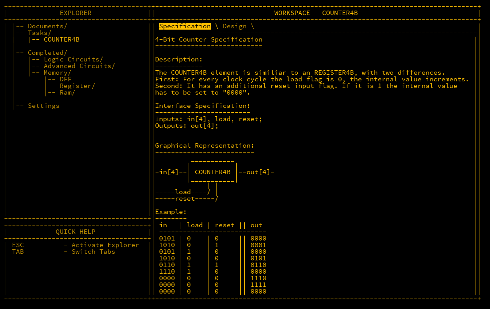

## Initial

Now that the concept of the ALU has been documented, the wiring of the device comes next. There are multiple ways to complete this challenge however I believe I have crafted one of the better ways to perform this.

## ALU4B - Wiring

Firstly, let's start with the predefined inputs/outputs and I've added the parts required:

```matlab
Inputs: in1[4], in2[4], opCode[4];
Outputs; out[4], negative, zero;

Parts:
  m1 MUX4B,
  m2 MUX4B,
  m3 MUX4B,
  m4 MUX4B,
  n1 NOT4B,
  n2 NOT4B,
  n3 NOT4B,
  a ADDER4B,
  nand NAND4B,
  n NOT,
  o OR4W;
```

### opCode[4] - Negating in1

If opCode[4] is true, then the value of `in1` is bitwise flipped. To do this in MHRD, the input of `in1` is fed into a NOT4B `n1` gate to handle the flipping. Next the output of `in1` and `n1` are fed into a MUX4B gate `m1`, using the opCode[4] as the `sel` will select if `in1` is negated or not. The wiring for this is:

```matlab
in1 -> m1.in1,
in1 -> n1.in,
n1.out -> m1.in2,
opCode[4] -> m1.sel;
```

### opCode[3] - Negating in2

The wiring for this is identical to the above, just with different components:

```matlab
in2 -> m2.in1,
in2 -> n2.in,
n2.out -> m2.in2,
opCode[3] -> m2.sel;
```

### opCode[2] - Selecting ADD or NAND

If `opCode[2]` is `0`, then the inputs of the two MUX4Bs are fed into an ADDER4B `a` gate, otherwise they are fed into an NAND4B `nand` gate.  The trick here is to not route the inputs into each component but rather select what output of each to select. This will be performed using a third MUX4B gate `m3`;

```matlab
m1.out -> a.in1,
m1.out -> nand.in1,
m2.out -> a.in2,
m2.out -> nand.in2,
a.out -> m3.in1,
nand.out -> m3.in2,
opCode[2] -> m3.sel;
```

### opCode[1] - Negating out

Very similar to the first two opCodes, the output is fed into a third NOT4B `n4`, and the output of that alongside the original output is fed into a fourth MUX4B `m4` using `opCode[1]` as the `sel`. The output of `m4` is then sent to `out[4]`.

```matlab
m3.out -> m4.in1,
m3.out -> n3.in,
n3.out -> m4.in2,
opCode[1] -> m4.sel
m4.out -> out;
```

### Negative Flag

For reasons that become apparent later, two flags are also outputted from the ALU, the first being the `negative` flag. This represents when a number is negative.  As discussed in the previous post, a number is potentially negative when the MSB is set to `1`.  As the bits are identical, the MSB of `m4` is piped to the `negative` flag.

```matlab
m4.out[4] -> negative;
```

### Zero Flag

To check if a number is != `0`, the output of m4 can be piped into an OR4B `o` gate, as if any bit in the output is positive, then the output cannot be zero.  Obviously, the opposite is what's requested, so a simple NOT `n` gate is used to negate this.

```matlab
m4.out -> o.in,
o.out -> n.in,
n.out -> zero;
```

Putting all of this together builds out a successfully operating ALU. Successfully creating this component unlocks the ALU16B component which performs the same actions as the ALU4B but with 16-bit inputs/outputs.

## COUNTER4B

The last remaining component in this section is the COUNTER4B which is useful for figuring out what part of the program we intend to run. The counter will increment by one per cycle if the `load` flag is `0`. If the flag is `1`, then the counter is loaded with the value of `in`. Also, it is reset to `0` if the `reset` flag is used.




First thing is to use a REGiSTER4B as the counter, and output that into an ADDER4B with the `carryIn` flag set to always be `1` which will continually increment the counter.  Next is to loop back the value to two MUX4Bs in order. The first one will handle the `load` input as its `sel`.  If `load` is `1` then it will use the input value instead. This is then outputted to the second MUX4B that uses the `reset` input as its `sel`.  As the value is set to `0` when reset, there is no need for a second input. Finally the output of the second MUX4B is inputted to the REGISTER4B that we started with. Note that the `load` input of the register is always set to `1`.  Wiring is as follows;

```
Inputs; in[4], load, reset;
Outputs: out[4];

Parts:
  r REgISTER4B,
  a ADDRE4B,
  m1 MUX4B,
  m2 MUX4B
;

Wires:
  r.out -> a.in1,
  r.out -> out,
  1 -> a.carryIn,
  1 -> r.load,
  a.out -> m1.in1,
  in -> m1.in2,
  load -> m1.sel,
  m1.out -> m2.in1,
  reset -> m2.sel,
  m2.out -> r.in;
```

Completing this unlocks the COUNTER16B component, and the final phase of building the MHRD CPU is upon us.  
## Conclusion

The ALU is now ready and all the major pieces are completed. The last stage of creating the CPU is all that remains.
