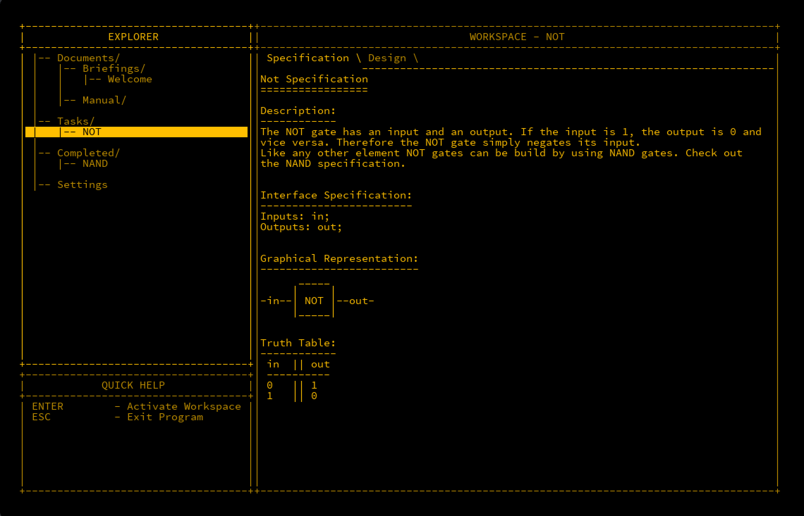
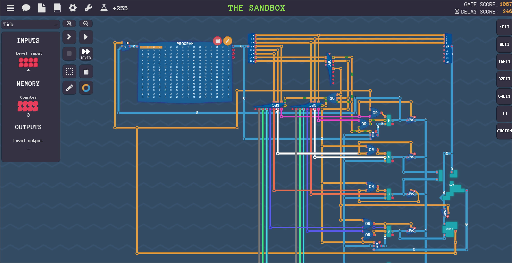
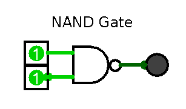
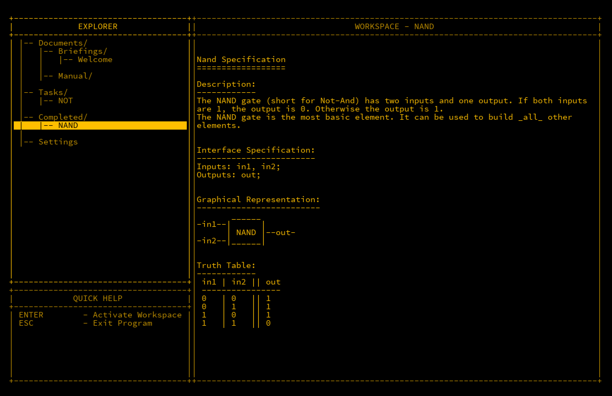

## Introduction

The field of digital electronics has always fascinated me. As a child in the 1980s, simply playing games on the Commodore 64 was not enough—I needed to know **how** they
were created. I vividly remember poring over magazines filled with BASIC code, typing them out line by line, often making mistakes and wondering why they didn't work. Even
when they did run, the games were slow and clunky. It was only later that I learned the code I was typing was in a high-level language that wasn’t as efficient.

The real magic on the Commodore 64 happened in **Assembly language (ASM)**, the low-level code used by developers to create fast and smooth games. However, at that age, I
found ASM far too complex to understand. Many years later, as I began studying malware and reverse engineering, I came across ASM again—this time not for creating games but
for understanding how computers operate at their core. This rekindled my curiosity about how CPUs function at a fundamental level, and after much research, I'd like to
share this journey with others who share my interest for understanding computers from the ground up.

---

## What is Assembly Language (ASM)?

**Assembly language** is a low-level programming language that is closer to what a CPU can directly understand. Technically, CPUs interpret **bytecode**, a series of machine
instructions, but this is difficult for humans to work with. ASM bridges the gap by providing a more human-readable version of bytecode.

One of ASM's primary advantages is its compactness. A few instructions can take up only a handful of bytes, making it highly efficient. It is also very fast to run, as it
operates close to the CPU's native language. This makes ASM a *low-level* language, in contrast to *high-level* languages like BASIC, which are easier for humans to write and
read but tend to be bulkier and slower in comparison.

This brief overview just scratches the surface of ASM—we will return to it later in more depth. But for now, it is important to understand that my curiosity about ASM led
me down a path of learning how CPUs operate at the most basic level.

---

## Learning Through Gaming

It is somewhat ironic that it was my want to code games that got me interested in digital electronics, and now there are games that can teach you the very fundamentals of
this field. Two games in particular, **MHRD** and **Turing Complete**, stand out for their educational value in hardware design and logic.

### MHRD

 [Steam Link](https://store.steampowered.com/app/576030/MHRD/)

**MHRD** is a hardware design game where you can build digital circuits from scratch, eventually constructing a basic CPU. The game features a retro-style terminal interface,
and you design circuits using a text-based syntax. It starts by teaching simple logic circuits and progressively moves to more complex systems, culminating in building a
working CPU.

### Turing Complete

 [Steam Link](https://store.steampowered.com/app/1444480/Turing_Complete/)

**Turing Complete** builds on the same fundamental concepts as MHRD but takes a more advanced approach. Instead of typing out connections, Turing Complete uses a graphical
user interface (GUI) that allows you to design circuits with your mouse. The game also gives you the freedom to design your own CPU and write a programming language to run
on it, offering almost unlimited possibilities.

In this series, we will start with **MHRD** to build a solid foundation in hardware design and then apply that knowledge to **Turing Complete** for more advanced projects.

---

## Further Reading

If you're looking to dive deeper, two other resources I found particularly valuable are:

1. **[NAND2Tetris](https://www.nand2tetris.org/):** This project takes a similar approach to MHRD, allowing you to build a computer from the ground up. In fact, if you complete
   MHRD, you will have already covered much of this course.
2. **[Digital Computer Electronics](https://archive.org/details/367026792DigitalComputerElectronicsAlbertPaulMalvinoAndJeraldABrownPdf1):** This book delves much deeper into
   digital electronics and includes instructions for building the SAP-1 (Simple As Possible) computer, a basic machine capable of executing small programmes. It is more
   technical and heavy-going, but extremely useful if you're serious about mastering the fundamentals.

---

## The NAND Gate

One of the first logic elements you will encounter in both **MHRD** and **Turing Complete** is the **NAND gate**. This tiny piece of hardware takes two binary inputs and
produces one output. Binary inputs can be either `TRUE` (1) or `FALSE` (0). The term “gate” is used because, much like a physical gate, it is either open or closed.
**NAND** stands for **NOT AND**, and it will become clear why this name is used when we explain its operation.

The beauty of the NAND gate lies in its versatility. In theory, all other types of logic gates and computer components can be constructed using just NAND gates. The basic
theory behind a NAND gate is that it outputs `TRUE` (1) as long as not both inputs are `TRUE` (1). If both input A and input B are 1, then the output will be `FALSE` (0).

### Boolean Logic

Boolean logic is used to describe how logic gates, including NAND gates, operate. To better understand this, we can use a **truth table** to represent the possible input
and output combinations for a NAND gate. Since there are two inputs with two possible values (0 and 1), there are four possible input combinations:

#### NAND Gate Truth Table

| Input A | Input B | Output |
| ------- | ------- | ------ |
|    0    |    0    |    1   |
|    0    |    1    |    1   |
|    1    |    0    |    1   |
|    1    |    1    |    0   |

The following is a graphical representation of a NAND gate. The `D` shape represents an AND gate, and the small circle (called a "bubble") indicates negation or inversion.
If you remove the bubble, you are left with an AND gate.

As you can see from the truth table, the NAND gate will output `1` unless both inputs are `1`. In **MHRD**, you will have the opportunity to experiment with this gate and
observe its behaviour.

---

## Conclusion

Now that we have explored the basic building block of the NAND gate, we are ready to begin constructing more complex circuits. In the next post, we will see how combining
logic gates can lead to more advanced, functional circuits, laying the groundwork for even greater projects.

*Note: This was originally published in July 2024*