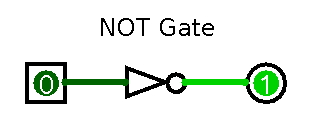
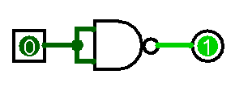
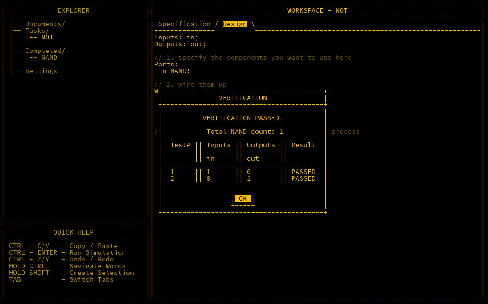
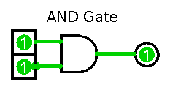
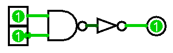
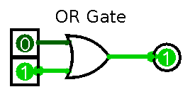
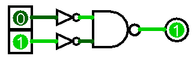
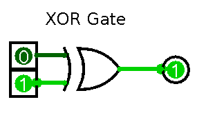
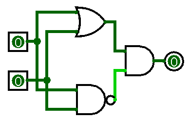
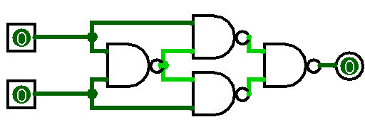

## Introduction

With the basic NAND gate under our belt, the next step is to use it to construct other logic gates. In this post, we will focus on building the NOT, AND, OR, and XOR gates.

---

## NOT Gate

The **NOT** gate takes a single input and negates it, turning `1` into `0` and vice versa. This is useful, for instance, when you need to invert a bit.



In MHRD, we can construct a NOT gate using a single NAND gate by wiring the input into both of the NAND inputs. If both `in1` and `in2` are `0`, the output will be `1`, and if
both are `1`, the output will be `0`. This replicates the NOT gate's truth table.



In MHRD, design this using the 'Design' tab. The component’s inputs and outputs are defined here, and you need to specify which parts to use and how to connect them. Below is
the design:

```matlab
Inputs: in;
Outputs: out;

Parts:
  n NAND;

Wires:
  in -> n.in1,
  in -> n.in2,
  n.out -> out;
```

After wiring this, run the simulation to check it works as expected (CTRL + ENTER).



---

## AND Gate

The **AND** gate outputs `1` only if both inputs are `1`, otherwise it outputs `0`. This is useful when checking whether two or more conditions are true.


*AND Gate Symbol*

With a NAND and a NOT gate already available, we can easily build an AND gate by inverting the NAND’s output using the NOT gate. Effectively, a NOT NAND becomes an AND gate.



Wiring this in MHRD looks like this:

```matlab
Inputs: in1, in2;
Outputs: out;

Parts:
  nand NAND,
  not NOT;

Wires:
  in1 -> nand.in1,
  in2 -> nand.in2,
  nand.out -> not.in,
  not.out -> out;
```

---

## OR Gate

The **OR** gate outputs `1` if at least one of its inputs is `1`, otherwise it outputs `0`. This is useful when you need to check if any one condition is true.


*OR Gate Symbol*

To create an OR gate from a NAND gate, we need to flip both input values with NOT gates before feeding them into the NAND gate, producing the required output.



The wiring looks like this:

```matlab
Inputs: in1, in2;
Outputs: out;

Parts:
  n1 NOT,
  n2 NOT,
  nand NAND;

Wires:
  in1 -> n1.in,
  in2 -> n2.in,
  n1.out -> nand.in1,
  n2.out -> nand.in2,
  nand.out -> out;
```

---

## XOR Gate

The **XOR** (Exclusive OR) gate outputs `1` only if one of the inputs is `1`. If both inputs are the same, the output is `0`. XOR gates are useful when checking for
differences between two inputs.


*XOR Gate Symbol*

There are two possible designs for an XOR gate. One solution uses more parts but is simpler to understand, while the other uses fewer parts but is more complex.

### Solution 1

This design is similar to an OR gate but with a different handling for the inputs if both are true. 

It uses both an OR gate and a NAND gate to achieve the correct result.

| OR out | NAND out | OUT |
| ------ | -------- | --- |
| 0      | 1        | 0   |
| 1      | 1        | 1   |
| 1      | 1        | 1   |
| 1      | 0        | 0   |

As you can see, if both inputs are true, then the the output is also true, so an AND gate is needed to combine the inputs of both the OR and NAND. 


The wiring for this looks like this:

```matlab
Inputs: in1, in2;
Outputs: out;

Parts:
 a AND,
 n NAND,
 o OR;

Wires:
 in1 -> o.in1,
 in2 -> o.in2,
 in1 -> n.in1,
 in2 -> n.in2,
 o.out -> a.in1,
 n.out -> a.in2,
 a.out -> out;
```

This solution has a NAND count of 6.

### Solution 2

This approach is more efficient, using fewer parts, but it is slightly more difficult to understand. The first gate outputs `0` when both inputs are `1`, and the two subsequent
gates handle the cases where one input is `1` and the other is `0`. The final NAND gate combines these outputs to produce the XOR result.



The wiring for this solution is as follows:

```matlab
Inputs: in1, in2;
Outputs: out;

Parts:
 n1 NAND,
 n2 NAND,
 n3 NAND,
 n4 NAND;

Wires:
 in1 -> n1.in1,
 in1 -> n2.in1,
 in2 -> n1.in2,
 in2 -> n3.in2,
 n1.out -> n2.in2,
 n1.out -> n3.in1,
 n2.out -> n4.in1,
 n3.out -> n4.in2,
 n4.out -> out;
```

---

## De Morgan's Laws

It is important to note the relationship between OR/NOR and AND/NAND gates. To convert an OR gate to a NOR gate or an AND gate to a NAND gate, you simply need to invert the
output. Moreover, an OR gate can be converted to a NAND gate by inverting the inputs as well. The following screenshot from **Turing Complete** demonstrates this concept.


---

## Conclusion

We have now expanded on the NAND gate by constructing the NOT, AND, OR, and XOR gates. In the next post, we will explore the concept of *buses* and how they are used to compute
larger amounts of data.


*Note: This was originally published in July 2024*