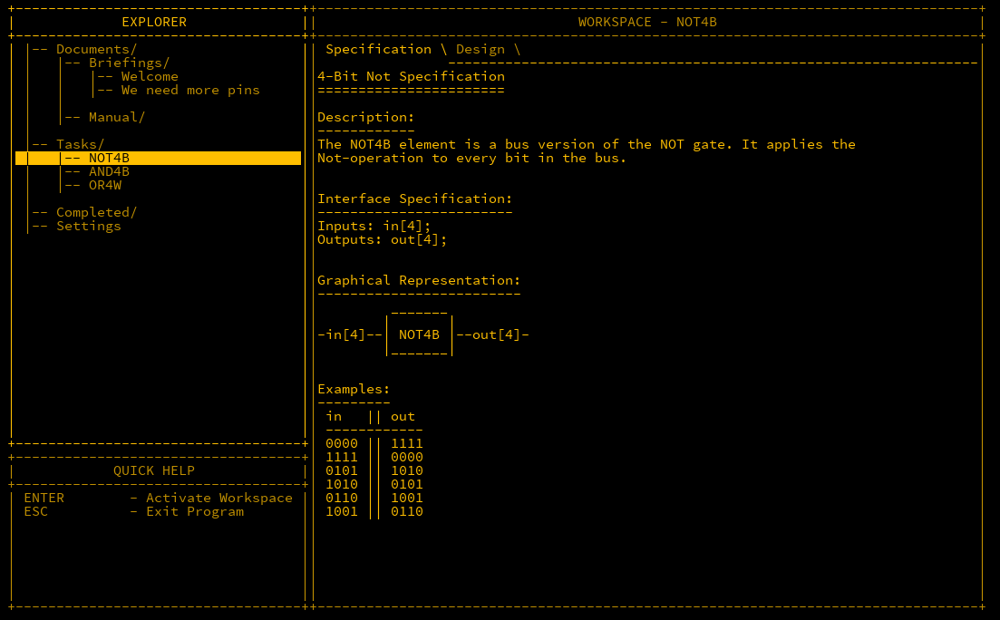
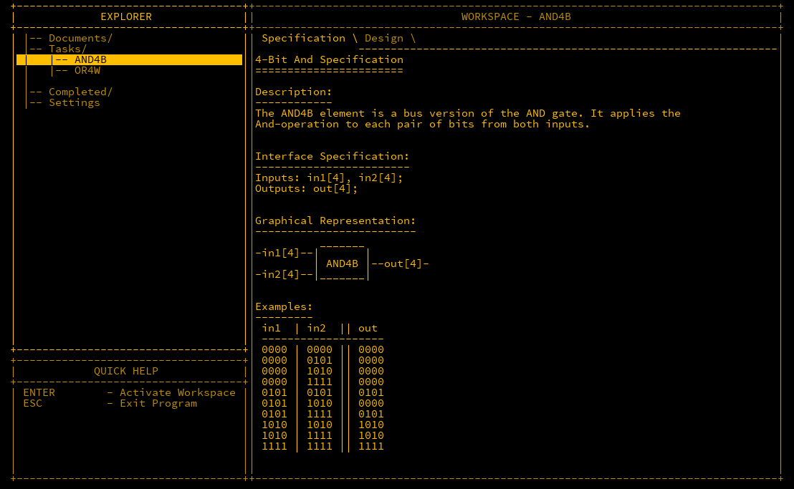
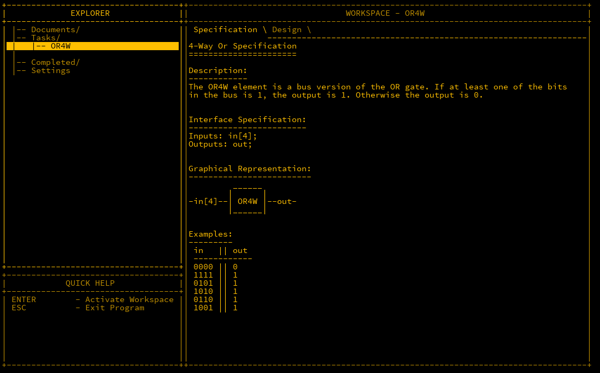

## Introduction

We now have a good collection of logic gates, but so far, they only handle single bits of information. With a single binary input, we can only represent the values `1` and `0`.
To work with higher numbers, we need to process multiple bits in parallel. For instance, using 4 inputs, we can represent numbers from 0 to 15.

---

## Understanding Multiple Bits

In a single-bit system, `1` and `0` are the only values available. To represent the number `2`, however, we need an additional bit. When that bit is active, it indicates
the presence of `2` in the total value. Each additional bit represents higher powers of 2. For example, the third bit represents `4` and the fourth bit represents `8`.
Here’s a simple breakdown:

```md
0 - 0000
1 - 0001
2 - 0010
3 - 0011
4 - 0100
5 - 0101
6 - 0110
7 - 0111
...
```

The concept of combining multiple bits is called a *bus*. Buses serve two main purposes: representing larger values and performing logical operations on multiple inputs.

---

## MHRD Challenges

MHRD presents several new challenges that demonstrate the power of buses. Let’s explore three of them and see how we can implement each one.

---

## NOT4B

The **NOT4B** (NOT 4-Bit) gate applies a NOT operation to each of the four inputs. MHRD’s documentation explains how to handle this. Essentially, each of the four bits is
processed by its own NOT gate.



Here’s the wiring for the NOT4B gate:

```matlab
Inputs in[4];
Outputs out[4];

Parts:
  n1 NOT,
  n2 NOT,
  n3 NOT,
  n4 NOT;

Wires:
  in[1] -> n1.in,
  in[2] -> n2.in,
  in[3] -> n3.in,
  in[4] -> n4.in,
  n1.out -> out[1],
  n2.out -> out[2],
  n3.out -> out[3],
  n4.out -> out[4];
```

This setup applies a NOT operation to each of the four inputs individually, producing the expected inverted outputs.

---

## AND4B

Similar to NOT4B, **AND4B** performs a 4-bit AND operation. Since AND gates have two inputs, we have a total of eight inputs, organised as in1[4] and in2[4].



Here’s the wiring for the AND4B gate:

```matlab
Inputs: in1[4], in2[4];
Outputs: out[4];

Parts:
  a1 AND,
  a2 AND,
  a3 AND,
  a4 AND;

Wires:
  in1[1] -> a1.in1,
  in1[2] -> a2.in1,
  in1[3] -> a3.in1,
  in1[4] -> a4.in1,
  in2[1] -> a1.in2,
  in2[2] -> a2.in2,
  in2[3] -> a3.in2,
  in2[4] -> a4.in2,
  a1.out -> out[1],
  a2.out -> out[2],
  a3.out -> out[3],
  a4.out -> out[4];
```

This wiring ensures that each bit from in1 and in2 is compared, and the result is output accordingly.

---

## OR4W

The **OR4W** (OR 4-Way) gate works slightly differently from the previous gates. Here, we take four inputs but only produce one output. This is useful for checking if any of the
four inputs are `1`.



To achieve this, we use three OR gates. The first two gates handle two inputs each, and the final gate combines the outputs of the first two.


Here’s the wiring for the OR4W gate:

```matlab
Inputs: in[4];
Outputs: out;

Parts:
  o1 OR,
  o2 OR,
  o3 OR;

Wires:
  in[1] -> o1.in1,
  in[2] -> o1.in2,
  in[3] -> o2.in1,
  in[4] -> o2.in2,
  o1.out -> o3.in1,
  o2.out -> o3.in2,
  o3.out -> out;
```

This setup allows us to check if any of the four inputs is `1`.

---

## Next Steps

After completing these tasks, MHRD unlocks more advanced gates, such as XOR16B, OR16W, AND16B, NOT16B, NAND16B, and NAND4B. By their names, the function of these gates should be
clear.

---

## Conclusion

We’ve now expanded our repertoire to include buses and multiple-bit logic gates. These gates are key for processing larger sets of data and making more complex logical decisions.
In the next post, we will explore how to use buses to build more advanced components and systems.
