## Introduction

It's time to move to the next level of components. In this post, we’ll be building more complex but manageable components: multiplexers (MUX) and adders.

---

## Multiplexer (MUX)

A multiplexer (MUX) is an essential component that takes two inputs and, depending on a third input called `sel` (selector), outputs the value of either `in1` or `in2`. If `sel`
is `0`, `in1` is outputted; if `sel` is `1`, `in2` is outputted.

Here’s a diagram of the MUX:

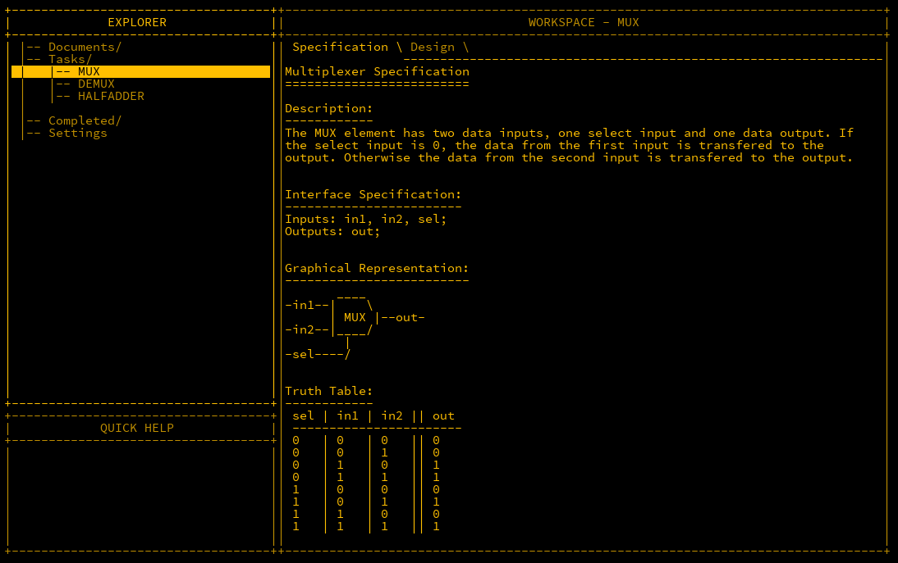

Let’s break it down further: when `sel` is `1`, the output is true if both `sel` and `in2` are true, which is achieved using an AND gate.

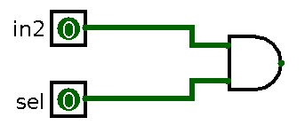

For `in1`, as `sel` is false, it must be inverted via a NOT gate. The outputs of the two AND gates are then fed into an OR gate.

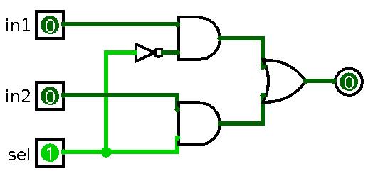

The MHRD code for wiring the MUX looks like this:

```matlab
Inputs: in1, in2, sel;
Outputs: out;

Parts:
 n NOT,
 a1 AND,
 a2 AND,
 o OR;

Wires:
 in1 -> a1.in1,
 in2 -> a2.in1,
 sel -> n.in,
 sel -> a2.in2,
 n.out -> a1.in2,
 a1.out -> o.in1,
 a2.out -> o.in2,
 o.out -> out;
```

---

## Demultiplexer (DEMUX)

A demultiplexer (DEMUX) performs the opposite function of a MUX: it takes one input and routes it to one of two outputs, based on the value of the selector input.

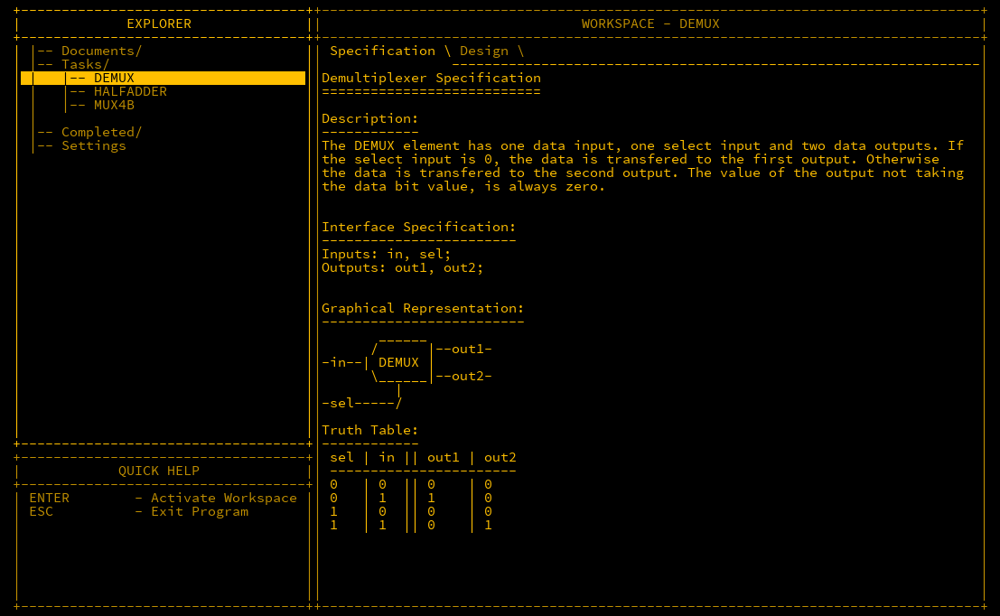

Here’s a logical arrangement of the DEMUX:

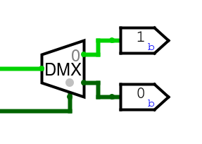

The truth table shows that each output is activated by different selector conditions. Two AND gates and a NOT gate are used to route the input based on the selector value.

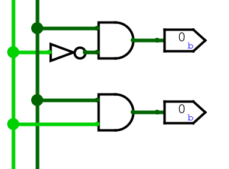

The wiring for the DEMUX is as follows:

```matlab
Inputs: in, sel;
Outputs: out1, out2;

Parts:
 n NOT,
 a1 AND,
 a2 AND;

Wires:
 in -> a1.in1,
 in -> a2.in1,
 sel -> n.in,
 n.out -> a1.in2,
 sel -> a2.in2,
 a1.out -> out1,
 a2.out -> out2;
```

---

## MUX4B

The MUX4B is an extension of the standard MUX to handle a 4-bit bus. It takes two 4-bit inputs and a single selector bit.

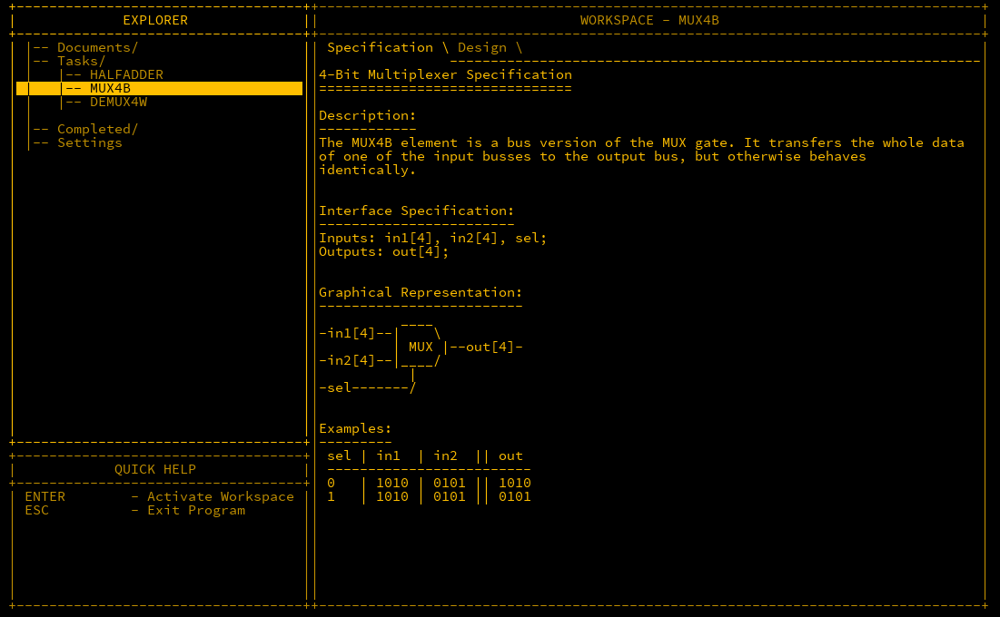

The wiring for the MUX4B looks like this:

```matlab
Inputs: in1[4], in2[4], sel;
Outputs: out[4];

Parts:
 m1 MUX,
 m2 MUX,
 m3 MUX,
 m4 MUX;

Wires:
 in1[1] -> m1.in1,
 in1[2] -> m2.in1,
 in1[3] -> m3.in1,
 in1[4] -> m4.in1,
 in2[1] -> m1.in2,
 in2[2] -> m2.in2,
 in2[3] -> m3.in2,
 in2[4] -> m4.in2,
 sel -> m1.sel,
 sel -> m2.sel,
 sel -> m3.sel,
 sel -> m4.sel,
 m1.out -> out[1],
 m2.out -> out[2],
 m3.out -> out[3],
 m4.out -> out[4];
```

---

## DEMUX4W

As the name suggests, DEMUX4W is a demultiplexer with four outputs. This requires a 2-bit selector since four outputs cannot be selected with only one bit.

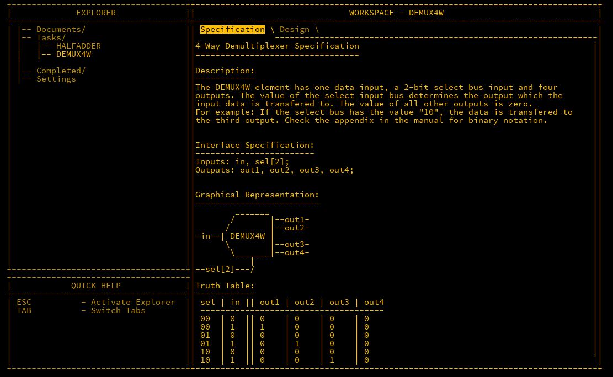

The first bit in the selector decides whether the output is routed to out1/out3 or out2/out4. The second bit further narrows it down to one of the four outputs.

The wiring is:

```matlab
Inputs: in, sel[2];
Outputs: out1, out2, out3, out4;

Parts:
 d1 DEMUX,
 d2 DEMUX,
 d3 DEMUX;

Wires:
 in -> d1.in,
 sel[2] -> d1.sel,
 d1.out1 -> d2.in,
 d1.out2 -> d3.in,
 d2.out1 -> out1,
 d2.out2 -> out2,
 d3.out1 -> out3,
 d3.out2 -> out4,
 sel[1] -> d2.sel,
 sel[1] -> d3.sel;
```

Completing this will unlock further components such as MUX4W16B, MUX16B, and DFF, which we will discuss later.

---

## Half Adder

A half adder is the foundational component of a CPU that enables basic addition. It takes two inputs and adds them. If both are `0`, the output is `0`. If one is `1`, the output
is `1`. If both are `1`, the output is `0` but the **carry** output is set to `1`.

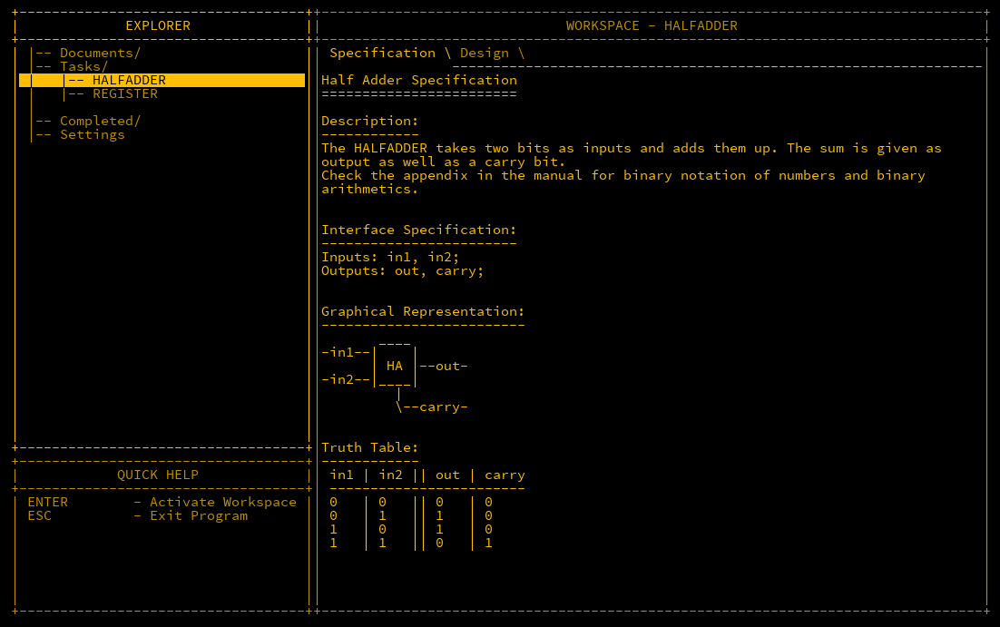

The half adder uses an XOR gate for the output and an AND gate for the carry.

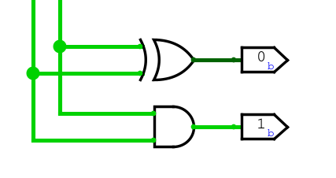

Here’s the wiring:

```matlab
Inputs: in1, in2;
Outputs: out, carry;

Parts:
 x XOR,
 a AND;

Wires:
 in1 -> x.in1,
 in2 -> x.in2,
 in1 -> a.in1,
 in2 -> a.in2,
 x.out -> out,
 a.out -> carry;
```

---

## Full Adder

A full adder extends the half adder by adding an additional input called `carryIn`, which is used to add bits from previous additions. This is crucial for adding larger numbers.

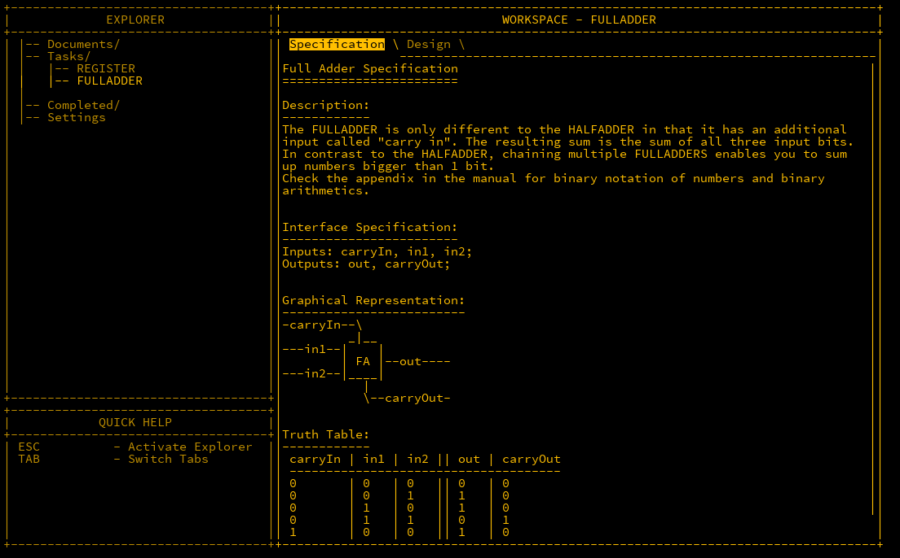

Here’s the truth table for the full adder:

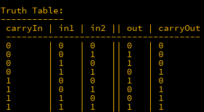

The concept is identical to the Half Adder when the `carryIn` is `0`, however the behaviour changes when it is enabled. Firstly the `out` is flipped, and the `carryOut` changes behaviour from an AND gate to an OR gate. Easiest way to solve this is by:

- Adding an OR to the inputs, and a NOT to the output of the XOR gate.
- Adding two MUX switches, and use the `carryIn` as the selector
- When `carryIn` is `0`, use the output like the Half Adder
- When `carryIn` is `1`, use the negated XOR output, and the OR gate output

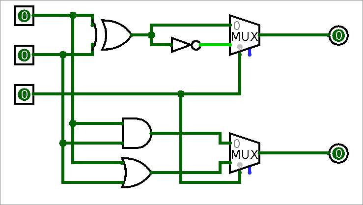

The wiring for the full adder looks like this:

```matlab
Inputs: carryIn, in1, in2;
Outputs: out, carryOut;

Parts:
 x XOR,
 a AND,
 o OR,
 n NOT,
 m1 MUX,
 m2 MUX;

Wires:
 in1 -> x.in1,
 in1 -> o.in1,
 in1 -> a.in1,
 in2 -> x.in2,
 in2 -> o.in2,
 in2 -> a.in2,
 x.out -> n.in,
 x.out -> m1.in1,
 n.out -> m1.in2,
 carryIn -> m1.sel,
 m1.out -> out,
 a.out -> m2.in1,
 o.out -> m2.in2,
 carryIn -> m2.sel,
 m2.out -> carryOut;
```

---

## Adder4B

Finally, we can chain multiple full adders to add two 4-bit numbers together.

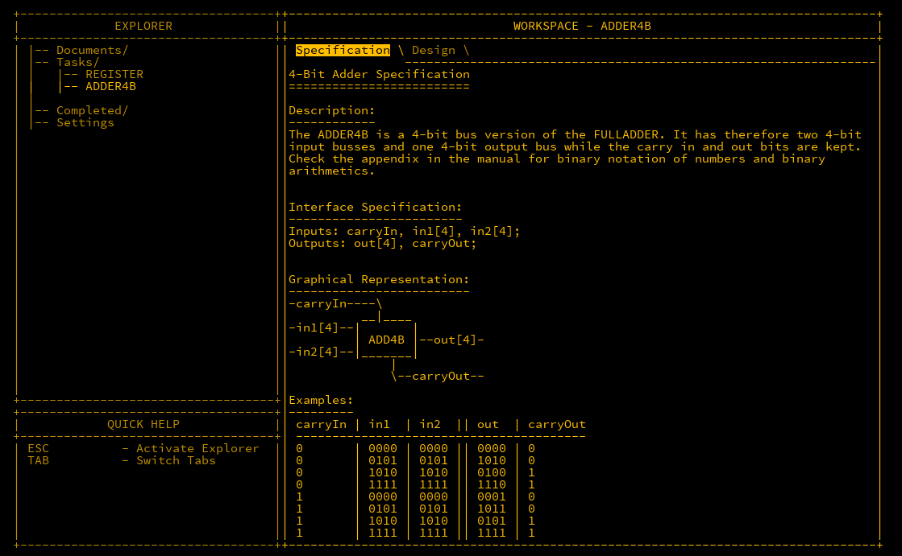

The wiring for the 4-bit adder is:

```matlab
Inputs: in1[4], in2[4], carryIn;
Outputs: out[4], carryOut;

Parts:
 f1 FULLADDER,
 f2 FULLADDER,
 f3 FULLADDER,
 f4 FULLADDER;

Wires:
 in1[1] -> f1.in1,
 in2[1] -> f1.in2,
 in1[2] -> f2.in1,
 in2[2] -> f2.in2,
 in1[3] -> f3.in1,
 in2[3] -> f3.in2,
 in1[4] -> f4.in1,
 in2[4] -> f4.in2,

 f1.out -> out[1],
 f2.out -> out[2],
 f3.out -> out[3],
 f4.out -> out[4],

 carryIn -> f1.carryIn,
 f1.carryOut -> f2.carryIn,
 f2.carryOut -> f3.carryIn,
 f3.carryOut -> f4.carryIn,
 f4.carryOut -> carryOut;
```

---

## Conclusion

We have now built multiplexers, demultiplexers, half adders, and full adders. These components allow us to perform logical operations and arithmetic on multiple bits, a crucial
step in constructing more complex systems, such as an Arithmetic Logic Unit (ALU).
