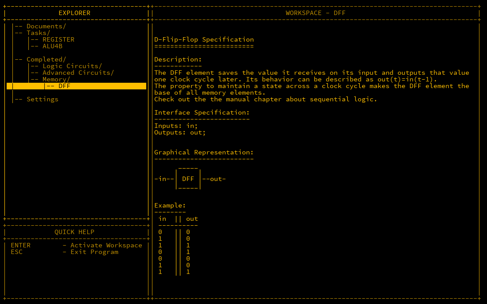
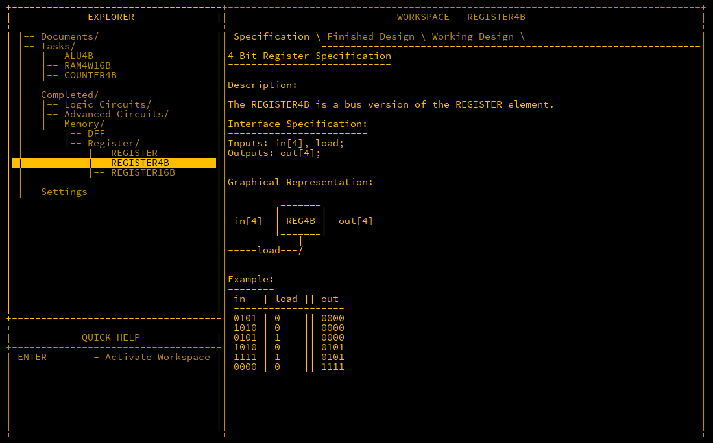
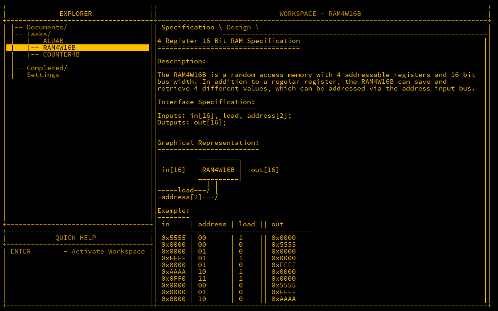

## Introduction

In this post, we turn our attention to data storage. Data storage is crucial for performing calculations, where input values are stored before processing, and outputs are held
afterwards. The most common component for storing data in these scenarios is a *register*.

---

## Registers

Registers are at the heart of a CPU. A register is a component that can store a value and hold it until it is needed. In programming terms, it functions similarly to a variable.
To work, a register requires an input value and a `load` signal that instructs the register to store the input value.

In MHRD, the *DFF* (D-Flip-Flop) component is used for building registers. The DFF stores an input value and outputs it one clock cycle later. Clock cycles, which determine the
speed of a CPU, are managed by a *clock* component, which we will discuss later. Below is an example of a DFF:



As the documentation suggests, we use DFFs to construct registers. The register takes an `input` bit and a `load` signal. When the `load` is active, the input value is stored in
the register, and the stored value is outputted on the `out` pin.

The trick is to feed the register’s output back into its input unless the `load` is active. When `load` is active, the input value is stored instead. This can be achieved using a
multiplexer (MUX). The wiring is as follows:

```matlab
Inputs: in, load;
Outputs: out;

Parts:
 d DFF,
 m MUX;

Wires:
 in -> m.in2,
 load -> m.sel,
 m.out -> d.in,
 d.out -> out,
 d.out -> m.in1;
```

This setup allows the register to store and repeatedly output a value until a new one is loaded.

---

## Register4B

While a 1-bit register can be useful, storing larger values requires more bits. A 4-bit register can store values from 0 to 15. As we’ve already built a 1-bit register, we can
extend this design to create a 4-bit register by using four 1-bit registers.



The wiring for a 4-bit register is as follows:

```matlab
Inputs: in[4], load;
Outputs: out[4];

Parts:
 r1 REGISTER,
 r2 REGISTER,
 r3 REGISTER,
 r4 REGISTER;

Wires:
 in[1] -> r1.in,
 in[2] -> r2.in,
 in[3] -> r3.in,
 in[4] -> r4.in,
 load -> r1.load,
 load -> r2.load,
 load -> r3.load,
 load -> r4.load,
 r1.out -> out[1],
 r2.out -> out[2],
 r3.out -> out[3],
 r4.out -> out[4];
```

This design also unlocks the REGISTER16B, which is a further extension of this concept.

---

## RAM4W16B

Registers are excellent for CPU calculations, but what if you need to store large amounts of data? The answer is *Random Access Memory* (RAM), which is essential for most
computers. RAM allows data to be written and recalled later, much like registers, except it consists of multiple registers linked together. Each register is assigned an
*address* for reading and writing. In this case, we start small, with four registers.



### Understanding Hexadecimal

If the `F` values in the example above seem confusing, it’s a good time to discuss hexadecimal notation. While humans count using base-10 (decimals) due to having 10 fingers,
computers, using binary, work in powers of 2. A single bit allows values of 0 or 1, but 4 bits can represent numbers from 0 to 15. In hexadecimal (base-16), values from 0 to 9
are the same as in decimal, but from 10 to 15, letters are used: `A`, `B`, `C`, `D`, `E`, `F`.

You may recall that a *byte* consists of 8 bits, which can represent numbers up to 255. In hexadecimal, the value 255 is represented as `0xFF`. This format allows for more
efficient data representation, especially when dealing with larger values.

### Wiring

Since there are 16-bit inputs, wiring each bit individually would be cumbersome. Fortunately, MHRD provides a shortcut: if an input matches the component’s byte size, it can be
wired as a full byte instead of bit by bit.

To store values, we use four 16-bit registers. The `in` is connected to all registers, but a value will only be stored if the `load` signal is active. The address is handled by a
DEMUX4W, which routes the `load` signal to the appropriate register. For output, a MUX4W16B is used to select the correct register based on the address.

The wiring is as follows:

```matlab
Inputs: in[16], load, address[2];
Outputs: out[16];

Parts:
 r1 REGISTER16B,
 r2 REGISTER16B,
 r3 REGISTER16B,
 r4 REGISTER16B,
 loader DEMUX4W,
 regout MUX4W16B;

Wires:
 in -> r1.in,
 in -> r2.in,
 in -> r3.in,
 in -> r4.in,
 load -> loader.in,
 address -> loader.sel,
 loader.out1 -> r1.load,
 loader.out2 -> r2.load,
 loader.out3 -> r3.load,
 loader.out4 -> r4.load,
 r1.out -> regout.in1,
 r2.out -> regout.in2,
 r3.out -> regout.in3,
 r4.out -> regout.in4,
 address -> regout.sel,
 regout.out -> out;
```

This design unlocks RAM64K16B, which provides a significant amount of memory.

---

## Conclusion

Unlocking registers and RAM components marks a major milestone towards building a simple computer. With 64K (65535) bytes of memory, we can handle larger and more complex data
processing tasks. Registers are essential for CPU operations, while RAM provides the necessary storage for more extensive computations.
