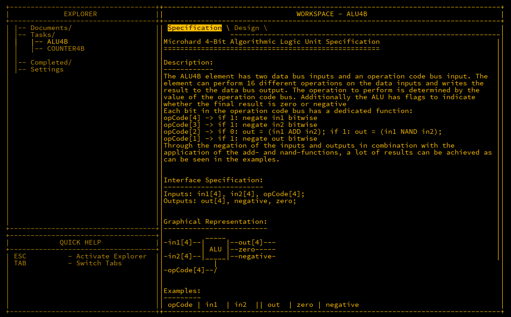

## Introduction

The *Arithmetic Logic Unit* (ALU) is the core component of a CPU responsible for performing calculations. It typically takes two inputs and provides a single output. Additionally, there is an opcode input, which determines the operation performed on the two inputs. For example, an opcode may signal to add the two inputs, or perhaps subtract one from the other. The specific design of the ALU, including which opcodes perform which functions, is left to the designer. Here, we will follow the tasks provided in MHRD to build an ALU.

---

## ALU4B

The ALU we are building takes two 4-bit inputs and a 4-bit `opCode`, providing 16 possible operations. There are also two 1-bit outputs, `negative` and `zero`, to indicate when the result is negative or zero, respectively.




The table below shows example opcodes and their corresponding actions:

| opCode | in1  | in2  | out  | zero | negative | Action       |
|--------|------|------|------|------|----------|--------------|
| 0000   | 0011 | 0101 | 1000 | 0    | 1        | in1 + in2    |
| 0000   | 0001 | 1111 | 0000 | 1    | 0        | overflow     |
| 0101   | 0011 | 0101 | 0010 | 0    | 0        | in2 - in1    |
| 1001   | 0011 | 0101 | 1110 | 0    | 1        | in1 - in2    |
| 0010   | 0011 | 0101 | 1110 | 0    | 1        | in1 NAND in2 |
| 0011   | 0011 | 0101 | 0001 | 0    | 0        | in1 AND in2  |
| 1110   | 0011 | 0101 | 0111 | 0    | 0        | in1 OR in2   |
| 0101   | 0011 | 0000 | 1101 | 0    | 1        | -in1         |
| 0001   | 1100 | 0000 | 0011 | 0    | 0        | NOT in1      |

---

## Representing Negative Numbers in Binary

Binary representation of negative numbers is achieved using the *most significant bit* (MSB). When the MSB is `1`, the value is negative. However, there’s more nuance to this concept.

---

### Signed vs Unsigned

A 4-bit binary number can typically represent values from `0` to `15`—this is an *unsigned* range. However, when using the MSB to indicate a negative number, we can represent a range from `-8` to `7`, as the 4th bit is used as a sign indicator.

In this signed system, the first 8 values (from `0000` to `0111`) represent positive numbers from `0` to `7`. The remaining values (from `1000` to `1111`) represent negative numbers, where `1000` is `-8`, `1111` is `-1`, and so on.

---

### Negating Signed Integers

To negate a signed integer, we flip all the bits and add `1` to the result. Here’s an example:

```matlab
2 = 0010
# Flip the bits
1101
# Add 1
-2 = 1110
```

Similarly, negating `-2` brings us back to `2`:

```matlab
-2 = 1110
# Flip the bits
0001
# Add 1
2 = 0010
```

---

## OpCodes and Instructions

The ALU uses 4-bit opcodes, which define the operation to be performed. Here’s a summary of what each bit of the opcode controls:

- `opCode[1]`: Negates the output if set to `1`.
- `opCode[2]`: Performs an addition if `0`, or NAND operation if `1`.
- `opCode[3]`: Negates `in2` if `1`.
- `opCode[4]`: Negates `in1` if `1`.

### Opcode Breakdown

- **0000 - in1 + in2 [ADD]**: The simplest operation where the two inputs are added without modification.
- **0010 - in1 NAND in2 [NAND]**: Performs a NAND operation on the inputs.
- **0011 - in1 AND in2 [AND]**: Uses De Morgan’s Laws to convert a NAND to an AND by negating the result.
- **1001 - in1 - in2 [SUBTRACT]**: Negates `in2` and subtracts it from `in1`.
- **0101 - in2 - in1 [SUBTRACT]**: Subtracts `in1` from `in2`.
- **1110 - in1 OR in2 [OR]**: Negates both inputs to create an OR operation via De Morgan’s Laws.

---

## Conclusion

The ALU is a crucial component for performing both arithmetic and logical operations. By using the breakdown provided above, you should have a clear idea of how to wire the ALU and implement various operations. In the next section, we will explore more advanced features of the ALU, including wiring techniques.

*Note: This was originally published in July 2024*