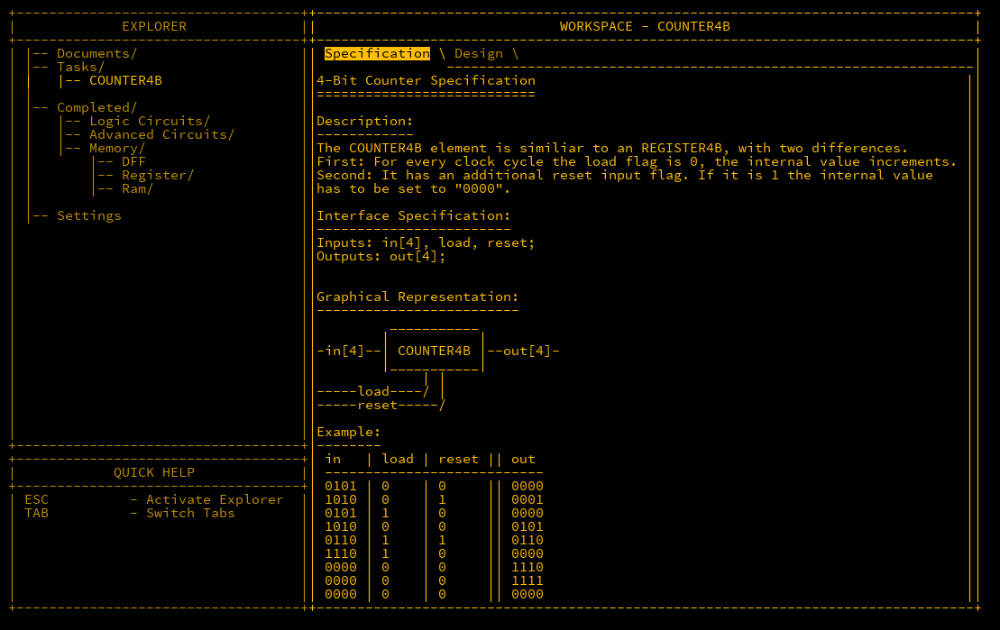

## Introduction

With the core concepts of the ALU now established, the next step involves wiring the device. There are various ways to tackle this, but I believe the following method strikes a good balance between simplicity and performance.

---

## ALU4B - Wiring

Let’s begin with the predefined inputs and outputs, along with the necessary components for the ALU:

```matlab
Inputs: in1[4], in2[4], opCode[4];
Outputs: out[4], negative, zero;

Parts:
  m1 MUX4B,
  m2 MUX4B,
  m3 MUX4B,
  m4 MUX4B,
  n1 NOT4B,
  n2 NOT4B,
  n3 NOT4B,
  a ADDER4B,
  nand NAND4B,
  n NOT,
  o OR4W;
```

### Step 1: opCode[4] - Negating `in1`

If `opCode[4]` is true, the value of `in1` will be bitwise negated. To achieve this, feed `in1` into a `NOT4B` gate (`n1`). The original `in1` value and the negated output from `n1` are then routed into the inputs of a `MUX4B` gate (`m1`). The `opCode[4]` value is used as the selector (`sel`) to determine whether `in1` is passed through unchanged or negated.

```matlab
in1 -> m1.in1,
in1 -> n1.in,
n1.out -> m1.in2,
opCode[4] -> m1.sel;
```

### Step 2: opCode[3] - Negating `in2`

This step is identical to Step 1 but for `in2`. Here, we route `in2` through a `NOT4B` gate (`n2`) and use another `MUX4B` (`m2`) to either negate or pass through the value based on the state of `opCode[3]`.

```matlab
in2 -> m2.in1,
in2 -> n2.in,
n2.out -> m2.in2,
opCode[3] -> m2.sel;
```

### Step 3: opCode[2] - Selecting Between ADD and NAND

If `opCode[2]` is `0`, the outputs of `m1` and `m2` are passed into an `ADDER4B` gate (`a`). If `opCode[2]` is `1`, the outputs are passed into a `NAND4B` gate (`nand`). Instead of wiring inputs to both the adder and NAND gates, we use a `MUX4B` (`m3`) to select the output of the correct operation.

```matlab
m1.out -> a.in1,
m1.out -> nand.in1,
m2.out -> a.in2,
m2.out -> nand.in2,
a.out -> m3.in1,
nand.out -> m3.in2,
opCode[2] -> m3.sel;
```

### Step 4: opCode[1] - Negating the Output

To potentially negate the final output, route `m3.out` into a `NOT4B` gate (`n3`). A fourth `MUX4B` (`m4`) selects whether the output remains unchanged or is negated, based on the value of `opCode[1]`. The output from `m4` is then sent to `out[4]`.

```matlab
m3.out -> m4.in1,
m3.out -> n3.in,
n3.out -> m4.in2,
opCode[1] -> m4.sel,
m4.out -> out;
```

### Negative Flag

The `negative` flag indicates when the result is negative. As discussed previously, a number is considered negative when the most significant bit (MSB) is `1`. To implement this, route the MSB of `m4.out` to the `negative` output.

```matlab
m4.out[4] -> negative;
```

### Zero Flag

The `zero` flag is used to check if the result is `0`. This can be done by piping the output of `m4` into an `OR4W` gate (`o`). If any bit in the result is non-zero, the output cannot be zero. Since we need the inverse of this, the output of the `OR4W` gate is negated using a simple `NOT` gate (`n`).

```matlab
m4.out -> o.in,
o.out -> n.in,
n.out -> zero;
```

This wiring successfully completes the ALU, and with this component built, the 16-bit version (ALU16B) is unlocked, which performs the same operations on 16-bit inputs and outputs.

---

## COUNTER4B

The next important component is the `COUNTER4B`, which is useful for tracking the execution state of a program. The counter increments by 1 per cycle when the `load` flag is `0`. When `load` is `1`, the counter is set to the input value. It is reset to `0` when the `reset` flag is active.



The counter is essentially a `REGISTER4B` that loops back its output to an `ADDER4B`, where the `carryIn` is always `1`, so the value increments each cycle. Two `MUX4B` components are then used: the first handles the `load` input, and the second handles the `reset` input. The wiring looks like this:

```matlab
Inputs: in[4], load, reset;
Outputs: out[4];

Parts:
  r REGISTER4B,
  a ADDER4B,
  m1 MUX4B,
  m2 MUX4B;

Wires:
  r.out -> a.in1,
  r.out -> out,
  1 -> a.carryIn,
  1 -> r.load,
  a.out -> m1.in1,
  in -> m1.in2,
  load -> m1.sel,
  m1.out -> m2.in1,
  reset -> m2.sel,
  m2.out -> r.in;
```

This completes the `COUNTER4B` and unlocks the `COUNTER16B`, which functions similarly but with 16-bit inputs and outputs.

---

## Conclusion

With the ALU now fully operational and the counter implemented, the foundational components for the CPU are complete. The next phase will involve integrating these components to build the final stages of the MHRD CPU.
