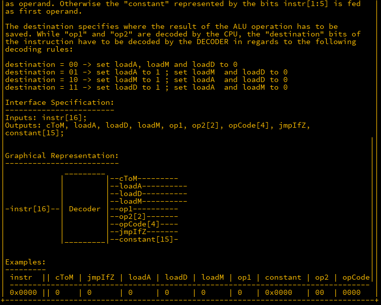
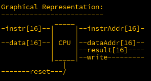
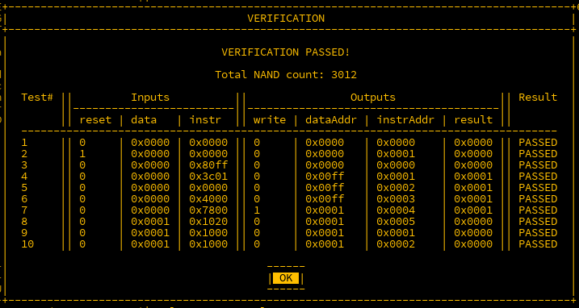

## Introduction

We're now in the final stretch of building a fully functioning CPU. But before we reach the finish line, there's one final piece to construct: the DECODER.

---

## DECODER

The **DECODER** takes a 16-bit input and performs basic preprocessing on it.

  
  


---

### Decoding the Input

The input is treated as multiple smaller parts rather than one large input. If the MSB (`instr[16]`) is `1`, the documentation specifies that the value stored in `instr[1:15]` is sent to the `memory register`. Since the register is part of another section, the first 15 bits are sent directly to the `constant` output.

When `instr[16]` is set, a number of flags are activated, which will be handled later. The value of `instr[16]` is also used to set `cToM`, which is piped to the appropriate output.

```matlab
instr[1:15] -> constant,
instr[16] -> cToM,
```

---

### Destination

The destination bits control where data is sent. There are three possible destinations: `A`, `M`, and `D`, with each having its own output flag: `loadA`, `loadM`, and `loadD`. Based on the values of the destination bits, one of these flags may be set to `1`.

```txt
Destination = 00 -> Set all flags to 0
Destination = 01 -> Set only loadA to 1
Destination = 10 -> Set only loadM to 1
Destination = 11 -> Set only loadD to 1
```

This can be managed using a `DEMUX4W` that takes a 2-bit input as the selector (`sel`) and produces four outputs. We set a constant `1` as the input, and the wiring will look like this (further refinement will be required later):

```matlab
1 -> d1.in,
instr[14:15] -> d1.sel,
d1.out2 -> loadA,
d1.out3 -> loadM,
d1.out4 -> loadD;
```

---

### Operands, Opcodes, and `jmpIfZ`

The next few input bits can be directly routed to their respective outputs:

```matlab
instr[13] -> op1,
instr[11:12] -> op2,
instr[7:10] -> opCode,
instr[6] -> jmpIfZ;
```

---

### Fixing the `load` Outputs and `jmpIfZ`

At this point, running verification shows that about 60% of the tests pass. The issue lies with the `load` outputs and `jmpIfZ`, which are still being set when `cToM` is active. To resolve this, we introduce MUXes so that if `cToM` (`instr[16]`) is set, it takes precedence. Three MUXes (`m1`, `m2`, `m3`) and an `OR` gate (`o`) are added to handle the outputs. In the case of `loadA`, `loadD`, and `jmpIfZ`, these are set to `0` when `cToM` is `1`. However, `loadM` should be set to `1`, so we use an `OR` gate for this.

```matlab
d1.out2 -> m1.in1,  // loadA
d1.out3 -> o.in1,   // loadM
d1.out4 -> m2.in1,  // loadD
instr[6] -> m3.in1, // jmpIfZ
instr[16] -> o.in2,
instr[16] -> m1.sel,
instr[16] -> m2.sel,
instr[16] -> m3.sel,
m1.out -> loadA,
m2.out -> loadD,
m3.out -> jmpIfZ,
o.out -> loadM;
```

After updating and running this, the `DECODER` will be functioning as expected.

---

## CPU

The final challenge combines all the components we've built so far. Here are the five main parts included in the design:

```txt
decoder DECODER      
// The decoder we just designed, used to handle instruction input.

mReg REGISTER16B     
// The Memory Register - used to store addresses in the data RAM.

aReg REGISTER16B     
// The Arithmetic Register - for temporary storage of computation results.

pc COUNTER16B        
// The Program Counter - determines which address is being accessed in the program.

alu ALU16B           
// The Arithmetic Logic Unit - handles the calculations specified by the opcodes.
```

There are several key inputs and outputs to consider:



Externally, we have two RAM units: one for instructions and one for data. The `instrAddr` and `dataAddr` outputs request the data at specified addresses, and the `instr` and `data` inputs return that data. The `in` and `load` inputs for the instruction RAM are not used, but in the data RAM, the `in` bus is connected to the CPU’s `result` output, and the `load` is connected to the `write` output.

The `reset` pin is set to `1` to start the program.

---

### Behavioural Specifications

The CPU uses the decoder outputs to follow the documented behavioural specifications:

```matlab
instr -> decoder.instr,
```

1. **If `cToM` and `loadM` are both `1`, the `constant` output must be loaded into `MR`:**

This can be simplified: whenever `cToM` is `1`, the `constant` is loaded into `MR`. If `loadM` is `1`, it will load the value into `MR`. A `MUX16B` (`m1`) will handle this.

```matlab
decoder.cToM -> m1.sel,
decoder.constant -> m1.in2[1:15],
m1.out -> mReg.in,
decoder.loadM -> mReg.load,
```

2. **If `loadM` is `1` and `cToM` is `0`, the result of the ALU must be loaded into `MR`:**

```matlab
alu.out -> m1.in1;
```

3. **If `loadA` is `1`, the result of the ALU must be loaded into `AR`:**

```matlab
decoder.loadA -> aReg.load,
alu.out -> aReg.in;
```

4. **The `write` output of the CPU must have the same value as `loadD`:**

```matlab
decoder.loadD -> write;
```

5. **The `opCode` output of the decoder must be fed into the ALU:**

```matlab
decoder.opCode -> alu.opCode;
```

6. **If `op1` is `1`, the `constant` must be fed into the ALU as the first operand. Otherwise, use the value from `AR`:**

A `MUX16B` (`m2`) will select between these two sources.

```matlab
decoder.op1 -> m2.sel,
aReg.out -> m2.in1,
decoder.constant -> m2.in2[1:15],
m2.out -> alu.in1;
```

7. **For `op2`:**

```txt
"00" -> feed `constant` as the second operand
"01" -> feed `AR` as the second operand
"10" -> feed `MR` as the second operand
"11" -> feed the `data` bus as the second operand
```

This requires a `MUX4W16B` (`m3`).

```matlab
decoder.op2 -> m3.sel,
decoder.constant -> m3.in1[1:15],
aReg.out -> m3.in2,
mReg.out -> m3.in3,
data -> m3.in4,
m3.out -> alu.in2;
```

8. **When feeding `constant` to the ALU, only the lowest 5 bits are used, sign-extended to 16 bits:**

```matlab
decoder.constant[1:5] -> m2.in2[1:5],
decoder.constant[1:5] -> m3.in1[1:5];
```

9. **If `jmpIfZ` and the ALU’s `zero` flag are both `1`, the value of `MR` must be loaded into the PC:**

Use an `AND` gate to manage this:

```matlab
decoder.jmpIfZ -> a.in1,
alu.zero -> a.in2,
a.out -> pc.load,
mReg.out -> pc.in;
```

---

### Final Wiring

Finally, the remaining wiring connections are straightforward:

```matlab
alu.out -> result,
mReg.out -> dataAddr,


pc.out -> instrAddr,
reset -> pc.reset;
```

With this complete, the CPU is operational.



---

## Conclusion

This marks the completion of the MHRD challenge, from building basic gates to constructing a fully functional CPU. While I may revisit this project to explore potential optimisations (such as reducing the NAND count), the core objective has been achieved.

Next up, we’ll tackle similar challenges in a more graphical game, **Turing Complete**, where we’ll not only build hardware but also write code that can be run on our CPU. I hope you enjoyed this walkthrough.

*Note: This was originally published in July 2024*