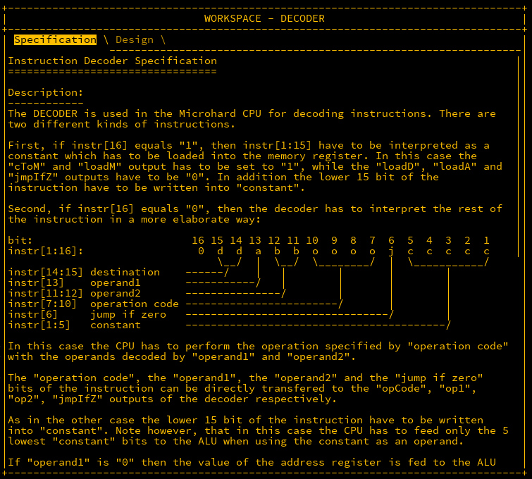
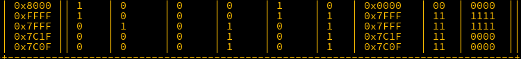

## Initial

The home stretch to building out a fully functioning CPU is almost upon us, however one final component remains before that, the DECODER.

## DECODER

The DECODER takes a 16-bit input and will perform some basic preprocessing on it.





### Decoding the input

Note that the input is not treated as one large input but multiple ones.  Firstly, if the MSB `instr[16]` is `1`, then the documentation states that the value stored in `instr[1:15]` is sent to the `memory register`. As the register is a part outside of the decoder, the first 15 bytes can be sent raw to the `constant` output.

If `instr[16]` is set, a number of flags are set which will be handled later, but it also is the value of `cToM` so this will be piped to that output

```matlab
instr[1:15] -> constant,
instr[16] -> cToM,
```

### Destination

The destination bits handle where the data will be sent to.  It appears there are three destinations, `A`, `M` and `D` and each destination has its own output flag, `loadA`, `loadM`, and `loadD`. Depending on the value of these bits, one of those may be set to `1`.

```txt
Destination = 00 -> Set all flags to 0
Destination = 01 -> Set only loadA to 1
Destination = 10 -> Set only loadM to 1
Destination = 11 -> Set only loadD to 1
```

This looks like a job for a DEMUX4W that takes a 2-bit input as a sel, and has 1 outputs.  Adding one to the parts list (as `d1`) and setting a constant of 1 as the input and ignoring the first output, the following wiring occurs.  Note that further finessing of this will be required later.

```matlab
1 -> d1.in,
instr[14:15] -> d1.sel,
d1.out2 -> loadA,
d1.out3 -> loadM,
d1.out4 -> loadD;
```

### Operands, opcodes and jmpIfZ

The next few input bits are straightforward in that they can just be directly piped to the respective outputs.

```matlab
instr[13] -> op1,
instr[11:12] -> op2,
instr[7:10] -> opCode,
instr[6] -> jmpIfZ;
```

### Fixing the load outputs and jmpIfZ

By now, running the verification shows that around 60% of the tests pass. Looking at the failing results, it appears that the load* outputs and `jmpIfZ` are still being set while using the `cToM` (constant to memory). To solve this, let's add some MUXs so that if `cToM` (`instr[16]`) is set, its value is ignored.  Start by creating three MUXs (`m1`, `m2`, `m3`) and an `OR` (`o`) and instead of directly inputting the output of the `DEMUX4W` used earlier to the load outputs, they are intercepted by the new components. As `loadA`, `loadD`, and `jmpIfZ` are supposed to be `0` in this instance, they are loaded into the MUXs and no second input is needed.  As `loadM` is required to be `1` however, this can be attached to `o` alongside `instr[16]`.

```matlab
d1.out2 -> m1.in1,  // loadA
d1.out3 -> o.in1,   // loadM
d1.out4 -> m2.in1,  // loadD
instr[6] -> m3.in1, // jmpIfZ
instr[16] -> o.in2,
instr[16] -> m1.sel,
instr[16] -> m2.sel,
instr[16] -> m3.sel,
m1.out -> loadA,
m2.out -> loadD,
m3.out -> jmpIfZ,
o.out -> loadM;
```

Updating and running this will solve the `DECODER` challenge.

## CPU

The last challenge is upon us and will test everything learned up to date.  For this, 5 parts are already included in the design, so let's get familiar with them.

```txt
decoder DECODER      
// The decoder unit just designed. Will be used to handle 
// instruction input

mReg REGISTER16B     
// The Memory Register - used to reference addresses in 
//the data RAM

aReg REGISTER16B     
// The Arithethic Register - Temporary storage of 
//computation results

pc COUNTER16B        
// The Program Counter. This is used to determine what address 
// in the program is being used

alu ALU16B           
// The Arithmetic Logic Unit. Used to perform the calculations 
// set in the opcodes
```

There are also a number of inputs and outputs to discuss also...


External to the CPU, there is a RAM element which contains the instructions to be executed and a secondary RAM element containing the data to be processed.  To control these, two outputs (`instrAddr` and `dataAddr`) are used to request the data at the addresses specified. In turn, the data is returned as CPU inputs called `instr` and `data` respectively. According to the documentation, the `in` and `load` inputs of the instruction RAM is not used however in the data RAM, the `in` bus is connected to the `result` CPU output and the `load` is connected to the `write` output.

Finally, the `reset` pin is set to `1` to start the program.

### Behavioural Specfications

There are a number of behavioural specifications also documented which will be stepped through and built top to bottom.

`After the instruction has been decoded by the DECODER, the CPU uses the DECODER outputs to ensure the following behaviour`

Okay, so the first item on the agenda is hooking up this.

```matlab
instr -> decoder.instr,
```

`If the "cToM" and "loadM" output of the decoder is "1", the "constant" output has to be loaded into the MR`

This can be simplified slightly.  If `cToM` is positive, it will always load the constant to `MR`. Also, if `loadM` is positive, then it will always be used to load something into `MR`.  Adding a `MUX16B` (`m1`) helps with this.

```matlab
decoder.cToM -> m1.sel,
decoder.constant -> m1.in2[1:15],
m1.out -> mReg.in,
decoder.loadM -> mReg.load,
```

`If "loadM is "1" and "cToM" is "0", the result of the APU operation has to be loaded into the MR`

This tells us what the other input into `m1` will be, the `alu` output.

```matlab
alu.out -> m1.in1
```

`If "loadA" is "1", the result of the ALU operation has to be loaded into the AR`

Simple as this has already been done for the `MR`.

```matlab
decoder.loadA -> aReg.load,
alu.out -> aReg.in,
```

`The "write" output of the CPU has to have the same value as the "loadD" output of the DECODER`

```matlab
decoder.loadD -> write,
```

`The "opCode" output of the DECODER has to be directly fed to the ALU`

```matlab
decoder.opCode -> alu.opCode,
```

`If the "op1" output of the DECODER is "1", the "constant" has to be fed in to the ALU as the first operand. Otherwise the AR has to be fed into the ALU`

This seems solvable with another `MUX16B` (`m2`).  

```matlab
decoder.op1 -> m2.sel,
aReg.out -> m2.in1,
decoder.constant -> m2.in2[1:15],
m2.out -> alu.in1,
```

```txt
For the "op2" output of the DECODER:
"00" -> feed "constant" as second operator into the ALU
"01" -> feed AR as second operator into the ALU
"10" -> feed MR as second operator into the ALU
"11" -> feed data bus as second operator into the ALU
```

This deals with the second operator. With 4 possible inputs, a `MUX4W16B` (`m3`) is required.

```txt
decoder.op2 -> m3.sel,
decoder.constant -> m3.in1[1:15],
aReg.out -> m3.in2,
mReg.out -> m3.in3,
data -> m3.in4,
m3.out -> alu.in2,
```

`When feeding "constant" as an operand to the ALU, only the lowest 5 bits of "constant" are used. Thie 5 bit value is padded to 16 bit in accordance to the sign of the value`.

Both references to this are modified to reflect this.

```matlab
decoder.constant[1:5] -> m2.in2[1:5],
decoder.constant[1:5] -> m3.in1[1:5],
```

`If "jmpIfZ" and the "zero" flag of the ALU is "1", load the value of the MR into the PC.`

Time to use an `AND` (`a`) for this.

```matlab
decoder.jmpIfZ -> a.in1,
alu.zero -> a.in2,
a.out -> pc.load,
mReg.out -> pc.in
```

Finally a few small specifications remain:

```txt
- Write the ALU output on the "result" bus
- Write the MR value on the "dataAddr" bus
- Write the PC value on the instrAddr bus
- Set the PC to "0" if the reset input is set
```

The last few wirings remaining are straightforward:

```matlab
alu.out -> result,
mReg.out -> dataAddr,
pc.out -> instrAddr,
reset -> pc.reset;
```

Running this shows the the CPU is complete.


## Conclusion

The MHRD challenge is completed, from building a basic gate to a simple CPU. I may return to this in the future to look for possible optimizations (lower NAND counts) but the main objective here is complete, in that a fully formed CPU is built.

Next up, we will attempt to do similar with a more GUI friendly game, Turing Complete. As well as building our own hardware, TC also allows the ability to create your own code to be read by your CPU.  Hope you enjoyed this walkthrough.
