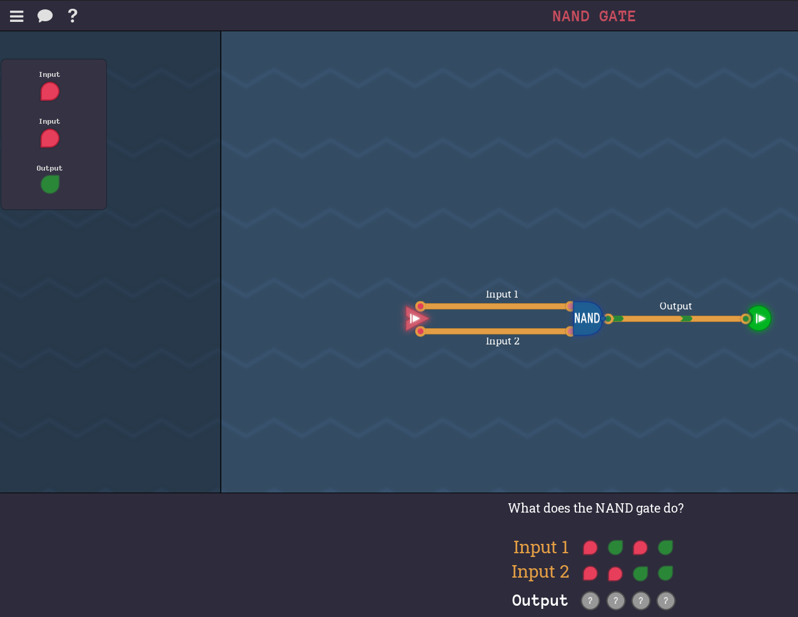
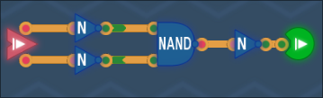
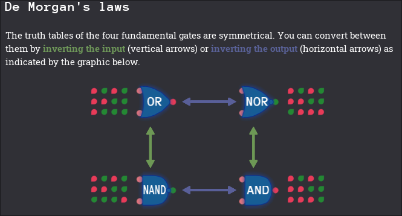

## Introduction

After successfully building a CPU in *MHRD*, we now turn to *Turing Complete* (TC). Like MHRD, TC involves building basic hardware to perform calculations. However, two key differences set TC apart. First, TC replaces the laborious process of typing out connections with an intuitive graphical user interface (GUI). Second, TC is much more extensible, allowing for custom component designs and custom machine code tailored to your architecture.

While we’ll revisit some of the initial building blocks, TC introduces new components, and the real potential of the game will soon become apparent.

Side note: In TC, you’ve been abducted by aliens who demand you build a functional computer—or face the unpleasant alternative of being eaten.

Let’s dive into the first set of challenges.

---

## Crude Awakening

(Note, renamed to *Humble Beginnings* in version 2.0)

This introductory challenge showcases how the toggles in the top left work. It demonstrates that when the input is disabled, the output is also disabled.

---

## NAND Gate

We’re already familiar with the NAND gate. The task here is to fill out the output at the bottom to match the expected results of a NAND gate. Once the correct pattern is completed, clicking `check` unlocks the `NAND` gate.

---

## NOT Gate

Our first new gate in TC, though creating a NOT gate using a NAND gate is trivial. Follow the design, click the `Run` button, and complete the task to unlock the `NOT` gate.

This also unlocks the map for the rest of the challenges.

---

## AND Gate

To create an AND gate, simply connect both inputs to a NAND gate, then negate the output using a NOT gate. This design unlocks the `AND` gate.

---

## NOR Gate

The NOR gate is new to TC and wasn't encountered in MHRD. NOR stands for “NOT OR,” meaning it only outputs true if neither input is true.

Since we only have NOT and NAND gates available, use a NAND gate and negate both the inputs and the output to achieve the desired result. This unlocks the `NOR` gate.

---

## OR Gate

This is similar to the NOR gate, but since we negate the output of the NAND gate, the original output NOT cancels out, so we can remove it. Completing this unlocks the `OR` gate.

---

## Always On

This is a new component not seen in MHRD. The “Always On” component means that the output is always true, regardless of the input. To implement this, a simple NOT gate is connected to the output, ensuring it always outputs `1`. This unlocks the `Always On` and `Always Off` (outputs `0` always) components.

This unlocks the “Always On” and “Always Off” components. Additionally, De Morgan's Laws, which describe the relationship between OR, NOR, NAND, and AND gates, are documented here.

---

## Second Tick

This challenge involves four input ticks, and the task is to output `1` only on the second tick. The condition for the second tick is that `input 1` is `1` and `input 2` is `0`. Use an `AND` gate with a `NOT` gate for `input 2` to replicate this.

---

## XOR Gate

This is familiar territory. Following the same diagram used in MHRD, completing this task unlocks the `XOR` gate.

---

## Bigger OR Gate

This introduces a new concept: larger input OR gates. However, this is similar to the 4-input OR gate in MHRD. Use two `OR` gates to achieve this, unlocking a 3-input OR gate.

## Bigger AND Gate

The same wiring method used for the OR gate applies here, but with `AND` gates. Completing this unlocks the 3-input AND gate.

## XNOR Gate

The final component in the basic logic section is the `XNOR` gate, which is simply the negated output of an XOR gate. Completing this unlocks the `XNOR` gate. Like when an `XOR` outputs when two inputs are different, this just does the opposite.

---
## Conclusion

This section of TC builds on much of what we learned from MHRD. With the foundational gates and logic complete, we're now ready to dive into more complex challenges.
