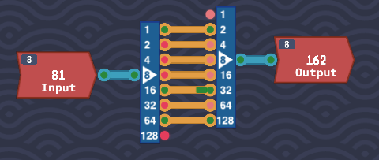
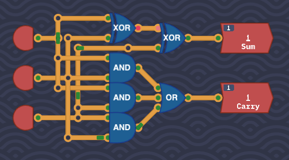
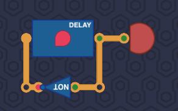
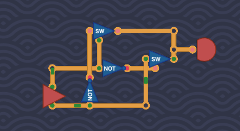
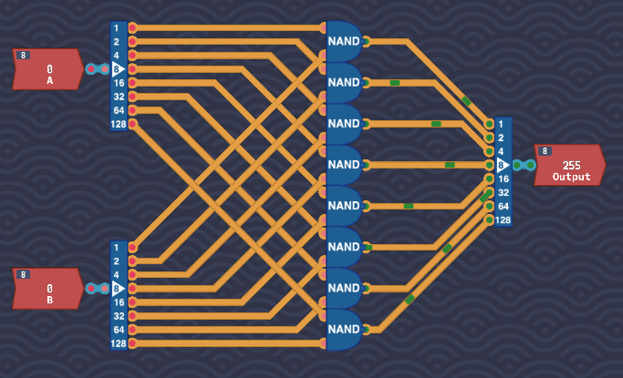
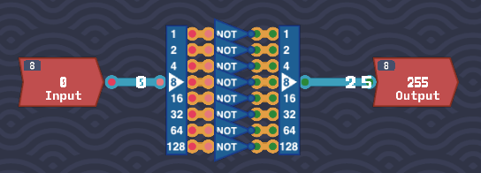
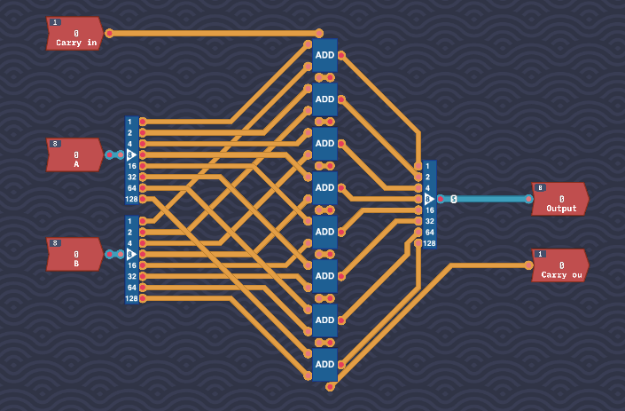
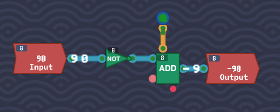

## Introduction

Next, we focus on the arithmetic challenges in *Turing Complete*. These exercises involve building more advanced gates that will serve as the foundation for future tasks. While some binary-based challenges are also included, we’ll focus on the key arithmetic components here.

---
## Small Challenges

You'll notice at this stage small challenges like `Binary Racer` or `Logic Exam`. Use these as validators that you understand that you should've learned to date. I'll let you figure those out.

## Double Detection

This challenge introduces a new concept in TC. You are presented with four inputs, and the output is positive if two or more inputs are positive.

Initially, I considered designing something intricate to solve this, but a simpler approach emerged. Since the condition for a positive output is at least two positive inputs, the solution involves using `AND` gates for each possible pair of inputs [(1,2), (1,3), (1,4), (2,3), (2,4), (3,4)]. The outputs of these `AND` gates are then fed into `OR` gates. The recently unlocked three-input `OR` gates are especially useful here.


---

## Odd Number of Signals

This challenge is similar to Double Detection, except the condition is to output true if there’s an odd number of positive inputs.

Despite the seemingly complex nature of the problem, the solution lies in a simple trick. An `XOR` gate can determine whether two bits are either both positive (even) or one is positive (odd). This principle extends to more inputs. With a constraint on the number of components (3), the solution is elegantly handled using three `XOR` gates.


---

## Counting Signals

This challenge builds on the previous two, asking you to count the number of positive signals. The output is a multi-bit result, as seen in the bus-type challenges in MHRD.

The truth table may seem complex at first, but with the knowledge gained from the Double Detection and Odd Number of Signals challenges, it becomes manageable.


The output has three output pins or *bits*, with the lowest bit on top cascading down. 
### 1st Bit (1)

The first output bit represents the lowest bit. By examining its permutations, you’ll notice they match the output of the Odd Number of Signals challenge. Use that logic for the first bit, which makes sense, as this outputs positively if the output is an odd number (1 or 3)

### 2nd Bit (2)

This bit is identical to the Double Detection solution. Connect it accordingly to the second output bit. This will always be true if the expected output value is `2` or above, except `4`, which is handled via the third bit.

### 3rd Bit (4)

The third bit is only positive when all inputs are true, which makes it a simple `AND` chain.

Remember that when all pins are positive, the second bit will also be true which will make the output `6` which is incorrect. To remedy this, just use an `XOR` gate to negate the 2nd bit when the 3rd bit is active.


---

## Half Adder

The Half Adder is identical to the one in MHRD, where the `SUM` output is generated using an `XOR` gate, and the `CARRY` output is produced by an `AND` gate.


---

## Delayed Lines

This introduces the `Delay Line` module which we encountered in MHRD. It takes in a value, and one tick later outputs that value. This challenge wants a delay of two ticks, so just add two delay lines. This unlocks the `Delay Line` component.


---

## Double the Number

This challenge introduces bytes in TC. Recall that a byte is simply a collection of 8 bits, each representing a value (1,2,4,8,16,32,62,128). The task here is to double the input value.

To achieve this, use a `Byte Splitter` to break down the input into individual bits and an `8-bit Maker` to reconstruct the output. The solution is straightforward: for each bit, the input is shifted to the next higher bit. The last bit can be ignored.



This unlocks a 2-bit,4-bit and 8-bit version of the splitters and makers. 


---

## Full Adder

Similar to the Half Adder, the Full Adder combines inputs but with an additional `carryIn` input. Unlike in MHRD, we don’t have `MUX` components here, but a simple solution still exists.


### SUM Output

The `SUM` output behaves like an `XOR` gate for the first 4 ticks, but the second 4 ticks produce the inverted result. This is identical to the `Odd Number of Inputs` challenge, using the concept of two `XOR` gates to 

### CARRY Output

The `CARRY` output is also straightforward. Connect each pair of inputs to an `AND` gate, and feed the results into a 3-input `OR` gate. This ensures that the `CARRY` output is positive when two or more inputs are positive. This unlocks the `Full Adder` component.




---

## Odd Ticks

This is a simple challenge where the output alternates between each tick. This uses the `Delay Line` as described. There is no need to use the input provided, just take the output of the `DL`, use a `NOT` gate on it and feed it back into the `DL`. This will constantly emit an alternating pulse as desired. Normally it's a bad idea to connect an output of a module to its own input, but because the `DL` is delayed, it can safely take its own input.



---
## Bit Switch

The `Switch` component is introduced in this challenge. The switch only outputs the input when the `enable` signal is active. This is useful when combining multiple outputs to avoid conflicts, or when data is fed out of one module potentially back to itself. 


The task here is to build an `XOR` gate using only two switches and two `NOT` gates.  Honestly i struggled on how to do this, but then I realised I shouldn't treat these as two inputs but one input, and one control. It basically boiled down to:

```
When Input 0 is 0, output Input 1
When Input 0 is 1, output the opposite of Input 1
```

To do this, I'll borrow from MHRD type terminology:

```
input0 -> not1.in        // negate
input0 -> switch1.sel    // Select this if input0 is 0
not1.out -> switch2.sel  // Select this if unput0 is 1
```

Then just route input1 and its inverse into the resepective switches.




This unlocks two switches, one for bits, one for bytes.

---

## Byte NAND

For the Byte NAND challenge, perform a bitwise `NAND` operation on all 8 bits of two inputs. Split the bytes using a `splitter`, perform the `NAND` operation on each respective bit, and then use a `maker` to reconstruct the output.



This unlocks the `Byte NAND` component.

---

## Byte NOT

The Byte NOT challenge is similar to Byte OR, but here you negate all 8 bits of a single input using `NOT` gates.


This unlocks the `Byte NOT` component.

---

## Adding Bytes

This challenge is essentially an 8-bit full adder, with two input bytes and a `carryIn`. Start by splitting the bytes, then connect the corresponding bits to 1-bit full adders. Chain the `carryOut` from one adder to the `carryIn` of the next. The carry in input is joined to the top adder and the final `carryOut` is connected to the output. 



This unlocks the `Byte Adder` component.

---

## Signed Negator

Signed numbers are back. The task is to negate a signed byte. As we’ve learned, the *most significant bit* (MSB) represents the sign. To negate the value, flip all the bits and add 1.

I recommend toggling the number format using the button on the top bar.

Feed the input into an `8-bit NOT` which is a bitwise flip of the input. You will notice that the output of the `NOT` is off by one. Feed the input into a `Byte Adder` and feed an `Always On` into the `carryIn`.   This will increment the value by 1, completing the negation. This unlocks the `Negate` component.



---

## Conclusion

With the Arithmetic section completed, we’re ready to tackle the next major topic: Plexers and Decoders
