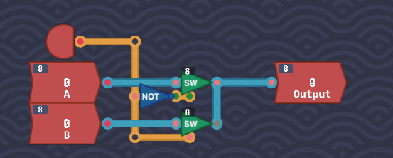
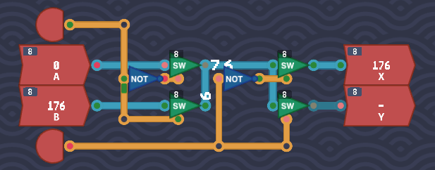
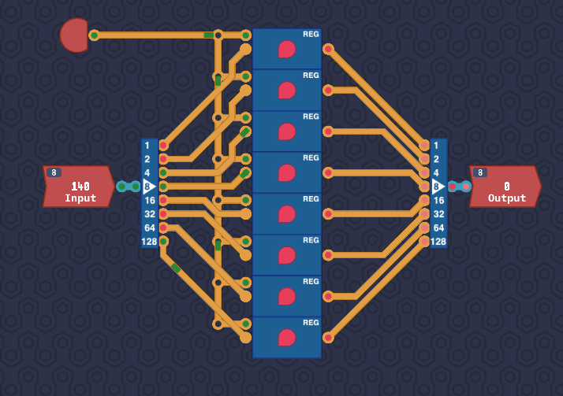
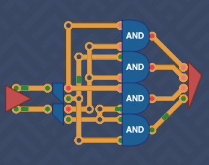
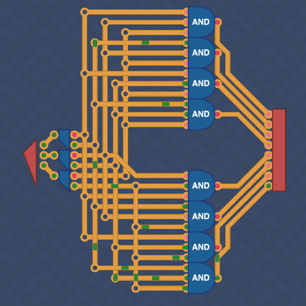
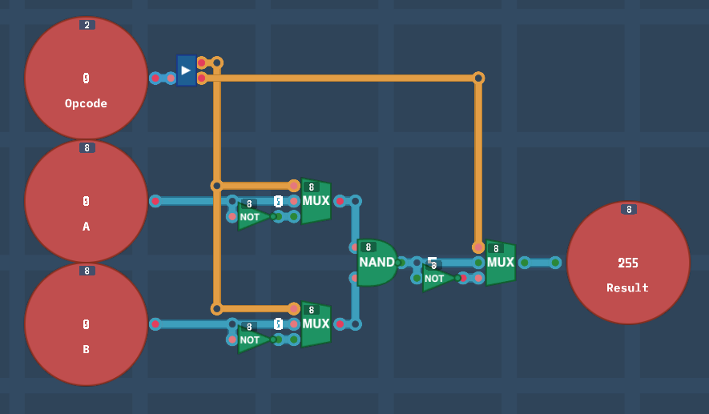
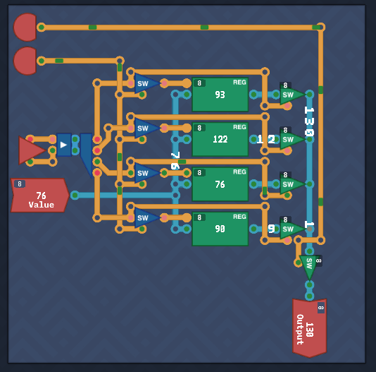
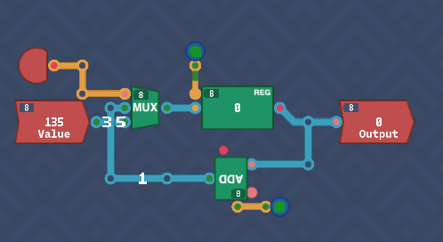

## Initial

The next series of components to be crafted are related to the memory, i.e. registers and later on RAM.

---
## Multiplexer

With two inputs `A` and `B`, choose which one to send to the output by the value set in the `SELECT` input. This is just at `MUX8B` like seen in MHRD.

As we have access to the `8-bit switch` component, just connect up the inputs to two switches, and use the `SELECT` as the `enable` flag on them, taking not to negate the input of the first switch. This unlocks the `MUX` component.



---
## The Bus

Another interesting challenge. There are two inputs, `A` and `B`. The `Input Select` input determines which input to take, and the `Output Select` input determines which output to send the input value to. There is a limit of parts to use, just 4 `8-bit switch` components and 2 `NOT` gates. The input part is identical to the `MUX` component just built, and the output part is very similar also. Just be sure to connect the outputs of the first two switches to the last two.



---
## Saving Gracefully

Looks like the time to build a register has arrived. There are two inputs, `Save` which if enabled means to save the second input `Value` to a `Delay Line`. The trick to keeping the value stored in the `Delay Line` is by looping it back on itself as observed before, but this time also allowing to set a new value if requested.

Start with a `Delay Line` as this will be storing our bit. Connect the `DL` out to `Output` as expected but also loop it back to a switch. This switch will be enabled when `Save` is `0` so add a `NOT` gate from `Save` to this switch's `enable`. As long as 'Save' is '0', it will repeat back the value of `DL` back into itself. 

Similar logic applied for the `Value` input, feed it into a second switch and enable when `Save` is `1`. Pipe both switch outputs to the `DL` input and you are set.


This unlocks a `1-bit Register`.

---
## Saving Bytes

Same design as above but just expanding into 8 bits, so chain up 8 `1-bit Registers`, connect up the 'Save' input as expected, then split/join the input and outputs from bytes to bits.



This unlocks our first `Register` in Turing Complete, and an `8-bit Delay Line`.

---
## 1 Bit Decoder

The first in our trio of decoders. Basically think of these are always outputting true on only one output. This couldn't be simpler, just use a `NOT` gate.


This unlocks the `1-bit Decoder`.

---

## 2 Bit Decoder

A simple extension of this, however we need to use the newly unlocked `1-bit decoders` and utilize them with four `AND` gates. This ensures only one output will ever be true.



---
## 3 Bit Decoder

This is just an extension of the `1-bit Decoder` however not as easy. I had originally decided to try this with a series of `1-bit Decoder` pieces and a bunch of switches, however in the end I settled for using decoders on the inputs, and piping all permutations into `3-bit AND` gates, one for each possible output. This unlocks the `3-bit Decoder`.



Although it works, I feel like I could tidy this wiring, but if it works....

This unlocks the `3-bit decoder` which will come in handy in future.

---

## Arithmetic Logic Unit - 1

The fun begins finally. All that toil in making the core components is paying off, and this will help us start building out a basic CPU. This should be recognizable as a part of the ALU from MHRD.

There are two byte inputs, and an `OpCode` input that determines what action is to be performed.

```txt
0 - NAND
1 - OR
2 - AND
3 - NOR
```

For logic, there is only one component available at present for bytes, a 8-bit `NAND` gate. If we remember the Demorgan's Theorem Graph, these four calculations can be performed by using one gate, just NOT the inputs/outputs to achieve the same effect.

Wiring up the two inputs and the output to the `NAND` gate, it runs as expected of course.  To achieve `AND` behaviour, the output needs to be swapped using a `8-bit NOT` gate.  The regular and inverted versions of the output are connected to a `MUX` to decide which one to use. This is also performed on both inputs.

To decide what should be flipped when, the `OpCode` is ran through a splitter, and the first bit manages the inputs, and the second bit manages the output.  A basic logic engine is built which also unlocks 8-bit versions of `NOR`, `AND` and `OR` components.



---
## Little Box

This challenge provide a new constraint not previously seen before, space.  The entirely of this component must fit in a *little box*.  This provides some extra challenges on what components to use and where to try to fit them.

The challenge builds out a 4-byte RAM module. With this of course, these modules can be chained together to make a larger RAM size. Start by setting up 4 `Register` components named `00`, `01`, `10`, `11`. There is a two bit `Address` input which will select which `Register` we want to interact with.

There is also a `Value` input which outputs a byte, and when the `Save` input is enabled, this value is to be saved to the respective `Register`. The final input `Load` is used to output the value of the selected `Register`. Simple save/load logic.

In the older version of TC, I struggled with this a lot, I believe that some parts may have been limited to me but I can no longer check or recall. Below is my old version, where I used a bunch of `3-input AND` and `MUX` gates.


In the newer version of TC, I came at this a different way and in fact it was easy to do. First, add the 4 `Register` components with a space between them, then hook up the `Value` input to all. For the address selector, I just piped in both bits in to a `2 bit Maker`, then piped that into a `2-bit Decoder` which will always select the correct register address. This is then hooked up to switches that enable the save function of the register when the `Save` input is enabled, then a similar logic for the output. A final switch was added to only output the selected register value when the `Load` input is on. This is a much more elegant and clean approach.



A fun challenge what unlocks a much larger component, a `256 byte RAM`.


## Counter

A counter is an extension of a `Register` in that it stores and hold a value, but also increments by one per tick.  This is useful for knowing what address of a program to run for example.  There's an extra contition, that if the `SAVE` input is set, then the value is overridden by the input value.

Grab a `Register`, then connect its out value to the output. Also connect the out value to a `Full Adder`. This will act as the incrementer. Connect the adder output to a `MUX` so that it can choose between the adder value or the input if overridden. Finally, connect an `Always On` to the load/save register inputs and the adder carry.



This unlocks the `Counter` component.
## Conclusion

Registers and RAM are now tackled as well as a basic ALU. Joining these up to the previously created arithmetic components will form a primitive CPU that can be coded for.
