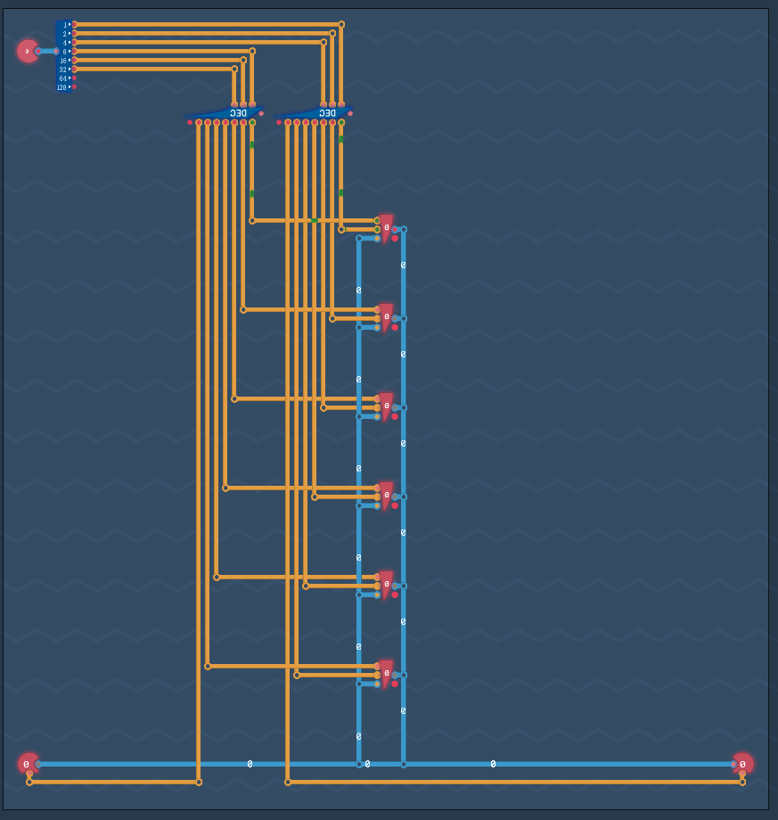
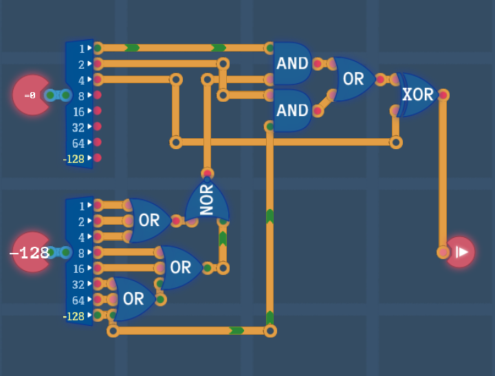

## Introduction

With the foundations now in place, it’s time to build our first CPU—capable of receiving and executing instructions. Unlike in MHRD, here we have the flexibility to craft our own instruction set. While it may be basic initially, the CPU will be of our own design and creation.

---

## Arithmetic Engine

We begin by enhancing the previous ALU design by adding `ADD` and `SUB` functionalities. While it’s possible to use De Morgan’s laws and rely on a single logic gate for the first four operations, it’s cleaner and more efficient to use the newly unlocked gates.

For handling instruction input, a bit splitter and a decoder simplify selecting the desired operation. The inputs are routed to `OR`, `NAND`, `NOR`, and `NAND` gates, with each output connected to a switch. The decoder then controls the enable signal for each switch.

The final two bits in the decoder correspond to `ADD` and `SUB` operations. Since there is no specific subtractor component, subtraction is achieved by negating the second input. The same adder handles both `ADD` and `SUB`, with a `Negator` and a `MUX` determining whether the second input is negated. This completes the ALU, which can still be edited for improvements later.


---

## Overture Architecture

We are now ready to build our first CPU architecture: **Overture**. Unlike previous challenges, this design will be refined over time, and improvements will carry over to earlier challenges when revisited.

---

## Registers

The architecture starts with three key components: `Instruction`, `INPUT`, and `OUTPUT`, along with six `Register` components named `REG 0` to `REG 5`. These registers are fixed in place, allowing space for future expansion.

At this stage, the instruction set is simple: values are copied from one location to another. The three lowest bits of the instruction specify the destination, while the next three bits indicate the source. The two highest bits are unused for now.

Here’s how the inputs and outputs map to the instruction bits:

```txt
000 - REG 0
001 - REG 1
010 - REG 2
011 - REG 3
100 - REG 4
101 - REG 5
110 - Input/Output
```

For instance, to store the value from `INPUT` into `REG 3`, the instruction would look like `XX110011` (the `XX` representing the ignored two highest bits).

Since only one source and one destination are used at a time, all inputs and outputs are connected together. The instruction byte is split, with the source and destination bits routed through a decoder, which is then connected to the appropriate `LOAD` and `SAVE` pins of each register.



---

## Instruction Decoder

The remaining two bits of the instruction determine the action to be performed. At this point, the CPU can only `COPY` values from one place to another. As additional functionality is added, these bits will drive more complex operations. For now, here are the possible values:

```txt
00 - IMMEDIATE
01 - CALCULATE
10 - COPY
11 - CONDITION
```

Other operations will be introduced as new components are added.


---

## Calculations

By integrating the ALU designed earlier, we can now perform arithmetic operations on two registers, specifically `REG 1` and `REG 2`, with the result stored in `REG 3`. While the `LOAD` input triggers the output of a register, there is now a second output that continuously outputs the current register value, regardless of the `LOAD` state.

To avoid unwanted behavior, the decoders (used during `COPY` operations) can be disabled during other operations by adding an additional control signal. This is managed by connecting the 7th bit of the instruction splitter to the decoder enable pins, ensuring they are only active during a `COPY`.

The instruction decoder feeds the inbound instruction into the ALU, which receives inputs from `REG 1` and `REG 2`. The ALU’s output is routed to a switch, which is only enabled for `CALCULATE` instructions, and the result is stored in `REG 3`.


To summarize, for all `CALCULATION` operations, `REG 1` provides the first input, `REG 2` the second, and `REG 3` stores the result. At this point, the **Overture** CPU can handle both `COPY` and `CALCULATE` instructions.


---

## Conditions

Conditional operations are the next step, though the component required for this hasn’t been designed yet. The goal is to check specific conditions, such as whether a value is zero, positive, negative, etc.

This component took some trial and error to design, but the solution became clear as I focused on building one condition at a time. Here’s how the conditions were implemented:

### 0 - NEVER

This is straightforward: the output is always false.

### 1 - VALUE == 0

This condition checks if a number is zero, which occurs only if all bits are `0`. To achieve this, several `3-bit OR` gates are chained to detect if any bit is `1`. The result is fed into a `NOR` gate, which outputs true only if all bits are `0`.


### 2 - VALUE < 0

This condition simply checks if the 8th bit of the value is set, indicating a negative number.


### 3 - ALWAYS

This is the opposite of `NEVER`: the output is always true.


### 4 - VALUE != 0

This is the opposite of `VALUE == 0`. By this point, it’s clear that if the third pin is positive, the output is negated. An `XOR` gate handles this, completing the rest of the conditions, including `VALUE >= 0` and `VALUE > 0`.



---

## Conclusion

The **Overture** CPU design is nearing completion. In the next section, we’ll finalize the design and take the first steps toward writing code that can execute on this CPU.
