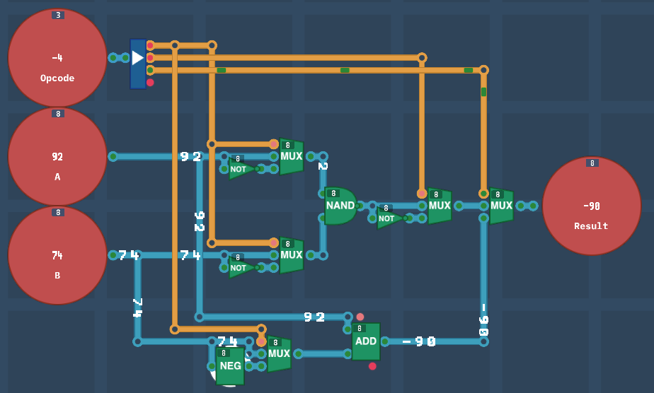
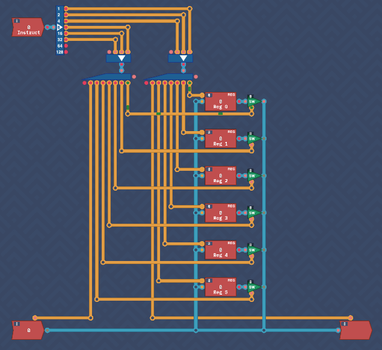
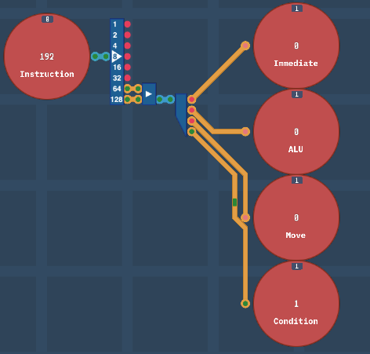
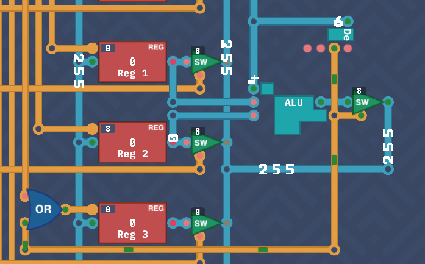
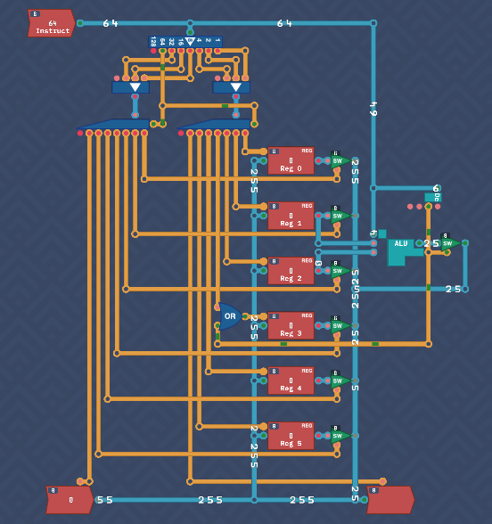
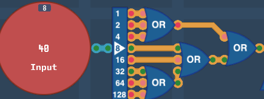
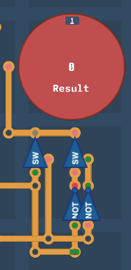
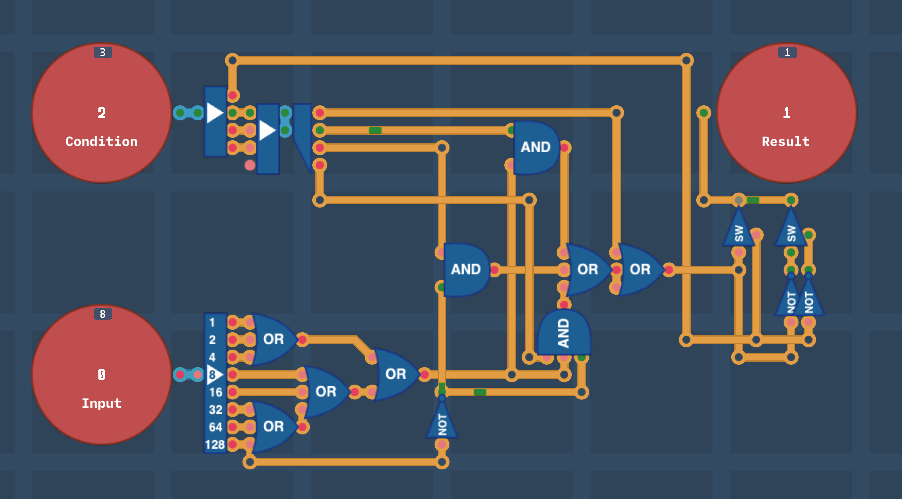

## Introduction

With the foundations now in place, it’s time to build our first CPU—capable of receiving and executing instructions. Unlike in MHRD, here we have the flexibility to craft our own instruction set. While it may be basic initially, the CPU will be of our own design and creation.

---

## Arithmetic Logic Unit - 2

We begin by enhancing the previous ALU design by adding `ADD` and `SUB` functionalities. While it’s possible to use De Morgan’s laws and rely on a single logic gate for the first four operations, it’s cleaner and more efficient to use the newly unlocked gates.

As the splitter only handled two bit inputs, I replaced it with a `4-bit splitter`. When the third bit is enabled, it switches to the `ADD/SUB` output. I added a `MUX` to handle this bit.

Next, add an `Adder` that takes input `A` and a `MUX` that is used a `Negate` to take the value of `B` and either pipe `B` as normal (ADD) or a negated version (SUB) using the `Negate` output.

This was just a simple addition but a basic ALU is now built.



---

## Overture Architecture

We are now ready to build our first CPU architecture: **Overture**. Unlike previous challenges, this design will be refined over time, and improvements will carry over to earlier challenges when revisited. This will also be a LOT of fun.

---

## Registers

The architecture starts with three key components: `Instruction`, `INPUT`, and `OUTPUT`, along with six `Register` components named `REG 0` to `REG 5`. 

At this stage, the instruction set is simple: values are copied from one location to another. The three lowest bits of the instruction specify the destination, while the next three bits indicate the source. The two highest bits are unused for now.

Here’s how the inputs and outputs map to the instruction bits:

```txt
000 - REG 0
001 - REG 1
010 - REG 2
011 - REG 3
100 - REG 4
101 - REG 5
110 - Input/Output
```

For instance, to store the value from `INPUT` into `REG 3`, the instruction would look like `XX 110 011` (the `XX` representing the ignored two highest bits).

Since only one source and one destination are used at a time, all inputs and outputs are connected together, with a `Switch` connected to the output of each register. 

Split the `Instruction` input with a `Splitter`. Feed the three source and destination bits into a `Maker` each and the outputs of the makers into a `3-bit Decoder`. This will act as the selector of what we want to input/output from.

The input decoder will enable a `Register` to load an input or load from the `Input` itself. The output decoder will enable a register output switch or the `Output` as the destination

I actually found it very useful to run the simulation until it reached an error, then connect the correct input/output selectors one by one until it completed.




---

## Instruction Decoder

The remaining two bits of the instruction determine the action to be performed. At this point, the CPU can only `COPY` values from one place to another. As additional functionality is added, these bits will drive more complex operations. For now, here are the possible values:

```txt
00 - IMMEDIATE
01 - CALCULATE
10 - COPY
11 - CONDITION
```

This is a simple grabbing of the two remaining bits and running them through a maker and decoder.



Other operations will be introduced as new components are added.


---

## ALU

This brings our freshly designed `ALU` and `Dec` components back into the registers schematic. The notes state the following two modes are now possible:

```
ALU - Perform ALU calculation
MOVE - Move data from input -> output (Already completed)
```

The notes also state that when in ALU mode, to take the values of `REG 1` and `REG 2` as inputs, and store the output of the `ALU` into `REG 3`.

I placed the ALU to the right of the input registers and fed their values into the `ALU`.  Next, I added the `Dec` module and connected it to the a switch that handles the `ALU` output which will only output back to the byte circuit when true. `Reg 3` however needs to be told to take a value so I added an `OR` gate to handle the move bit as well as the `ALU` calculation output.
d


The `ALU` OpCode is the lower bits of the `Instruction` input, so that is fed into it also.

To avoid unwanted behavior, the decoders (used during `MOVE` operations) can be disabled during other operations by adding an additional control signal. This is managed by connecting the 7th bit of the instruction splitter to the decoder disable pins, ensuring they are only active during a `COPY`.

To summarize, for all `ALU` operations, `REG 1` provides the first input, `REG 2` the second, and `REG 3` stores the result. At this point, the **Overture** CPU can handle both `MOVE` and `ALU` instructions.



---

## Conditions

Conditional operations are the next step, though the component required for this hasn’t been designed yet. The goal is to check specific conditions, such as whether a value is zero, positive, negative, etc.

This component took some trial and error to design, but the solution became clear as I focused on building one condition at a time. Here’s how the conditions were implemented.

The OpCodes are:

```
000 (0) - Never
001 (1) - Always
010 (2) - If value == 0
011 (3) - If value != 0
100 (4) - If value < 0
101 (5) - If value >= 0
110 (6) - If value <= 0
111 (7) - If value > 0
```

Let's think about this. Ignoring the first two for now, all compare the value to a relationship of zero.  Also, if you close closely, they are four pairs of opposites with the least significant bit toggling between them.

Start by splitting the bits of the input and chaining them together with multiple `OR` gates. This will determine if it is zero of not.  



Next, build a bit flipper using two switches and `NOT` gates. I would've used a `MUX` however they were not available.  This will be controlled by the LSB of the condition making the opposite of the input if it is true.



Next chain up an `OR` and a `3-bit OR` gate so that it can take four inputs, one for each condition.

Finally, with the remaining 3 bits from the condition, feed into a decoder.


### Always/Never True

This is the simplest logic. Just feed decoder bit 1 into the first `OR` input.

### Value =0 or !=0

Add an `AND` gate to take the decoder bit 2 and the output of the input `OR` gates. Feed into the second `OR` gate input.


### Value <0 or >=0

This is very simple and similar to the above, just one `AND` gate taking decoder bit 3 and the negative bit from input negated. 

### Value <=0 or > 0

This is slightly more complex where it requires a three input `AND` gate that's a combination of the above two conditions. It takes the final decoder bit, the negated negative bit and the input `OR` gates.

This was my solution but I get the feeling there's a more efficient approach. I'll return to this in the future but overall this is efficient and elegant enough for me.



---

## Conclusion

The **Overture** CPU design is nearing completion. In the next section, we’ll finalize the design and take the first steps toward writing code that can execute on this CPU.
