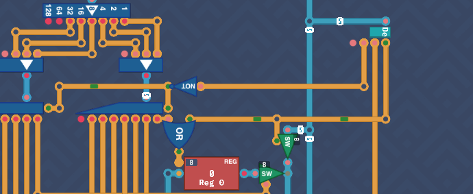
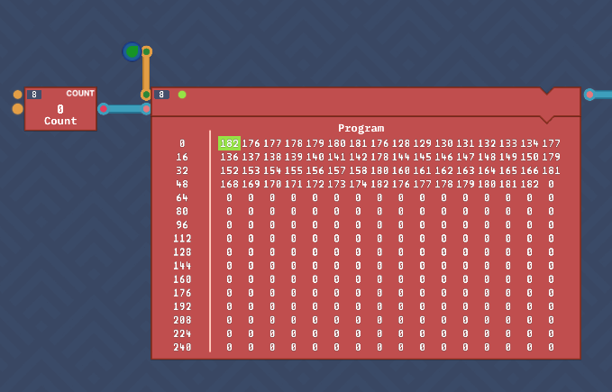
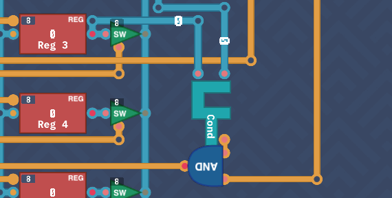
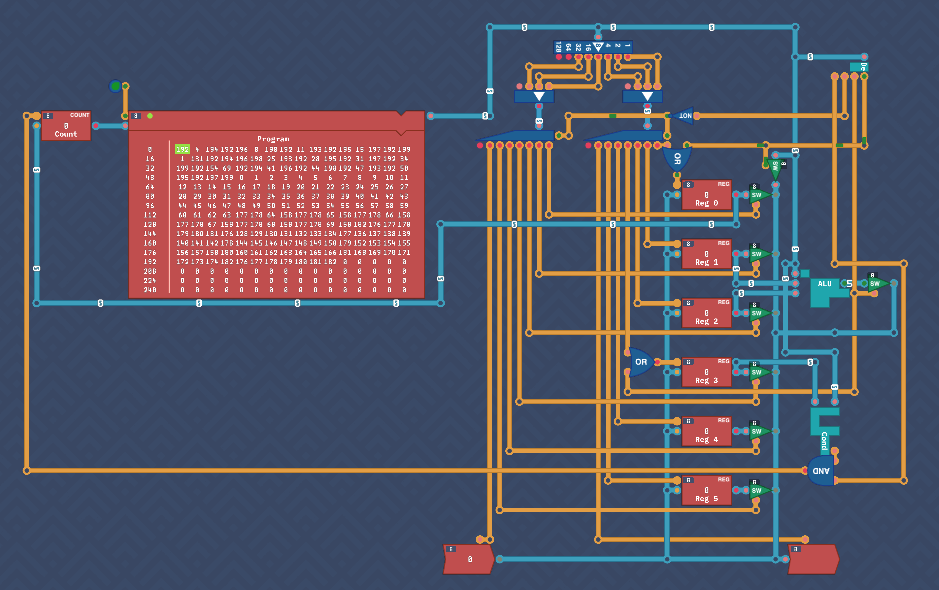
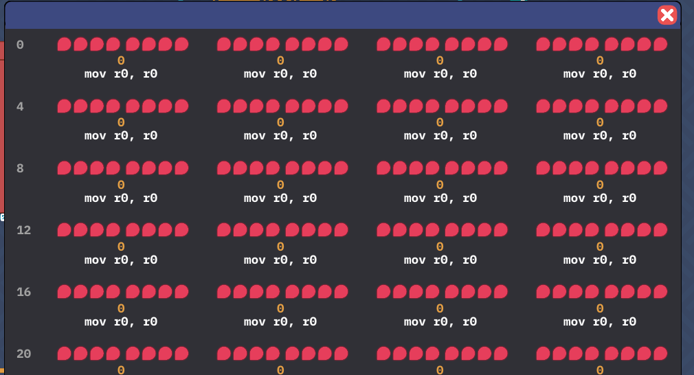
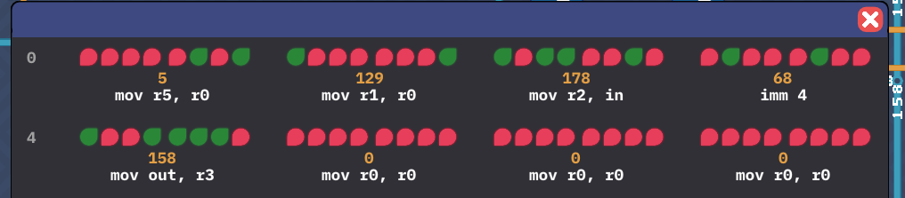

## Introduction

In this section, we continue building and refining the **Overture** CPU. With the ability to load instructions from memory and manage immediate values, the design starts to take shape. We also introduce conditional logic, making the CPU capable of handling jumps, loops, and custom scripting.

---

## Immediate Values

To allow the loading of immediate values into a register, the `IMMEDIATE` instruction is introduced. When this instruction is flagged, the next 6 bits of the instruction are stored directly in `REG 0`. Although the last two bits should technically be ignored, simulations show that using them as-is works fine. An additional enable condition is wired to `REG 0`, allowing input only when the `IMMEDIATE` flag is set, with the input value piped into the register. A byte switch is also added to only output the value during immediate.

The trick of just using the 7th bit to disable the source destination decoders no longer worked, so a negated decoder `MOVE` bit does the trick now.



---

## Program

Up until now, the `Instruct` input was just something we couldn't control, but this is to be replaced with a block of RAM called `Program`. This will act as our instruction input. Delete the old instruction input and connect the output of `Program` to where the instruct was. Next, it needs to be enabled, so just add an `Always-On` to the enable pin. the RAM is just a long list of registers and it needs to know what register to output. You should also see a `Counter` to the left of this. This will track where in the program it is (called an instruction pointer also). After each tick, the `Counter` increments by 1, moving to the next instruction.

Connect up like so and the program should run. In the future, you'll be able to manipulate the data in this to make your own programs.



This unlocks load and store pins on memory components. 

---


## Turing Complete

The final piece needed to complete the **Overture** CPU is the conditional logic component, previously designed. This component checks the value of `REG 3` and, if the specified condition is met, resets the `COUNTER` to the value in `REG 0`. This enables loops and jumps within the program. Cool.

To implement this, connect the `CONDITIONAL` component to the diagram, feeding the instruction and `REG 3` into its inputs. The output bit and conditional flag are sent to an `AND` gate, ensuring that the `COUNTER` is overridden only when both conditions are met. `REG 0` is then connected to the `COUNTER`.






---

## Overture Complete

Congrats, your first Turing Complete computer is built!  At this point, we’ve reached a similar stage as the final design in MHRD, but Turing Complete is just beginning to expand. The **Overture** architecture is still basic, but it provides a foundation for more complex designs and operations in the future.

---

## Punchcard Programming

With the **Overture** CPU completed, we now move on to writing some machine code to run on it. The goal is to create a program that reads an input, adds 5 to it, and then outputs the result. The ability to do stuff with the CPU is limited but I promise you, this is the first baby steps into assembly coding.

A high level concept for this challenge would be:

```
- Load 5 into Reg 0 (Immediate)
- Move 5 from Reg 0 to Reg 1 for future use
- Move input to Reg 2
- Add (Reg 1 + Reg 2) => Reg 3
- Move Reg 3 to Output
```

To write the code, click the edit icon on the `RAM` block to open the binary editor.  You can see the instructions mapped below each byte.



Note, at the time of doing this challenge, the instructions are mapped incorrectly so it's misleading. Instead, remember this mapping for instructions (two highest bits)

```
00 - Immediate
01 - ALU
10 - Move
11 - Conditional
```

There is no requirement for a loop, it will just start at the beginning once complete. This is only 5 instructions long:

```
00 000 101 (5)   - Immediate 5 - (5 to Reg 0)
10 000 001 (129) - Mov Reg 0 -> Reg 1
10 110 010 (178) - Mov Input -> Reg 2
01 000100  (68)  - ADD (Reg 1 + Reg 2)
01 000 100 (68)  - Immediate 4
10 011 110 (158) - Mov Reg 3 -> Out
```


**Instructions incorrectly labelled in this image - BETA VERSION**

If you're not aware, it's called *Punchcard Programming* as this was literally how early programs were written, via holes punched in a paper card which were fed into a card reader.

---

## Assembly Programming

Doing basic instructions via punchcards is tedious and hard. To help us, there is a low level language called *Assembly* which will make our lives easier. In this challenge, we replicate the same logic but in assembly.  It should be fairly intuitive.

**Important Note:** When using the `mov` command, the syntax is `mov <dst>, <src>`. 

If you are unsure of the syntax of a certain command, click the `ASM/ISA` button, which will show you the assembly instructions. With that, let's convert our old program into assembly.

```
imm 5
mov r1, r0
mov r2, in
add
imm 4
mov out, r3
```

---

### Register Usage Recap

Now is a good time to understand our registers a little better for future reference. There are 6 `Register` components, each with specific usage characteristics. It’s important to document these so that we can manage the storage and retrieval of data effectively:

```txt
REG 0 -> Stores immediate inputs and used as an address when resetting the counter.
REG 1 -> First operand for calculations.
REG 2 -> Second operand for calculations.
REG 3 -> Stores the output of calculations and input for conditionals.
REG 4/5 -> Can be used for long-term storage.
```

---
## Circumference

The next challenge involves calculating the circumference while given a radius. The rough calculation is `2*π*r`, where `r` is the input. For simplicity, we round `π` to 3, so the calculation becomes multiplying the input by 6.

### Handling Multiplication

There is no multiplication component, but we can simulate multiplication through repeated additions.

### Solution

Here’s a simple solution to multiply the input by 6:

```txt
Grab input (e.g. 10)
Double it (20)
Add the original input (30)
Double again (60)
```

The code to achieve this:

```matlab
mov r1, in  // input to r1
mov r2, r1  // r1 to r2
add         // add both numbers (double) (r*2)
mov r1, r3  // copy output back to r1
add         // add original and doubled number (r*3)
mov r1, r3
mov r2, r3  // Copy output to r1,r2
add         // r*6
mov out, r3 // output the result
```

---

## Conclusion

We can now write basic code that our CPUs can run. This is monumental step in getting stuff running. You should be proud of yourself.