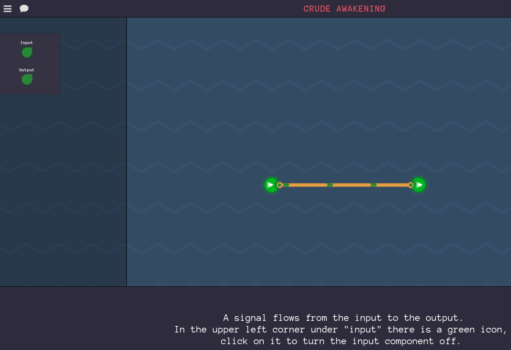
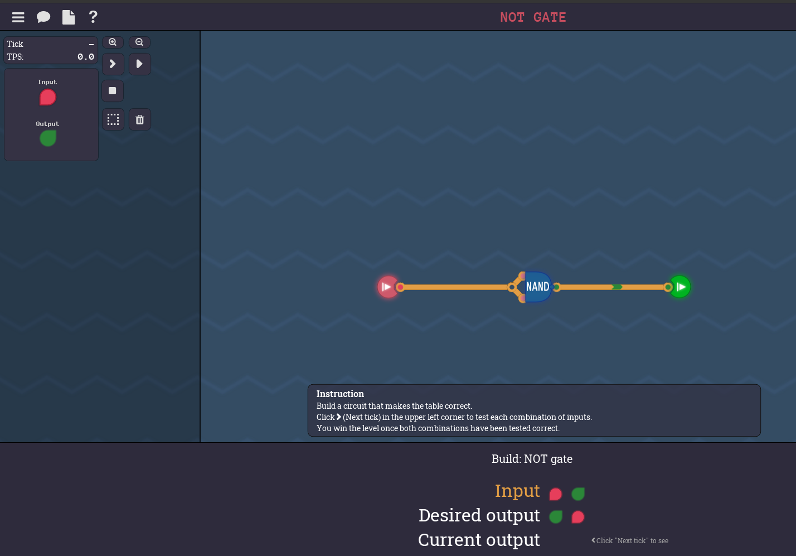

## Initial

After the successful completion of building a CPU in MHRD, we turn our attention to a new game, *Turing Complete* (TC). TC delivers a similar quest like MHRD in that basic hardware is built to perform some calculations however two major differences should be known. Firstly, gone is the method of having to laboriously type out the connections to get the components to work; an intuitive GUI design is used instead. Secondly it is much more extensible.  The more complex components can be custom designed and the machine code for it can also be custom written to suit the architecture.

Like in MHRD, the initial building blocks will be performed again, however some newer components will also be created during this time. After this, the real power of TC will emerge.

Side note, in TC you've been abducted by some aliens who require you to perform ~~slave labour~~ exciting work. They state that you should build a functional computer or else you will be eaten.

Let's get started with the first few challenges.

## Crute Awakening

This is just a simple exercise to showcase the usage of the toggles on the top left and shows that when the input is disabled, the output also is disabled.

## NAND Gate

We are already familiar with the NAND gate. The challenge here is to fill out the output at the bottom to match the expected outputs of a NAND gate. Simply fill out the correct pattern and click `check` to complete.  This will unlock a `NAND` gate.

## NOT Gate

Our first new gate. As before, creating a NOT gate with a NAND is trivial.  Create the design as shown and click on the Run button on the top left to complete.

This unlocks the `NOT` gate and the level map which will be traversed for the rest of this exercise.

## AND Gate

Just connect up both inputs to a NAND, then negate the output with a NOT and this will represent an AND gate. This unlocks the `AND` gate.

## NOR Gate

This is a new type of gate not seen previously in MHRD.  NOR means 'NOT OR', so it will only be true if neither input is also true.

As there's only NOTs and NANDs available to us, insert a NAND, and negate both inputs and the output to get the desired result. This unlocks the `NOR` gate.

## OR Gate

Same as above, but as we are again negating the output of the NAND, the original output NOT is cancelled out, so it can be removed.  This unlocks the `OR` gate.

## Always on

Another new component previously unseen, 'always on'. It simply means that regardless of the input, the output is always true. As the input value is ignored, it is not needed for this. Instead, a simple NOT gate is connected to the output which will always output a `1`.

This unlocks the Always On and an Always Off component. It also documents De Morgan's Laws as previously discussed that shows the relationship between the OR, NOR, NAND and AND gates.

## Second Tick

There are four input ticks and the ask is to only output `1` on the second tick.  The condition for the second tick is only when `input 1` is `1` and `input 2` is `0`. To replicate this, an `AND` gate can be used with a `NOT` for `input 2`.

## XOR Gate

Familiar territory again. Using the same diagram from MHRD, this is trivial. This unlocks the `XOR` gate.

## Bigger OR Gate

A new concept emerges with a bigger amount of inputs for an `OR` gate however this is just like the 4 input `OR` gate in MHRD. All that's required are 2 `OR` gates.  This unlocks a `3 input OR` gate.

## Bigger AND Gate

Exactly the same wiring as the above except with `AND` gates. This unlocks the `3 input AND` gate.

## XNOR Diagram

The final component in the basic logic section is an `XNOR` gate which is simply a negative output of an `XOR` gate.  This unlocks the `XNOR` gate.

## Conclusion

A lot of previous learnings from MHRD were applied to this section but the base for the next section is ready.
