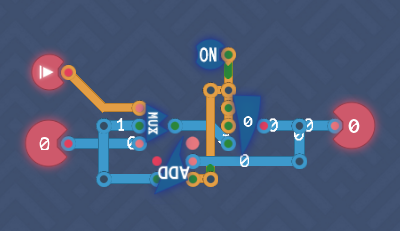
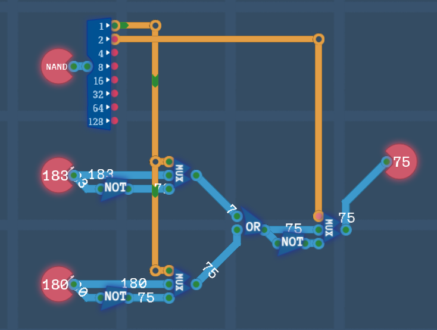

## Initial

The next series of components to be crafted are related to the memory, i.e. registers and later on RAM.

## Delayed Lines

This introduces the `Delay Line` component which takes and input and outputs the bit value one clock tick later. This is identical to the `DFF` component observed in MHRD.

The challenge asks to take an input and then to output the same value two ticks later. This just requires chaining of two `Delay Line` components. This unlocks the `Delay Line`.


## Odd Ticks

Another simple challenge. The goal is to output a `1` every second tick.  The trick here is taking the output of a `Delay Line`, negating it, and feeding it back, so that it will change every tick. The output is also fed to the `output`.


## Bit Inverter

This is just an `XOR` gate as previously discussed.


## Input Selector

With two inputs `A` and `B`, choose which one to send to the output by the value set in the `SELECT` input. This is just at `MUX8B` like seen in MHRD.

As we have access to the `8-bit switch` component, just connect up the inputs to two switches, and use the `SELECT` as the `enable` flag on them, taking not to negate the input of the first switch. This unlocks the `MUX` component.


## The Bus

Another interesting challenge. There are two inputs, `IN 0` and `IN 1`. The `FROM` input determines which input to take, and the `TO` input determines which output to send the input value to. There is a limit of parts to use, just 4 `8-bit switch` components and 2 `NOT` gates. The input part is identical to the `MUX` component just built, and the output part is very similar also. Just be sure to connect the outputs of the first two switches to the last two.


## Saving Gracefully

Looks like the time to build a register has arrived. There are two inputs, `ACTION` which if enabled means to save the second input `VALUE` to a `Delay Line`. The trick to keeping the value stored in the `Delay Line` is by looping it back on itself as observed before, but this time also allowing to set a new value if requested.

Use two `1-bit switch` components and connect the `enable` to the `ACTION` input, with one negated.  For the negated switch, connect the output of the `Delay Line` to the input, so if the `ACTION` is negative, then it will continuously store the value back on itself. If the `ACTION` is positive however, then the other switch is enabled which outputs the value of the `VALUE` input.


While we call this component a `Register` from MHRD, its name here is `1-bit memory` which is unlocked. TC's version of a `Register` comes next.

## Saving Bytes

Slightly more complex design here. Only store the input value when the `SAVE` input is set, and only output the stored value when the `LOAD` input is set.

As there is no way to store a byte, 8 `1-bit memory` components are used. The input byte is split and fed into each memory piece, and the outputs of the memory pieces are piped back to a `Byte Maker`.  Finally, to handle the `LOAD` input, this input is connected to the newly added `enable` flag on the `Output`. This creates an `8-bit Register`.


## 1 Bit Decoder

Basic challenge that routes a bit. If the input is negative, then `output 1` is postive, otherwise `output 2` is. This can all be achived just using a `NOT` gate. Decoders are useful when using switches.  This unlocks the `1-bit Decoder`.


## 3 Bit Decoder

This is just an extension of the `1-bit Decoder` however not as easy. I had originally decided to try this with a series of `1-bit Decoder` pieces and a bunch of switches, however in the end I settled for using decoders on the inputs, and piping all permutations into `3-bit AND` gates, one for each possible output. This unlocks the `3-bit Decoder`.


## Little Box

This challenge provide a new constraint not previously seen before, space.  The entirely of this component must fit in a *little box*.  This provides some extra challenges on what components to use and where to try to fit them.

The challenge builds out a 4-byte RAM module. With this of course, these modules can be chained together to make a larger RAM size. Set up 4 `Register` components, and connect the `INPUT` to the inputs of the registers. Note that this is safe to so as the registers will only accept the value *if* the `SAVE` input is enabled.  There are two other inputs that basically state what address to save the value to. The 4 register addresses are `A0`, `A1`, `B0` and `B1` but you can just think of these as `0,1,2,3`. My initial idea to solve this was to just use a bunch of `3-bit AND` gates to be connected to the `LOAD` and `SAVE` inputs, however space did not allow it.  Instead, I just used 4 of the ANDs to control input. Each AND gets an input from the two address inputs (or negatives of) and the third input for when the `SAVE` input is enabled.  Due to space, the outputs are handled differently. When the `LOAD` input is enabled, all registers output however three `MUX` gates are used to choose which output is requested.

A fun challenge what unlocks a much larger component, a `256 byte RAM`.


## Counter

A counter is an extension of a `Register` in that it stores and hold a value, but also increments by one per tick.  This is useful for knowing what address of a program to run for example.  There's an extra contition, that if the `SAVE` input is set, then the value is overridden by the input value.

Grab a `Register`, then connect its out value to the output. Also connect the out value to a `Full Adder`. This will act as the incrementer. Connect the adder output to a `MUX` so that it can choose between the adder value or the input if overridden. Finally, connect an `Always On` to the load/save register inputs and the adder carry.



## Logic Engine

The last piece in this section before the CPU building can commence.  This should be recognizable as a part of the ALU from MHRD.

There are two byte inputs, and a `CODE` input that determines what action is to be performed.

```txt
0 - OR
1 - NAND
2 - NOR
3 - AND
```

For logic, there is only one component available at present for bytes, an `OR` gate. If we remember the Demorgan's Theorem Graph, these four calculations can be performed by using one gate, just NOT the inputs/outputs to achieve the same effect.

Wiring up the two inputs and the output to the `OR` gate, it runs as expected of course.  To achieve `NAND` behaviour, the output needs to be swapped using a `8-bit NOT` gate.  The regular and inverted versions of the output are connecte to a `MUX` to decide which one to use. This is also performed on both inputs.

To decide what should be flipped when, the `CODE` is ran through a splitter,and the first bit manages the output, and the second bit manages the two inputs.  A basic logic engine is built which also unlocks 8-bit versions of `NOR`, `AND` and `NAND`.



## Conclusion

Registers and RAM are now tackled as well as a basic ALU. Joining these up to the previously created arithmetic components will form a primitive CPU that can be coded for.
