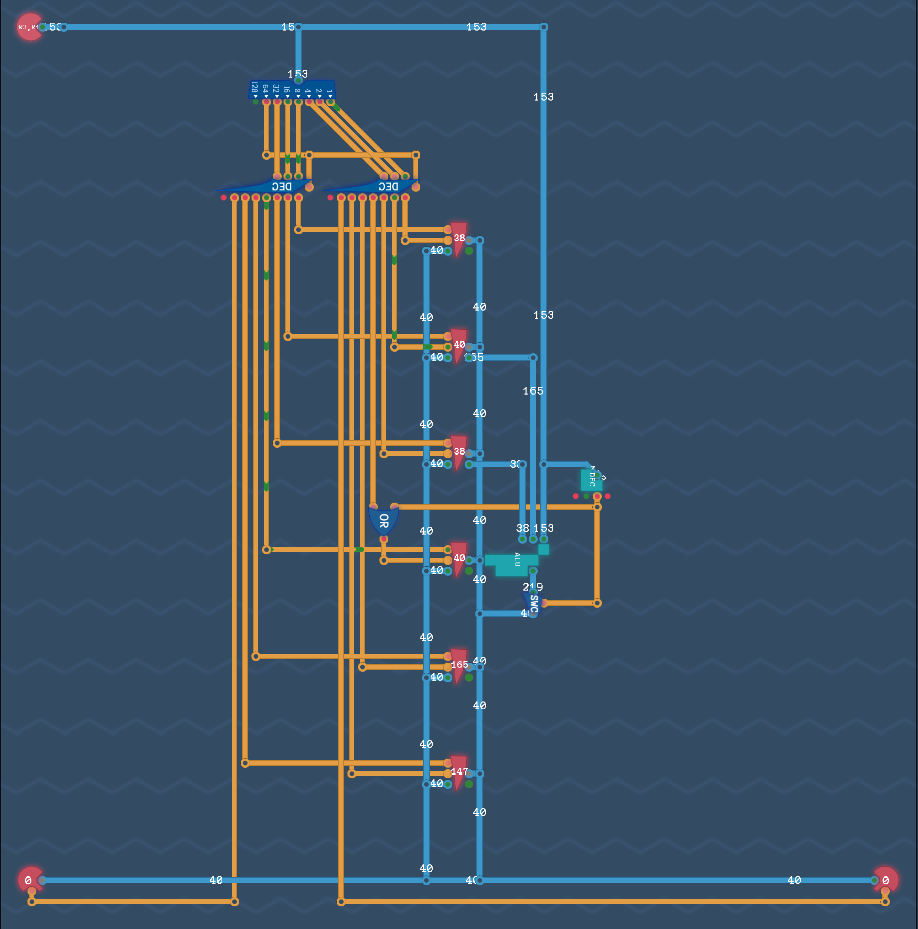

## Initial

The foundations are now set to build our first CPU, i.e. a device that can take instructions and action them. Unlike in MHRD however, it will be possible to craft the instructions ourselves. It will be basic, but it will be of our own creation.

## Arithmetic Engine

The last ALU component was basic, and this challenge can extend it by adding `ADD` and `SUB` functionality to it.  It's entirely possible to use the same method of using Demorgans and only use one logic gate for the first four instructions, however as some new shiny gates were just unlocked, using them instead looks cleaner.

For the input instruction, it's also cleaner to use a bit splitter and a decoder to handle choosing which instruction is requested.  Next, the inputs are connected to an `OR`, `NAND`, `NOR` and `NAND` gate with the output of each connected to a switch. The enable of each switch is then controlled using the decoder bit.

The final two bits used in the decoder are for `ADD` and `SUB`. There is not a subtractor component however this can be replicated by negating the second input. For these two instructions, the same adder is used, the only difference being if the second value is negated or not using a `Negator` and `MUX`.  This completes our ALU.

It should be noted that this design can be now plugged into designs but still can be edited in future.


## Overture Architecture

The time has come to build our first architecture, the **Overture**. This is not a one off challenge like before, but a design that will be improved upon over time.  If you improve the design and go back to a previous challenge, the latest one will appear.

## Registers

This starts with an `Instruction`, `INPUT` and `OUTPUT`, with six `Register` components called `REG 0` to `REG 5`. Note that these are stuck in place and cannot be moved. This is fine, as it allows space to evolve.

The instruction bytes at this time are simple, where values are copied from one place to another. The three lowest bits indicate the *destination* while the next three indicate the *source*.  The two highest bits are not used at this time.

The mapping for the inputs/output bit values are:

```txt
000 - REG 0
001 - REG 1
010 - REG 2
011 - REG 3
100 - REG 4
101 - REG 5
110 - Input/Output
```

So, for example, if the value from `INPUT` is to be saved in `REG 3`, then the instruction would look like `XX110011` where the two highest bits are ignored, `110` is the source and `011` is the destination.

As there will only be one source and one destination used, all inputs and outputs can be connected together. Next, the instruction byte is split, and the source bits and destination bits are both fed into a decoder. The decoder pins are connected to their respective devices with source connecting to the `LOAD` pin and destination connecting to the `SAVE` pin.


## Instruction Decoder

The two remaining bits in the instruction are used to determine what action is to be performed. Note that it is only able to COPY values from one place to another. Other funcionality will come by using the other components designed but first there needs to be an instruction decoder. The bit values are:

```txt
00 - IMMEDIATE
01 - CALCULATE
10 - COPY
11 - CONDITION
```

The other instruction types will be explained as they are built.


## Calculations

Adding the previously created ALU to this diagram will allow the ability to perform calculations on two values, namely `REG 1` and `REG 2`. The output of the calculation is then to be stored in `REG 3`. While the `LOAD` input is used to output a reg value, there is now a second output which will always output the value regardless of state.

It should also be noted that the two decoders are only explicitly used during a `COPY`, so to prevent unwanted behaviour, they can be disabled by using a newly added decoder input that when enabled does not output any values. Useful. For this diagram, I connected the 7th bit of the splitter to the decoder disablers, so when it was true (in this case, during a calculation), it disables the decoders.  This will be finessed later.

An `Instruction Decoder` is added and connected to the inbound instruction.  Our `ALU` is added to the diagram, inputting the instruction byte and `REG-1`/`REG-2` values. The `ALU` output is fed to a switch, so it will always remain disabled until the instruction is for a `CALCULATE`. The output is then set into `REG 3`.


To be clear, when a `CALCULATION` occurs, regardless of what calculation to perform, `REG 1` is the first input and `REG 2` is the second, with `REG 3` as the output of calculation. At this stage, the **Overture** can `COPY` and `CALCULATE`.



## Conditions

The diagram will require some conditional calculations to occur, but that component hasn't been built yet, so, time to explore this.

The logic of this is basically to check if something is true, i.e. if the input is zero, positive or negative, etc.

This component I found hard to design knowing all the conditions that had to be made, but I've learned to embrace the idea of build it to meet the first condition, then adapting for the rest. When approaching it this way, I came up with some novel ideas to achieve my goal.

I started out splitting both inputs for further parsing, then observed the conditions as they came in through the simulator.  

### 0 - NEVER

The first instruction is easy, never output true when picked.

### 1 - VALUE == 0

The next one checks if a number is zero. This can only occur when all bits are `0`, so if any bit is `1`, this is incorrect. Chaining up some `3-bit OR` gates to read all the bits can detect if it is not `0`, then fed into a `NOR`, so it will be positive if the input is `0`.  Chaining this output to an AND, with the split instruction bit makes this work.


### 2 - VALUE < 0

This is a lot simpler. All that's needed is to check if the 8th bit of the value is set.


### 3 - ALWAYS

The opposite of `NEVER`. When this is true, just output true.


### 4 - VALUE != 0

So this is the second opposite instruction in a row. It's now clear that if the third pin is positive, then the output is negated. An `XOR` gate to handle the outputs of the previous instructions with the output of the third pin should complete this and the remaining conditions.

The other instructions (`VALUE >= 0` and `VALUE > 0`) work flawlessly with this approach.


## Conclusion

The final pieces for the **Overture** design is almost completed. In the next section, it will be completed and the first steps of writing code to execute on it will be performed.
