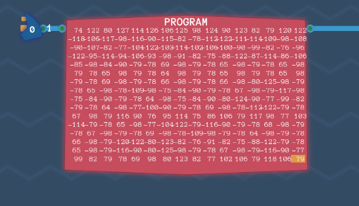

## Initial

## Program

The instruction input is removed and replaced with a RAM block. The inbound instructions are finally observable and will eventually be editable, allowing custom scripting. Connect the RAM block to where the old input was. Next, connect a `Counter` to the block, which will read it as the pointer to what instruction is needed to be outputted.



## Immediate Values

The needs to be an ability to load a value from the code into a register. The `IMMEDIATE` instruction can handle this. When the `IMMEDIATE` flag is set, the next 6 bits of the instruction are immediately stored in `REG 0`.

While techinically the last two bits should be ignored, the simulations show that this can just be used as is. An extra enable condition for `REG 0` is wired to allow input when the `IMMEDIATE` is enabled, and the input value is piped into the register.


## Turing Complete

The last piece is to be added and the **Overture** is complete.  The `CONDITIONAL` piece that was previously created is needed to be added and it's done.  The condition is checked against the value of `REG 3`. If the condition is met, then the value of the `COUNTER` is reset to the value of what is in `REG 0`.  

Adding the ability to control the `COUNTER` means that we can perform loops or jump to other pieces of code when we need to.

Start by adding the `CONDITIONAL` to the diagram, then add the instruction and the value of `REG 3` as the input. The output bit and conditional flag to an `AND` gate, so that if both are positive, the `COUNTER` is overridden. `REG 0` is fed to the `COUNTER` and the diagram is complete.


## Overture Complete

At this stage, we have reached as similar stage as the end of MHRD, however Turing Complete only really starts to expand at this point. The building of the **Overture** architecture is basic yes, but it is a foundation for more complex designs.

## ADD 5

With the newly created **Overture**, it's time to create some machine code to run on it.  To modify the input code, click on the pencil icon on the `RAM`. This opens the binary editor.  Now what?

The challenge is to create code that reads an input, adds 5 to it, then outputs it.

### 1 - Read Input

Figuring out what code to write is tough at the start, but clicking on the 'View instructions Definitions' is useful to getting started.  For the first step, the input must be copied to a place we can use later like `REG 1`, do using the helper, this instruction value is `177`.


### 2 - Add 5

Next, a `5` must be loaded into `REG 2` but this requires two steps.  First perform an `IMMEDIATE` which will save the value `5` into `REG 0`. Next, the copy from `REG 0` to `REG 2` is performed.


### 3 - Perform calculation

Next a `COMPUTE` is performed with the instruction to `ADD`.


### 4 - Output result

The value of the `ADD` is now in `REG 3`, so just copy that to the `OUTPUT`.


The bytes should look like this.  Run the program and it will complete.


This unlocks the IDE which will be used in the next challenge.

## Calibrating Laser Cannons

The next challenge is to calculate the circumference of an asteroid using the equation `2*π*r` where `r` is the input.  The value of `π` can be rounded to `3`, so in reality, the input just has to be multiplied by 6.

### Handling Multiplication

An issue has arisen in that there is no component to multiply a number. Not to worry however as multiplication is just repeated additions.

### Assembly Editor

The IDE or Assembly Editor makes writing code for this a lot easier. All that is needed is to map out an operation code (opcode) to a name of your choosing.  Just click on the `add` button in the editor and build your opcode there.

### Understanding Register Usage

There are 6 `Register` components, however some have special usages so, it's worth documenting what each ones characteristic is so that when we want store data for later retrieval (like the `r` value or a constant `6`), they are stored in a place that won't get overwritten.

```txt
REG 0 -> Stored immediate inputs. Also used when resetting counter
REG 1 -> First value when using calculate
REG 2 -> Second value when using calculate
REG 3 -> Output value of calculate and input of conditional
REG 4/5 -> Can be used for long term storage
```

### Solution

I had toiled with a possible solution for this, even considering building out a multiplier function, however reviewing some other ways this was tackled showed a simple solution, which is basically:

```txt
Grab input (e.g. 10)
Double it (20)
Add original input (30)
Double again (60)
```

I've added some self explanitory instructions to achieve this.

```matlab
in_to_r1  # grab input
r1_to_r2  # copy to r2
ADD       # r1+r2
r3_to_r1  # copy output to r1
r1_to_r2  # copy to r2
ADD       # r1+r2
r3_to_r1  # copy output to r1
ADD       # r1+r2
r3_to_out # result out
```

This unlocks the `Robotron 9000` which is a little robot that can be controlled.

## Spacial Invasion

Looking over the documentation, two things are mentioned that will become useful, first, the use of `const` which can declare a constant in the IDE. This makes life easier when trying to keep track of the Robotron's actions. Second is the `label` which is very useful for creating loops.  When using the `label` with a keyword, the address of the label is noted.

The Robotron starts out behind some boxes and the mission is to shoot all the "rats". This is similar to Space Invaders.  Running the code empty will show that the rats make their way down the screen until they reach a certain point and the game is over.  It should also be noted that the Robotron can 'see' directly in front of itself. If there is nothing, then a value of `0` is shown, however if there is something like a rat, then a value is shown, and the robot should then shoot.


### Starting Position

It is not possible to be effective at the starting point, so the Robotron needs to be positioned accordingly.  To move the robot, just output a value to `OUTPUT`.  Robotron (let's just call him 'Rob' from now on) has different values for each action, so the ones used are declared as `const` values.  Rob then needs to turn right, move fowards two squares, turn left then go forward once.

```matlab
const LEFT = 0
const FORWARD = 1
const RIGHT = 2
const WAIT = 3
const SHOOT = 5

# Move to position
RIGHT
r0_to_out
FORWARD
r0_to_out
r0_to_out
LEFT
r0_to_out
FORWARD
r0_to_out
```

### Waiting and Shooting


Next, Rob will wait at that position until something appears directly in front of him. The pseudocode for this would be: check in front, if nothing then wait another turn, or if there is something then shoot. As mentioned, loops are very useful for this part.

Two new instructions also: `JEZ` means "Jump if Zero" which is perfect when the input is zero and `JMP` is just "Jump always"

```matlab
label wait
WAIT         # Do nothing
r0_to_out
label shoot  # Come back here after shooting
in_to_r3     # Check input
wait
JEZ          # Jump back if Zero
SHOOT        # Shoot if not
r0_to_out
shoot
JMP          # Jump
```

Rob waits patiently for a rat to appear where he quickly dispatches it until they are all gone.

## Storage Cracker

A simple challenge where a PIN has to be cracked.  I've read some complex solutions on this, and if we wanted to be efficient, this could be an option however I am lazy, so this code is also lazy.

This just simply outputs a number and increments it until the right one is found. No need to fancy tactics.

```matlab
1
r0_to_r2

label check
r3_to_out
r3_to_r1
ADD
check
JMP
```

## Masking Time

Find out what day of the week a certain date is. As the bottom text says, the `mod 4` of the date is really what's requested.  

### Modulus

If you're familiar with basic division, there can be instances where a remainder is returned, i.e. `14 / 5 = 2 remainder 4`. With modulus, it doesn't matter what the result is, only the remainder. So `mod 5` of `14` is `4`. If there is no remainder left, then the value is `0`. The `mod` calculation is represented with a `%`.

### Getting MOD 4

The nice thing about performing a `mod 4` is that this is identical to the first two bits in the date value:

```txt
27 % 4 = 3
27     - 0b00011011
 3     - 0b00000011
```

To get the two bits, an `AND` of value `0b11` (3) is used.  This will drop all other bits.  Code for this is small.

```matlab
3
r0_to_r2
in_to_r1
AND
r3_to_out
```
