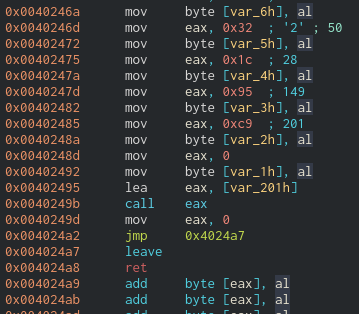
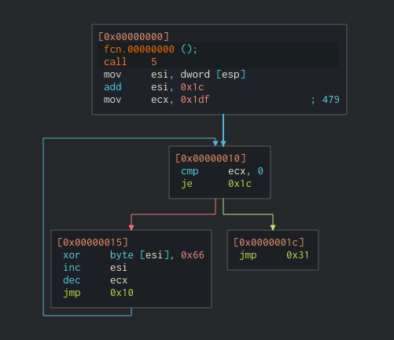
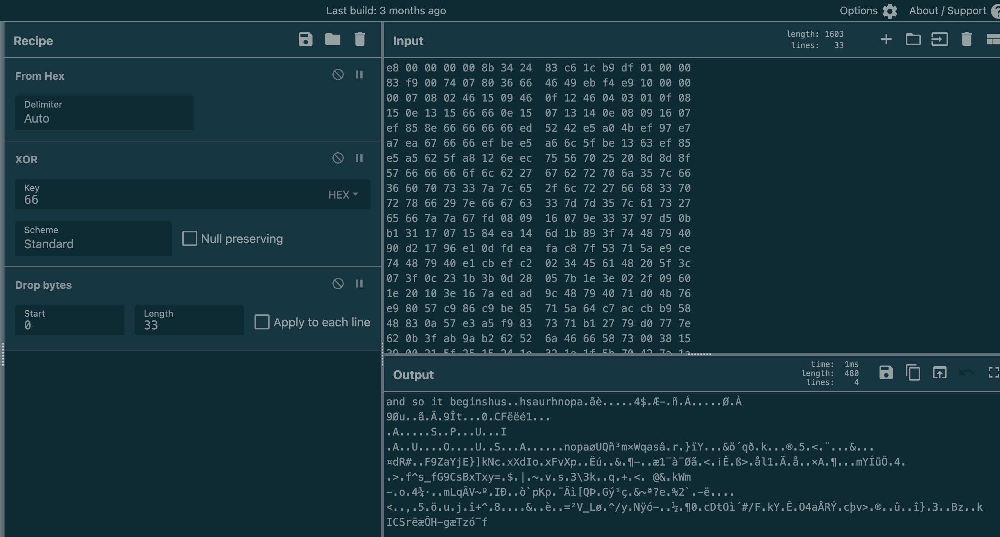
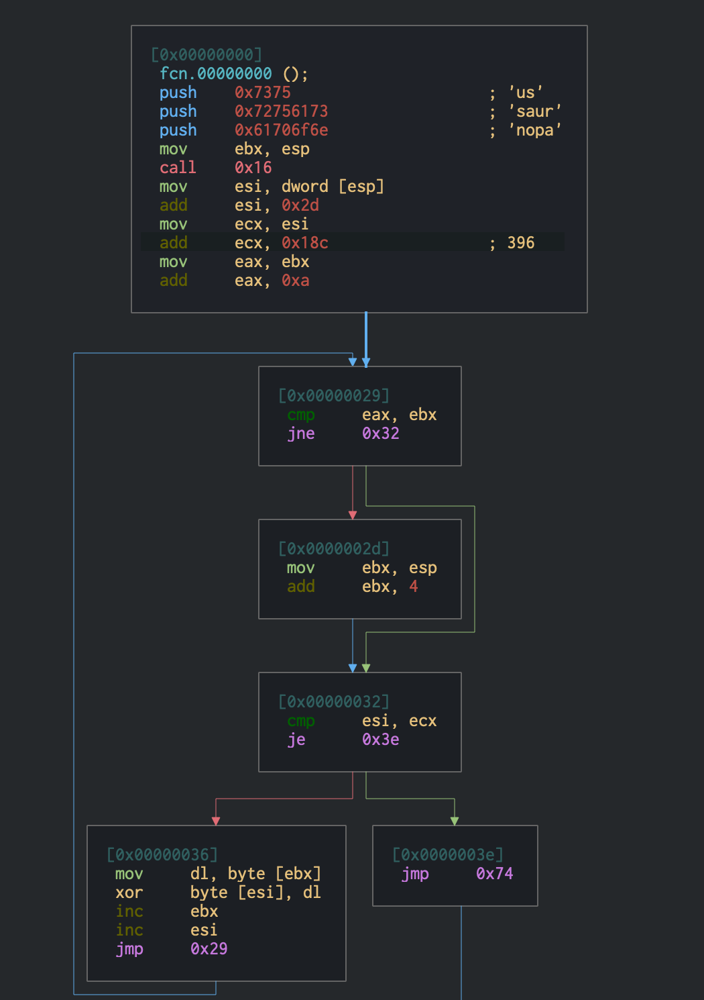
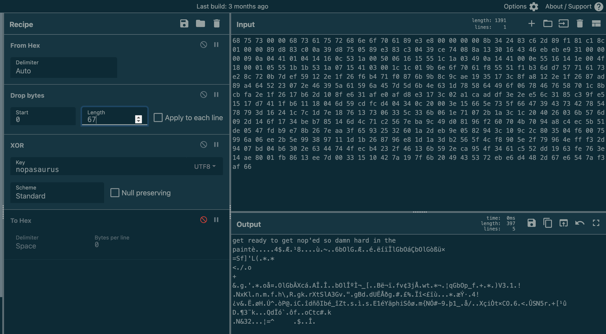
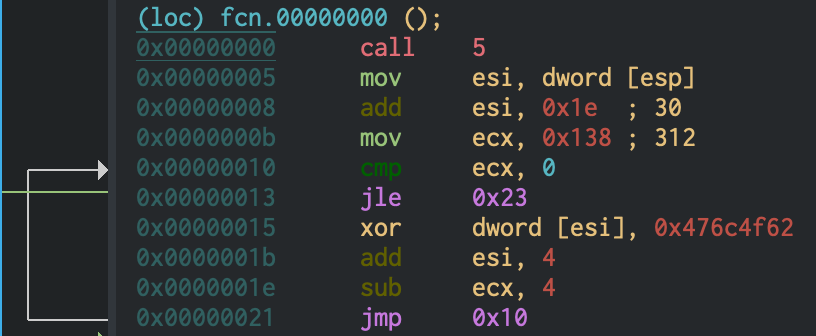
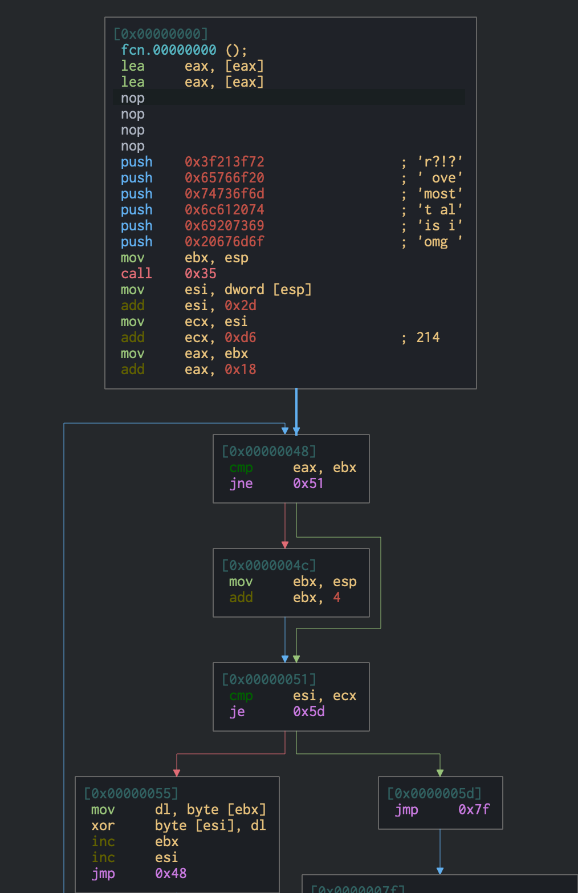
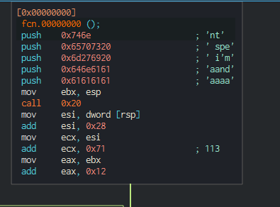

## Initial

A file called 'such_evil' is contained in the zip. The `file` command shows it to be a PE32 executable. When executed it promply crashes. Note: After I completed this, I read up on other people's solutions for this challenge and it appears that it executed for them. It may have been incompatible with my Windows 10 system for some reason.

As execution is currently not an option, static analysis our first path. For this challange I decided to use [Cutter](https://github.com/rizinorg/cutter) which is used to disassemble code. It will also come in use later as Cutter can take shellcode bytes as input.

Opening the exe in Cutter shows some basic commands but `fcn.00401000` stands out. The function pushes 0x201 bytes of shellcode into the stack and executes it (`call eax`). 



## Shellcode Extraction

Running the binary in X32Dbg, the code crashed just after the data was loaded into the stack. I was able to extract the shellcode. It is entirely feasible to carve out the bytes using something like python but manual extraction in memory was the simplest.

The bytes are below.

```
e8 00 00 00 00 8b 34 24 83 c6 1c b9 df 01 00 00
83 f9 00 74 07 80 36 66 46 49 eb f4 e9 10 00 00
00 07 08 02 46 15 09 46 0f 12 46 04 03 01 0f 08
15 0e 13 15 66 66 0e 15 07 13 14 0e 08 09 16 07
ef 85 8e 66 66 66 66 ed 52 42 e5 a0 4b ef 97 e7
a7 ea 67 66 66 ef be e5 a6 6c 5f be 13 63 ef 85
e5 a5 62 5f a8 12 6e ec 75 56 70 25 20 8d 8d 8f
57 66 66 66 6f 6c 62 27 67 62 72 70 6a 35 7c 66
36 60 70 73 33 7a 7c 65 2f 6c 72 27 66 68 33 70
72 78 66 29 7e 66 67 63 33 7d 7d 35 7c 61 73 27
65 66 7a 7a 67 fd 08 09 16 07 9e 33 37 97 d5 0b
b1 31 17 07 15 84 ea 14 6d 1b 89 3f 74 48 79 40
90 d2 17 96 e1 0d fd ea fa c8 7f 53 71 5a e9 ce
74 48 79 40 e1 cb ef c2 02 34 45 61 48 20 5f 3c
07 3f 0c 23 1b 3b 0d 28 05 7b 1e 3e 02 2f 09 60
1e 20 10 3e 16 7a ed ad 9c 48 79 40 71 d0 4b 76
e9 80 57 c9 86 c9 be 85 71 5a 64 c7 ac cb b9 58
48 83 0a 57 e3 a5 f9 83 73 71 b1 27 79 d0 77 7e
62 0b 3f ab 9a b2 62 52 6a 46 66 58 73 00 38 15
39 00 21 5f 25 15 24 1e 32 1e 1f 5b 70 42 7a 1a
7b 18 7e 10 75 15 60 55 3a 55 0d 60 78 17 61 4d
7c 5a 7a 46 26 40 65 0d 31 0b 6f 4b 72 09 71 52
d8 d1 e3 72 0b 2a 17 a4 30 18 dc fa 2f b6 e7 f0
94 06 16 2d 16 f2 ce a2 8a 3d 37 b8 63 21 9b df
81 ed 40 18 cc 59 03 f5 43 54 06 7c 4b 8d f8 63
e4 f2 5a 76 fa 4a e6 53 62 90 66 13 ff 0c 60 88
4d 38 ff 5e f1 77 7b 7d 40 e1 f0 8e 7b 7c 5b d4
30 39 2a 9e f6 38 49 1f f0 28 99 95 4b f2 61 db
62 d0 56 48 05 22 12 29 8a d2 45 49 20 75 0d 3f
48 ac f3 29 52 07 a3 34 bb 7f 05 98 10 58 72 c8
e6 67 9d e0 75 88 1b 66 55 73 76 24 1c 7f 19 0d
46 2f 25 35 14 8d 80 b2 2e 4b 01 80 32 1c 95 c9
00
```

As documented below, the shellcode is multi layered shellcode, with the outer code wrapping around the contents. When each wrapper is executed, it opens the contents of the next layer.

## Shellcode Wrapper 1

As mentioned, Cutter allows the ability to import shellcode. Once imported, the only thing I needed to do was to ensure it was set to 32 bits as it defaulted to 64 for me. The outline is this:



The code starts with `call 5` which is just a call to the next instruction, then sets the `esi` register to the stack pointer (`0x05`) and adds `0x1c` to it (`0x21`). This makes sense as the size of the wrapper is 0x20 bytes, so the actions that happen next are going to occur on the data immediately after the wrapper.

The code then loops through each byte from esi upwards and xors it with key `0x66` until it find a null byte '(0x00)'. Then it is completed, the code jumps to `0x31`.

While it is possible to emulate this action through Cutter's debug feature, this report will perform this in Cyber Chef.



Cyber Chef link [here](<https://gchq.github.io/CyberChef/#recipe=From_Hex('Auto')XOR(%7B'option':'Hex','string':'66'%7D,'Standard',false)Drop_bytes(0,33,false)&input=ZTggMDAgMDAgMDAgMDAgOGIgMzQgMjQgIDgzIGM2IDFjIGI5IGRmIDAxIDAwIDAwIAo4MyBmOSAwMCA3NCAwNyA4MCAzNiA2NiAgNDYgNDkgZWIgZjQgZTkgMTAgMDAgMDAgCjAwIDA3IDA4IDAyIDQ2IDE1IDA5IDQ2ICAwZiAxMiA0NiAwNCAwMyAwMSAwZiAwOCAKMTUgMGUgMTMgMTUgNjYgNjYgMGUgMTUgIDA3IDEzIDE0IDBlIDA4IDA5IDE2IDA3IAplZiA4NSA4ZSA2NiA2NiA2NiA2NiBlZCAgNTIgNDIgZTUgYTAgNGIgZWYgOTcgZTcgCmE3IGVhIDY3IDY2IDY2IGVmIGJlIGU1ICBhNiA2YyA1ZiBiZSAxMyA2MyBlZiA4NSAKZTUgYTUgNjIgNWYgYTggMTIgNmUgZWMgIDc1IDU2IDcwIDI1IDIwIDhkIDhkIDhmIAo1NyA2NiA2NiA2NiA2ZiA2YyA2MiAyNyAgNjcgNjIgNzIgNzAgNmEgMzUgN2MgNjYgCjM2IDYwIDcwIDczIDMzIDdhIDdjIDY1ICAyZiA2YyA3MiAyNyA2NiA2OCAzMyA3MCAKNzIgNzggNjYgMjkgN2UgNjYgNjcgNjMgIDMzIDdkIDdkIDM1IDdjIDYxIDczIDI3IAo2NSA2NiA3YSA3YSA2NyBmZCAwOCAwOSAgMTYgMDcgOWUgMzMgMzcgOTcgZDUgMGIgCmIxIDMxIDE3IDA3IDE1IDg0IGVhIDE0ICA2ZCAxYiA4OSAzZiA3NCA0OCA3OSA0MCAKOTAgZDIgMTcgOTYgZTEgMGQgZmQgZWEgIGZhIGM4IDdmIDUzIDcxIDVhIGU5IGNlIAo3NCA0OCA3OSA0MCBlMSBjYiBlZiBjMiAgMDIgMzQgNDUgNjEgNDggMjAgNWYgM2MgCjA3IDNmIDBjIDIzIDFiIDNiIDBkIDI4ICAwNSA3YiAxZSAzZSAwMiAyZiAwOSA2MCAKMWUgMjAgMTAgM2UgMTYgN2EgZWQgYWQgIDljIDQ4IDc5IDQwIDcxIGQwIDRiIDc2IAplOSA4MCA1NyBjOSA4NiBjOSBiZSA4NSAgNzEgNWEgNjQgYzcgYWMgY2IgYjkgNTggCjQ4IDgzIDBhIDU3IGUzIGE1IGY5IDgzICA3MyA3MSBiMSAyNyA3OSBkMCA3NyA3ZSAKNjIgMGIgM2YgYWIgOWEgYjIgNjIgNTIgIDZhIDQ2IDY2IDU4IDczIDAwIDM4IDE1IAozOSAwMCAyMSA1ZiAyNSAxNSAyNCAxZSAgMzIgMWUgMWYgNWIgNzAgNDIgN2EgMWEgCjdiIDE4IDdlIDEwIDc1IDE1IDYwIDU1ICAzYSA1NSAwZCA2MCA3OCAxNyA2MSA0ZCAKN2MgNWEgN2EgNDYgMjYgNDAgNjUgMGQgIDMxIDBiIDZmIDRiIDcyIDA5IDcxIDUyIApkOCBkMSBlMyA3MiAwYiAyYSAxNyBhNCAgMzAgMTggZGMgZmEgMmYgYjYgZTcgZjAgCjk0IDA2IDE2IDJkIDE2IGYyIGNlIGEyICA4YSAzZCAzNyBiOCA2MyAyMSA5YiBkZiAKODEgZWQgNDAgMTggY2MgNTkgMDMgZjUgIDQzIDU0IDA2IDdjIDRiIDhkIGY4IDYzIAplNCBmMiA1YSA3NiBmYSA0YSBlNiA1MyAgNjIgOTAgNjYgMTMgZmYgMGMgNjAgODggCjRkIDM4IGZmIDVlIGYxIDc3IDdiIDdkICA0MCBlMSBmMCA4ZSA3YiA3YyA1YiBkNCAKMzAgMzkgMmEgOWUgZjYgMzggNDkgMWYgIGYwIDI4IDk5IDk1IDRiIGYyIDYxIGRiIAo2MiBkMCA1NiA0OCAwNSAyMiAxMiAyOSAgOGEgZDIgNDUgNDkgMjAgNzUgMGQgM2YgCjQ4IGFjIGYzIDI5IDUyIDA3IGEzIDM0ICBiYiA3ZiAwNSA5OCAxMCA1OCA3MiBjOCAKZTYgNjcgOWQgZTAgNzUgODggMWIgNjYgIDU1IDczIDc2IDI0IDFjIDdmIDE5IDBkIAo0NiAyZiAyNSAzNSAxNCA4ZCA4MCBiMiAgMmUgNGIgMDEgODAgMzIgMWMgOTUgYzkgCjAwIA>)

We are on the right track as the data blob starts with `and so it begins`. Removing the remaining bytes up to `0x31` gives us new shellcode to examine.

## Shellcode Wrapper 2

```
68 75 73 00 00 68 73 61 75 72 68 6e 6f 70 61 89
e3 e8 00 00 00 00 8b 34 24 83 c6 2d 89 f1 81 c1
8c 01 00 00 89 d8 83 c0 0a 39 d8 75 05 89 e3 83
c3 04 39 ce 74 08 8a 13 30 16 43 46 eb eb e9 31
00 00 00 09 0a 04 41 01 04 14 16 0c 53 1a 00 50
06 16 15 55 1c 1a 03 49 0a 14 41 00 0e 55 16 14
1e 00 4f 18 00 01 05 55 1b 1b 53 1a 07 15 41 03
00 1c 1c 01 9b 6e 6f 70 61 f8 55 51 f1 b3 6d d7
57 71 61 73 e2 8c 72 0b 7d ef 59 12 2e 1f 26 f6
b4 71 f0 87 6b 9b 8c 9c ae 19 35 17 3c 8f a8 12
2e 1f 26 87 ad 89 a4 64 52 23 07 2e 46 39 5a 61
59 6a 45 7d 5d 6b 4e 63 1d 78 58 64 49 6f 06 78
46 76 58 70 1c 8b cb fa 2e 1f 26 17 b6 2d 10 8f
e6 31 af e0 af d8 e3 17 3c 02 a1 ca ad df 3e 2e
e5 6c 31 85 c3 9f e5 15 17 d7 41 1f b6 11 18 04
6d 59 cd fc d4 04 34 0c 20 00 3e 15 66 5e 73 5f
66 47 39 43 73 42 78 54 78 79 3d 16 24 1c 7c 1d
7e 18 76 13 73 06 33 5c 33 6b 06 1e 71 07 2b 1a
3c 1c 20 40 26 03 6b 57 6d 09 2d 14 6f 17 34 be
b7 85 14 6d 4c 71 c2 56 7e ba 9c 49 d0 81 96 f2
60 70 4b 70 94 a8 c4 ec 5b 51 de 05 47 fd b9 e7
8b 26 7e aa 3f 65 93 25 32 60 1a 2d eb 9e 05 82
94 3c 10 9c 2c 80 35 04 f6 00 75 99 6a 06 ee 2b
5e 99 38 97 11 1d 1b 26 87 96 e8 1d 1a 3d b2 56
5f 4c f8 90 5e 2f 79 96 4e ff f3 2d 94 07 bd 04
b6 30 2e 63 44 74 4f ec b4 23 2f 46 13 6b 59 2e
ca 95 4f 34 61 c5 52 dd 19 63 fe 76 3e 14 ae 80
01 fb 86 13 ee 7d 00 33 15 10 42 7a 19 7f 6b 20
49 43 53 72 eb e6 d4 48 2d 67 e6 54 7a f3 af 66
```

As before, it is imported to Cutter.



Firstly, three strings are pushed to the stack, spelling out `'nopasaurus'`. Like before, the stack pointer (`0x16`) is pushed to esi and `0x2d` is added to it giving a starting point `0x43`, and in turn, every byte after is XORed with the `nopasaurus` key. Finally, the next
instruction is called at `0x74`.

Cyber Chef shows another message, `get ready to get nop'ed so damn hard in the paint`.



Cyber Chef link [here](<https://gchq.github.io/CyberChef/#recipe=From_Hex('Auto')Drop_bytes(0,67,false)XOR(%7B'option':'UTF8','string':'nopasaurus'%7D,'Standard',false)To_Hex('Space',0/disabled)&input=NjggNzUgNzMgMDAgMDAgNjggNzMgNjEgNzUgNzIgNjggNmUgNmYgNzAgNjEgODkgZTMgZTggMDAgMDAgMDAgMDAgOGIgMzQgMjQgODMgYzYgMmQgODkgZjEgODEgYzEgOGMgMDEgMDAgMDAgODkgZDggODMgYzAgMGEgMzkgZDggNzUgMDUgODkgZTMgODMgYzMgMDQgMzkgY2UgNzQgMDggOGEgMTMgMzAgMTYgNDMgNDYgZWIgZWIgZTkgMzEgMDAgMDAgMDAgMDkgMGEgMDQgNDEgMDEgMDQgMTQgMTYgMGMgNTMgMWEgMDAgNTAgMDYgMTYgMTUgNTUgMWMgMWEgMDMgNDkgMGEgMTQgNDEgMDAgMGUgNTUgMTYgMTQgMWUgMDAgNGYgMTggMDAgMDEgMDUgNTUgMWIgMWIgNTMgMWEgMDcgMTUgNDEgMDMgMDAgMWMgMWMgMDEgOWIgNmUgNmYgNzAgNjEgZjggNTUgNTEgZjEgYjMgNmQgZDcgNTcgNzEgNjEgNzMgZTIgOGMgNzIgMGIgN2QgZWYgNTkgMTIgMmUgMWYgMjYgZjYgYjQgNzEgZjAgODcgNmIgOWIgOGMgOWMgYWUgMTkgMzUgMTcgM2MgOGYgYTggMTIgMmUgMWYgMjYgODcgYWQgODkgYTQgNjQgNTIgMjMgMDcgMmUgNDYgMzkgNWEgNjEgNTkgNmEgNDUgN2QgNWQgNmIgNGUgNjMgMWQgNzggNTggNjQgNDkgNmYgMDYgNzggNDYgNzYgNTggNzAgMWMgOGIgY2IgZmEgMmUgMWYgMjYgMTcgYjYgMmQgMTAgOGYgZTYgMzEgYWYgZTAgYWYgZDggZTMgMTcgM2MgMDIgYTEgY2EgYWQgZGYgM2UgMmUgZTUgNmMgMzEgODUgYzMgOWYgZTUgMTUgMTcgZDcgNDEgMWYgYjYgMTEgMTggMDQgNmQgNTkgY2QgZmMgZDQgMDQgMzQgMGMgMjAgMDAgM2UgMTUgNjYgNWUgNzMgNWYgNjYgNDcgMzkgNDMgNzMgNDIgNzggNTQgNzggNzkgM2QgMTYgMjQgMWMgN2MgMWQgN2UgMTggNzYgMTMgNzMgMDYgMzMgNWMgMzMgNmIgMDYgMWUgNzEgMDcgMmIgMWEgM2MgMWMgMjAgNDAgMjYgMDMgNmIgNTcgNmQgMDkgMmQgMTQgNmYgMTcgMzQgYmUgYjcgODUgMTQgNmQgNGMgNzEgYzIgNTYgN2UgYmEgOWMgNDkgZDAgODEgOTYgZjIgNjAgNzAgNGIgNzAgOTQgYTggYzQgZWMgNWIgNTEgZGUgMDUgNDcgZmQgYjkgZTcgOGIgMjYgN2UgYWEgM2YgNjUgOTMgMjUgMzIgNjAgMWEgMmQgZWIgOWUgMDUgODIgOTQgM2MgMTAgOWMgMmMgODAgMzUgMDQgZjYgMDAgNzUgOTkgNmEgMDYgZWUgMmIgNWUgOTkgMzggOTcgMTEgMWQgMWIgMjYgODcgOTYgZTggMWQgMWEgM2QgYjIgNTYgNWYgNGMgZjggOTAgNWUgMmYgNzkgOTYgNGUgZmYgZjMgMmQgOTQgMDcgYmQgMDQgYjYgMzAgMmUgNjMgNDQgNzQgNGYgZWMgYjQgMjMgMmYgNDYgMTMgNmIgNTkgMmUgY2EgOTUgNGYgMzQgNjEgYzUgNTIgZGQgMTkgNjMgZmUgNzYgM2UgMTQgYWUgODAgMDEgZmIgODYgMTMgZWUgN2QgMDAgMzMgMTUgMTAgNDIgN2EgMTkgN2YgNmIgMjAgNDkgNDMgNTMgNzIgZWIgZTYgZDQgNDggMmQgNjcgZTYgNTQgN2EgZjMgYWYgNjY>)

As before, all bytes before the new call instruction to `0x74` are removed and reimported to Cutter.

## Shellcode Wrapper 3

```
e8 00 00 00 00 8b 34 24 83 c6 1e b9 38 01 00 00
83 f9 00 7e 0e 81 36 62 4f 6c 47 83 c6 04 83 e9
04 eb ed ef cf 6c 47 62 4f e1 c7 62 4f 6c 47 f2
df fc d7 0a 3d 53 66 5d 27 4c 28 14 2a 04 2a 0d
3c 18 2f 16 6f 0d 2b 0a 26 1f 67 0b 27 03 2a 05
6f e5 a4 8a 4f 6c 47 62 c4 58 63 e1 89 41 ce 93
ce ad 91 62 4f 6c ce ba cc ac 5f 5b 97 19 42 eb
ac ef 84 66 76 a2 33 6a c5 7f 77 74 0c 2a ac 89
a6 71 47 62 4f 70 5f 66 07 2b 01 2a 15 29 56 33
12 31 19 21 0a 0c 4e 78 4b 6c 1d 6e 1f 6d 04 66
00 68 5c 2c 52 18 67 6b 03 72 58 74 53 6c 41 33
47 76 19 22 1e 67 42 64 0e 64 55 cb c5 f0 67 03
23 01 a3 25 1f cf ee 3c a3 ef f9 82 01 03 2a 05
e6 dd b7 82 34 21 bf 76 26 88 cb 92 f8 48 11 da
5e 16 f2 50 40 15 69 43 84 ee 64 f1 f5 49 62 e9
5f ee 5a 74 97 73 14 ec 18 73 9d 45 31 e9 59 e4
70 68 69 53 f4 f8 87 6d 7b 4e d3 23 2d 39 8b fe
31 5f 18 e5 2f 8a 81 58 e7 69 d2 74 d7 43 4f 16
36 01 3c 82 db 53 4e 35 72 1e 2b 5b b9 fb 20 44
00 b6 33 a8 6b 16 8d 18 51 64 cf f3 60 8e f4 66
9d 13 6f 43 74 63 23 0f 6b 0a 18 4e 26 33 32 01
8a 93 a6 3d 5e 09 89 24 1b 80 ce 13
```

This code is a lot smaller. Similar to what we have seen, it is an XOR iteration but this time via a hard coded value "`0x476c4f62`".



I had struggled with this for the longest time, only to understand that the bytes are little-endian, i.e. I had to reverse them. No string like clues like last time, only straight into more code.

Cyber Chef link [here](<https://gchq.github.io/CyberChef/#recipe=From_Hex('Auto')Drop_bytes(0,35,false)XOR(%7B'option':'Hex','string':'624f6c47'%7D,'Standard',false)To_Hex('Space',0/disabled)&input=ZTggMDAgMDAgMDAgMDAgOGIgMzQgMjQgODMgYzYgMWUgYjkgMzggMDEgMDAgMDAgODMgZjkgMDAgN2UgMGUgODEgMzYgNjIgNGYgNmMgNDcgODMgYzYgMDQgODMgZTkgMDQgZWIgZWQgZWYgY2YgNmMgNDcgNjIgNGYgZTEgYzcgNjIgNGYgNmMgNDcgZjIgZGYgZmMgZDcgMGEgM2QgNTMgNjYgNWQgMjcgNGMgMjggMTQgMmEgMDQgMmEgMGQgM2MgMTggMmYgMTYgNmYgMGQgMmIgMGEgMjYgMWYgNjcgMGIgMjcgMDMgMmEgMDUgNmYgZTUgYTQgOGEgNGYgNmMgNDcgNjIgYzQgNTggNjMgZTEgODkgNDEgY2UgOTMgY2UgYWQgOTEgNjIgNGYgNmMgY2UgYmEgY2MgYWMgNWYgNWIgOTcgMTkgNDIgZWIgYWMgZWYgODQgNjYgNzYgYTIgMzMgNmEgYzUgN2YgNzcgNzQgMGMgMmEgYWMgODkgYTYgNzEgNDcgNjIgNGYgNzAgNWYgNjYgMDcgMmIgMDEgMmEgMTUgMjkgNTYgMzMgMTIgMzEgMTkgMjEgMGEgMGMgNGUgNzggNGIgNmMgMWQgNmUgMWYgNmQgMDQgNjYgMDAgNjggNWMgMmMgNTIgMTggNjcgNmIgMDMgNzIgNTggNzQgNTMgNmMgNDEgMzMgNDcgNzYgMTkgMjIgMWUgNjcgNDIgNjQgMGUgNjQgNTUgY2IgYzUgZjAgNjcgMDMgMjMgMDEgYTMgMjUgMWYgY2YgZWUgM2MgYTMgZWYgZjkgODIgMDEgMDMgMmEgMDUgZTYgZGQgYjcgODIgMzQgMjEgYmYgNzYgMjYgODggY2IgOTIgZjggNDggMTEgZGEgNWUgMTYgZjIgNTAgNDAgMTUgNjkgNDMgODQgZWUgNjQgZjEgZjUgNDkgNjIgZTkgNWYgZWUgNWEgNzQgOTcgNzMgMTQgZWMgMTggNzMgOWQgNDUgMzEgZTkgNTkgZTQgNzAgNjggNjkgNTMgZjQgZjggODcgNmQgN2IgNGUgZDMgMjMgMmQgMzkgOGIgZmUgMzEgNWYgMTggZTUgMmYgOGEgODEgNTggZTcgNjkgZDIgNzQgZDcgNDMgNGYgMTYgMzYgMDEgM2MgODIgZGIgNTMgNGUgMzUgNzIgMWUgMmIgNWIgYjkgZmIgMjAgNDQgMDAgYjYgMzMgYTggNmIgMTYgOGQgMTggNTEgNjQgY2YgZjMgNjAgOGUgZjQgNjYgOWQgMTMgNmYgNDMgNzQgNjMgMjMgMGYgNmIgMGEgMTggNGUgMjYgMzMgMzIgMDEgOGEgOTMgYTYgM2QgNWUgMDkgODkgMjQgMWIgODAgY2UgMTM>)

## Shellcode Wrapper 4

```
8d 80 00 00 00 00 8d 80 00 00 00 00 90 90 90 90
68 72 3f 21 3f 68 20 6f 76 65 68 6d 6f 73 74 68
74 20 61 6c 68 69 73 20 69 68 6f 6d 67 20 89 e3
e8 00 00 00 00 8b 34 24 83 c6 2d 89 f1 81 c1 d6
00 00 00 89 d8 83 c0 18 39 d8 75 05 89 e3 83 c3
04 39 ce 74 08 8a 13 30 16 43 46 eb eb e9 1d 00
00 00 1c 18 04 48 47 46 48 5a 45 11 51 5d 5d 5e
43 45 60 09 1a 04 00 5a 0c 50 01 43 04 4f 04 1b
4e 1d 74 20 09 4c 1e 1f 16 1c 00 06 51 08 1a 5e
40 51 0b 05 06 41 08 12 a9 8a 9c 20 61 6c 6d e4
47 50 a3 a9 5e ec 83 be e0 4e 6f 6d 67 a9 b1 f0
e0 7b 4d f8 14 69 e4 8c f0 b7 24 56 b8 11 7a b5
32 0f 79 2e 21 cb 82 23 93 ba 25 25 8b 10 82 1d
16 d8 1f 53 8e 57 1f da 27 7e 85 1e 86 3f 04 2e
31 bb 94 c0 0f 34 22 94 41 62 55 cc 9c 7e 33 5f
87 60 e6 c6 3a a8 05 95 16 98 2f 08 74 79 6d 7b
e0 94 3f 09 57 3d 72 6c 39 f6 97 67 26 4f da 74
ca 24 7a ca 7a 1e 08 88 91 2f e2 b3 04 d2 7f 28
21 3b 0f 64 6d 24 66 5f 2c 69 5f 75 63 c5 ff e1
5f 11 65 ce 46 54 ec 89 71
```



Yet another XOR key, this time it is "`omg is it almost over?!?`"

Running this will finally show us the key: "`such.5h311010101@flare-on.com`"

Cyber Chef link [here](<https://gchq.github.io/CyberChef/#recipe=From_Hex('Auto')Drop_bytes(0,98,false)XOR(%7B'option':'UTF8','string':'omg%20is%20it%20almost%20over?!?'%7D,'Standard',false)&input=OGQgODAgMDAgMDAgMDAgMDAgOGQgODAgMDAgMDAgMDAgMDAgOTAgOTAgOTAgOTAKNjggNzIgM2YgMjEgM2YgNjggMjAgNmYgNzYgNjUgNjggNmQgNmYgNzMgNzQgNjgKNzQgMjAgNjEgNmMgNjggNjkgNzMgMjAgNjkgNjggNmYgNmQgNjcgMjAgODkgZTMKZTggMDAgMDAgMDAgMDAgOGIgMzQgMjQgODMgYzYgMmQgODkgZjEgODEgYzEgZDYKMDAgMDAgMDAgODkgZDggODMgYzAgMTggMzkgZDggNzUgMDUgODkgZTMgODMgYzMKMDQgMzkgY2UgNzQgMDggOGEgMTMgMzAgMTYgNDMgNDYgZWIgZWIgZTkgMWQgMDAKMDAgMDAgMWMgMTggMDQgNDggNDcgNDYgNDggNWEgNDUgMTEgNTEgNWQgNWQgNWUKNDMgNDUgNjAgMDkgMWEgMDQgMDAgNWEgMGMgNTAgMDEgNDMgMDQgNGYgMDQgMWIKNGUgMWQgNzQgMjAgMDkgNGMgMWUgMWYgMTYgMWMgMDAgMDYgNTEgMDggMWEgNWUKNDAgNTEgMGIgMDUgMDYgNDEgMDggMTIgYTkgOGEgOWMgMjAgNjEgNmMgNmQgZTQKNDcgNTAgYTMgYTkgNWUgZWMgODMgYmUgZTAgNGUgNmYgNmQgNjcgYTkgYjEgZjAKZTAgN2IgNGQgZjggMTQgNjkgZTQgOGMgZjAgYjcgMjQgNTYgYjggMTEgN2EgYjUKMzIgMGYgNzkgMmUgMjEgY2IgODIgMjMgOTMgYmEgMjUgMjUgOGIgMTAgODIgMWQKMTYgZDggMWYgNTMgOGUgNTcgMWYgZGEgMjcgN2UgODUgMWUgODYgM2YgMDQgMmUKMzEgYmIgOTQgYzAgMGYgMzQgMjIgOTQgNDEgNjIgNTUgY2MgOWMgN2UgMzMgNWYKODcgNjAgZTYgYzYgM2EgYTggMDUgOTUgMTYgOTggMmYgMDggNzQgNzkgNmQgN2IKZTAgOTQgM2YgMDkgNTcgM2QgNzIgNmMgMzkgZjYgOTcgNjcgMjYgNGYgZGEgNzQKY2EgMjQgN2EgY2EgN2EgMWUgMDggODggOTEgMmYgZTIgYjMgMDQgZDIgN2YgMjgKMjEgM2IgMGYgNjQgNmQgMjQgNjYgNWYgMmMgNjkgNWYgNzUgNjMgYzUgZmYgZTEKNWYgMTEgNjUgY2UgNDYgNTQgZWMgODkgNzE>)

All the steps above can be performed in one Cyber Chef link [here](<https://gchq.github.io/CyberChef/#recipe=From_Hex('Auto')Drop_bytes(0,49,false)XOR(%7B'option':'Hex','string':'66'%7D,'Standard',false)Drop_bytes(0,67,false)XOR(%7B'option':'UTF8','string':'nopasaurus'%7D,'Standard',false)Drop_bytes(0,49,false)Drop_bytes(0,35,false)XOR(%7B'option':'Hex','string':'624f6c47'%7D,'Standard',false)Drop_bytes(0,98,false)XOR(%7B'option':'UTF8','string':'omg%20is%20it%20almost%20over?!?'%7D,'Standard',false)&input=ZTggMDAgMDAgMDAgMDAgOGIgMzQgMjQgIDgzIGM2IDFjIGI5IGRmIDAxIDAwIDAwIAo4MyBmOSAwMCA3NCAwNyA4MCAzNiA2NiAgNDYgNDkgZWIgZjQgZTkgMTAgMDAgMDAgCjAwIDA3IDA4IDAyIDQ2IDE1IDA5IDQ2ICAwZiAxMiA0NiAwNCAwMyAwMSAwZiAwOCAKMTUgMGUgMTMgMTUgNjYgNjYgMGUgMTUgIDA3IDEzIDE0IDBlIDA4IDA5IDE2IDA3IAplZiA4NSA4ZSA2NiA2NiA2NiA2NiBlZCAgNTIgNDIgZTUgYTAgNGIgZWYgOTcgZTcgCmE3IGVhIDY3IDY2IDY2IGVmIGJlIGU1ICBhNiA2YyA1ZiBiZSAxMyA2MyBlZiA4NSAKZTUgYTUgNjIgNWYgYTggMTIgNmUgZWMgIDc1IDU2IDcwIDI1IDIwIDhkIDhkIDhmIAo1NyA2NiA2NiA2NiA2ZiA2YyA2MiAyNyAgNjcgNjIgNzIgNzAgNmEgMzUgN2MgNjYgCjM2IDYwIDcwIDczIDMzIDdhIDdjIDY1ICAyZiA2YyA3MiAyNyA2NiA2OCAzMyA3MCAKNzIgNzggNjYgMjkgN2UgNjYgNjcgNjMgIDMzIDdkIDdkIDM1IDdjIDYxIDczIDI3IAo2NSA2NiA3YSA3YSA2NyBmZCAwOCAwOSAgMTYgMDcgOWUgMzMgMzcgOTcgZDUgMGIgCmIxIDMxIDE3IDA3IDE1IDg0IGVhIDE0ICA2ZCAxYiA4OSAzZiA3NCA0OCA3OSA0MCAKOTAgZDIgMTcgOTYgZTEgMGQgZmQgZWEgIGZhIGM4IDdmIDUzIDcxIDVhIGU5IGNlIAo3NCA0OCA3OSA0MCBlMSBjYiBlZiBjMiAgMDIgMzQgNDUgNjEgNDggMjAgNWYgM2MgCjA3IDNmIDBjIDIzIDFiIDNiIDBkIDI4ICAwNSA3YiAxZSAzZSAwMiAyZiAwOSA2MCAKMWUgMjAgMTAgM2UgMTYgN2EgZWQgYWQgIDljIDQ4IDc5IDQwIDcxIGQwIDRiIDc2IAplOSA4MCA1NyBjOSA4NiBjOSBiZSA4NSAgNzEgNWEgNjQgYzcgYWMgY2IgYjkgNTggCjQ4IDgzIDBhIDU3IGUzIGE1IGY5IDgzICA3MyA3MSBiMSAyNyA3OSBkMCA3NyA3ZSAKNjIgMGIgM2YgYWIgOWEgYjIgNjIgNTIgIDZhIDQ2IDY2IDU4IDczIDAwIDM4IDE1IAozOSAwMCAyMSA1ZiAyNSAxNSAyNCAxZSAgMzIgMWUgMWYgNWIgNzAgNDIgN2EgMWEgCjdiIDE4IDdlIDEwIDc1IDE1IDYwIDU1ICAzYSA1NSAwZCA2MCA3OCAxNyA2MSA0ZCAKN2MgNWEgN2EgNDYgMjYgNDAgNjUgMGQgIDMxIDBiIDZmIDRiIDcyIDA5IDcxIDUyIApkOCBkMSBlMyA3MiAwYiAyYSAxNyBhNCAgMzAgMTggZGMgZmEgMmYgYjYgZTcgZjAgCjk0IDA2IDE2IDJkIDE2IGYyIGNlIGEyICA4YSAzZCAzNyBiOCA2MyAyMSA5YiBkZiAKODEgZWQgNDAgMTggY2MgNTkgMDMgZjUgIDQzIDU0IDA2IDdjIDRiIDhkIGY4IDYzIAplNCBmMiA1YSA3NiBmYSA0YSBlNiA1MyAgNjIgOTAgNjYgMTMgZmYgMGMgNjAgODggCjRkIDM4IGZmIDVlIGYxIDc3IDdiIDdkICA0MCBlMSBmMCA4ZSA3YiA3YyA1YiBkNCAKMzAgMzkgMmEgOWUgZjYgMzggNDkgMWYgIGYwIDI4IDk5IDk1IDRiIGYyIDYxIGRiIAo2MiBkMCA1NiA0OCAwNSAyMiAxMiAyOSAgOGEgZDIgNDUgNDkgMjAgNzUgMGQgM2YgCjQ4IGFjIGYzIDI5IDUyIDA3IGEzIDM0ICBiYiA3ZiAwNSA5OCAxMCA1OCA3MiBjOCAKZTYgNjcgOWQgZTAgNzUgODggMWIgNjYgIDU1IDczIDc2IDI0IDFjIDdmIDE5IDBkIAo0NiAyZiAyNSAzNSAxNCA4ZCA4MCBiMiAgMmUgNGIgMDEgODAgMzIgMWMgOTUgYzkgCjAwIA>)

## Shellcode Wrapper 5
Even though we now have the flag, there's one more piece left after the flag. We can carve it out for fun...

```
68 6e 74 00 00 68 20 73 70 65 68 20 69 27 6d 68
61 61 6e 64 68 61 61 61 61 89 e3 e8 00 00 00 00 
8b 34 24 83 c6 28 89 f1 81 c1 71 00 00 00 89 d8 
83 c0 12 39 d8 75 05 89 e3 83 c3 04 39 ce 74 08 
8a 13 30 16 43 46 eb eb 50 b3 d3 51 05 ea 7c ef 
72 65 ac 3f 3c f8 32 6d e5 06 41 ea 73 e1 1f 6d 
5d 11 d2 e0 e0 6e 58 4f fb 32 16 75 a3 ea 1b 41 
60 a6 5f 89 ab 5d 88 6c e6 36 f1 5b 28 15 15 00 
14 93 e0 1f 66 21 58 00 53 18 c9 f8 0a 41 6f b3 
07 ea 4d 0e ea 1b 72 65 e7 e2 5b c2 dc 72 b7 0d 
17 00 04 60 09 0a 04 0f 2c 0c 00 2b 55 02 a9 92 
8e 2c 65 45 a1 30 31 9e b6 50
```
Unsurprinsingly, it's one more XOR decrypt with the key `aaaaaand i'm spent`. 



The code that came after appears to be a fake error code thrown when it gets to the end, however I wasn't able to execute this successfuly, so I just called it a day here :)

## Tools Used

- Cutter
- X32Dbg
- Cyber Chef