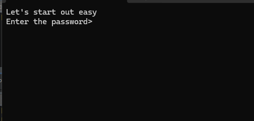

Running the binary opens a prompt for a password... okay...



I imported the exe into Ghidra, and it is basically one function:

```c
void entry(void)
{
  HANDLE hFile;
  HANDLE hFile_00;
  int iVar1;
  DWORD local_8;
  
  hFile = GetStdHandle(0xfffffff6);
  hFile_00 = GetStdHandle(0xfffffff5);
  WriteFile(hFile_00,s_Let's_start_out_easy_Enter_the_p_004020f2,0x2a,&local_8,(LPOVERLAPPED)0x0);
  ReadFile(hFile,&DAT_00402158,0x32,&local_8,(LPOVERLAPPED)0x0);
  iVar1 = 0;
  do {
    if (((&DAT_00402158)[iVar1] ^ 0x7d) != DAT_00402140[iVar1]) {
      WriteFile(hFile_00,s_You_are_failure_0040212e,0x12,&local_8,(LPOVERLAPPED)0x0);
      return;
    }
    iVar1 = iVar1 + 1;
  } while (iVar1 < 0x18);
  WriteFile(hFile_00,s_You_are_success_0040211c,0x12,&local_8,(LPOVERLAPPED)0x0);
  return;
}
```

The `WriteFile` is the printed string, and the `ReadFile` is what I would input into the console. It is saved at `DAT_00402158`.  Note that there is a loop, that reads the byte at `iVar1` (which increments), XORs if with 0x7D and compares it with the same position in `DAT_00402140`. If it doesn't match, then it prints out 'You are a failure'. If it does match, it continues.

The key here is just dumping the bytes at `DAT_00402140`  which according to the loop is 0x18 (24) bytes long.

I simply dumped these into CyberChef and XORed using 0x7D.

`1F 8 13 13 4 22 E 11 4D D 18 3D 1B 11 1C F 18 50 12 13 53 1E 12 10` becomes

`bunny_sl0pe@flare-on.com`

Nice easy start to the contest.