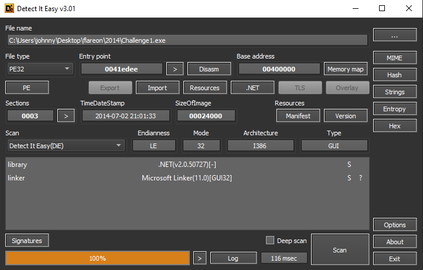

## Initial

The first challenge of [Flare-On 2014](/ctf/writeups/#flare-on-2014) is a Windows PE-32 executable. Running the program shows Bob Ross painting and a button marked 'DECODE!'.


Pressing this button changes the picture and top text.


Assuming that we have zero knowledge of reverse engineering, any new tools or technique will be explained.  The first tool that we will use is [Detect It Easy](https://github.com/horsicq/Detect-It-Easy) which tells us information on the binary we are looking at.  Analyzing it through Detect It Easy shows that the binary is a .NET application.



.NET apps are relatively easy to reverse engineer, as they can be decompiled making the source code accessible and ultimately easier to understand. Let's use [DNSpy](https://github.com/dnSpy/dnSpy) to do exactly that. DNSpy does a best effort in decompiling .NET apps so you can browse the source code. Opening this up, we see a function called `btnDecode_Click` which runs when the decode button is clicked.

## Analysis

```vb
private void btnDecode_Click(object sender, EventArgs e)
{
	this.pbRoge.Image = Resources.bob_roge;
	byte[] dat_secret = Resources.dat_secret;
	string text = "";
	foreach (byte b in dat_secret)
	{
		text += (char)((b >> 4 | ((int)b << 4 & 240)) ^ 41);
	}
	text += "\0";
	string text2 = "";
	for (int j = 0; j < text.Length; j += 2)
	{
		text2 += text[j + 1];
		text2 += text[j];
	}
	string text3 = "";
	for (int k = 0; k < text2.Length; k++)
	{
		char c = text2[k];
		text3 += (char)((byte)text2[k] ^ 102);
	}
	this.lbl_title.Text = text3;
}
```

The function loads resource `dat_secret` as a byte array. The contents are:

```
[A1,B5,44,84,14,E4,A1,B5,D4,70,B4,91,B4,70,D4,91,E4,C4,96,F4,54,84,B5,C4,40,64,74,70,A4,64,44]
```

Each byte is iterated through and firstly a _rotate right_ (ror) is performed on the byte `((b >> 4 | ((int)b << 4 & 240))` which rotates the byte bits 4 times. Next, each byte is XORed using decimal value `41`. At the end of this iteration loop, the key is revealed: `3rmahg3rd.b0b.d0ge@flare-on.com`

CyberChef Recipe: [here](<https://gchq.github.io/CyberChef/#recipe=From_Hex('Auto')Rotate_left(4,false)XOR(%7B'option':'Decimal','string':'41'%7D,'Standard',false)&input=QTFCNTQ0ODQxNEU0QTFCNUQ0NzBCNDkxQjQ3MEQ0OTFFNEM0OTZGNDU0ODRCNUM0NDA2NDc0NzBBNDY0NDQK>)

## Tools Used

- Detect It Easy
- DNSpy