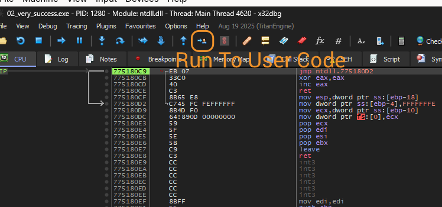
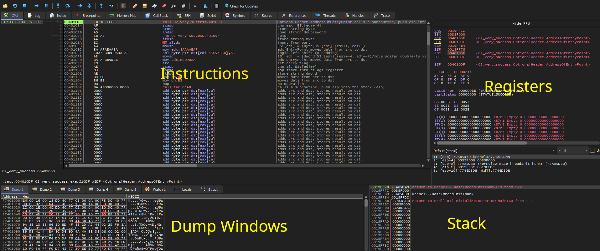
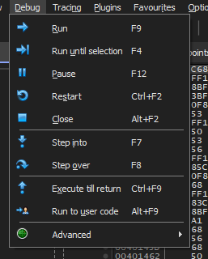

## Initial

If you've been following my FlareOn posts, you should know by now that debuggers are a vital tool. I personally use `x64dbg` which is a free and frankly brilliant one. When starting out with it however, it can be a little daunting. I wrote this little introduction as a way to hopefully get you started should you need it.

**Note: This is a rolling document that may be continually updated as I learn more or as topics emerge from doing FlareOn Challenges**
## Getting the ropes in X64dbg

Before you ask, this is only for 64-bit exes, and there's a similarly named `x32dbg` for 32-bit exes. The software is identical in use. To start a binary in x64dbg, just go `File -> Open` and open the desired binary. When it starts, it pauses at the very first instruction, long before the first line of code in the binary. At the very beginning, before the binary is executed, it starts loading DLLs and prepares it to start running.  You can see this in fact if you look at the very top bar where the current line of execution is. In this case it's loading somewhere in `ntdll.dll` which is a base Windows DLL. 

Most of the time like now, we don't care about this part of execution, but the latter stages. Hit the 'Run to User Code' button which will continue the instructions until it hits the entry point (the first user instruction).

The screen should look like this :

**Note: The screenshots were taken from x32dbg during a FlareOn challenge**

Let's talk briefly about each window.

### Instructions
What it says on the tin. The list of instructions about to be executed, one by one. The green highlighted box indicates the instruction next to be ran (The instruction pointer address). On the left is the address of the instruction, then the raw machine code of the instruction, then a slightly more understandable version of said instruction. The grey text to the right is a feature I've turned on called a 'mnemonic' which is an even more clearer version of that the instruction is.

### Registers

I've written a separate article about registers [here](/posts/reveng/2026-06-01-registers/) which gives a core understanding of how registers work in a CPU.  In 64-bit, registers normally start with `R` but the above screenshot is 32-bit, so registers start with `E`. The naming conventions are interchangeable. 

The screenshot shows the normal registers: `EAX, EBX, ECX, EDX, ESI, EDI, EBP and ESP`.  The last register and the most important is `EIP` or the *instruction pointer*. It literally points to the next instruction. If you see the value of EIP above which is `0x004010DF` you'll see that's the address of the green box. 
EIP is normally changed in four ways: 
- When an instruction increments (it would update to the next address in the instruction)
- A `jump` is issued, telling the code to go immediately here. There are conditional versions of `jump` also which we'll see later
- When a block of code called a *subroutine* is called, a lot like a function (the EIP would get replaced with the address of the subroutine)
- When a subroutine is finished and calls a `ret` which means *return to whence you came*. How where it knows to return to is related to the stack

There are also flags which I hope to cover in a future article but essentially these are outputs of calculations or comparisons like checking if a value is equal to zero of similar.

### Stack
Registers are great in that they can hold values, and calculations like adding, subtracting, XORing, decrementing etc can be done with them really fast. There is in reality only four general purpose registers that are normally used. Sometimes when you have more data than that, you have to store some data temporarily, which is where the stack comes in handy. When you need to put something aside for later reference, you can `push` it to the stack, and it goes on top. Later, you may want to take data from the stack and put it into a register via a `pop` command. You can even do similar calculations against values stored in the stack like you would registers. The stack is also useful when you are about to call a function, and the pushed values will be later retrieved by the function being called.

The *base pointer* (EBP) is the reference of where this particular function has started storing data. Note that stacks work decrementally, i.e. they decrease in the memory address when data is added to it. Everything below the EBP is data being used by the current function. The *stack pointer* (ESP) is where the top of the current stack is. As you push data to it, the ESP decrements, and as data is popped, it is increased.

When you see it in action, it will become a little clearer I hope.

### Dump Windows
These are windows where you can see what's in memory currently. If you right click on an a register and click on `Follow In Dump` , provided it's an address in memory, you can inspect the data that's at that address.

## Debugging the Binary

If you followed the above, you probably have arrived at the start of the user instructions. At your own pace, you can start to step through each instruction line by line to get an understanding of what's happening. There are a series of buttons on the top row, but here are most of them in the `Debug` menu.

The useful ones are:

|                     |                                                                                                        |
| ------------------- | ------------------------------------------------------------------------------------------------------ |
| Run                 | Run the binary as normal                                                                               |
| Run until selection | Run the code until the selected line in the instruction is reached                                     |
| Restart/Pause/Close | Obvious what they are                                                                                  |
| Step Into           | Perform a single step (command execution). If it reaches a `call`, enter into that call                |
| Step Over           | Same as `Step Into` except it will run and skip over any calls. Useful when system calls are used.     |
| Execute till Return | If you're in a subfunction, pressing this will continue execution until the return (`ret`) is reached. |
Using the above will happily navigate you throughout the execution.  

## BreakPoints

It can be useful to use a breakpoint, i.e. "stop here when you get to me" when debugging. Maybe you don't want to continuously step over code you've already looked at.  You can click on the circle to the left of an address to add a breakpoint. 

## Conclusion

This is just a high level look at x64dbg. I intend to add more knowledge to it as I continue using it. Right now it should reflect my knowledge of the tool as I use it in FlareOn challenges.
